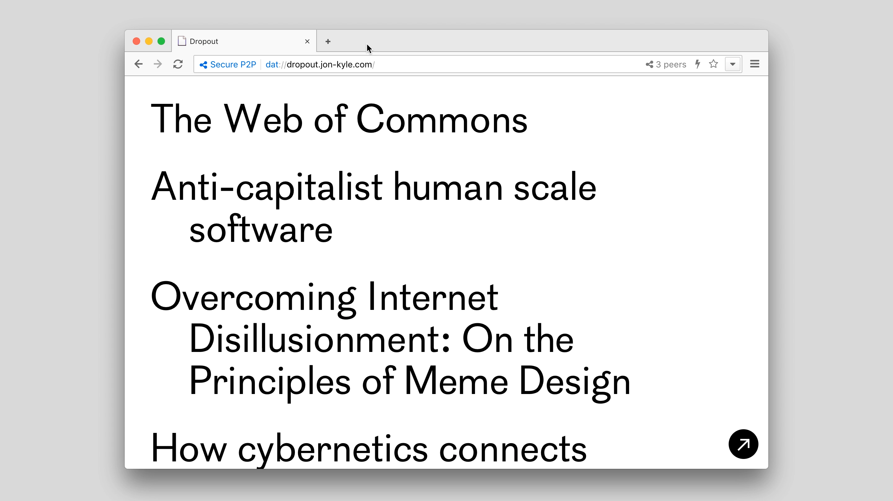

# Dropout
 
I’ve been on the internet since I was seven or eight. Got my own machine when I was around ten, a hand-me-down. That’s also around when I stopped going to school. We lived in a small town of around 2500. With a connection the browser was truly my window to the world.

The internet felt really big then.

<!-- more -->

I’ve been going offline here and there recently. I’ll connect for a minute to load my inbox in the morning, then go offline and reconnect to send them.

I’ll work on a project, making notes as I run into problems instead of searching for an answer immediately. After they accumulate for a while I’ll go online to find the answers. The answers tend to stick better that way, too.

Growing up with a connection from a very young age, and being connected all day (and sometimes all night) the internet became integral to how my brain works. Turning it off feels like a lobotomy, but having a constant connection is sort of like running my faucet all day, regardless of if I’m filling my cup.

When I find myself wandering online I’ll sometimes come across something interesting. But even if I care about it deeply, my attention will drift. Not an accident so much as it is the result of effective design and years of personal exposure.

When coming across these things I wanted a way to save them to read offline. Didn’t want to use a platform. Didn’t want to use an app. Just wanted a tool.

I put together `dropout` for myself, but you can also use it, both as a command line interface and js module. All it does right now is save a url as static html/json for later offline access and personal archive.

You can install it via `npm install dropout -g`. Head to the repository to [scope the source and view documentation](https://github.com/jondashkyle/dropout).

As always, very excited about future networks and hope to see you there.

### Update 10/29/2017

The response to releasing this, though modest, was [unanticipated and appreciated](https://twitter.com/jondashkyle/status/923948416723324928) for what it is. Thanks!

To make it more widely usable, I created a full webapp providing you an interface for managing your offline library. It runs in [Beaker Browser](beakerbrowser.com) and saves your data to a Dat Archive, which remain as static files on your machine.

To give it a try, simply navigate to [dropout.jon-kyle.com](https://dropout.jon-kyle.com). Additional documentation is waiting for you [in the repository](https://github.com/jondashkyle/dropout-app).

In addition to being immediately useful, I hope this provides a useful example of how to use Choo and Beaker to create a fully functional webapp, emphasizing the ideas expressed above.

---

1. I like what [Graham Mckay](https://misfitsarchitecture.com/2017/10/19/naked-houses/) recently noted on Misfits’ Architecture about Gustave Flaubert, unbookmarking and the propagation of good ideas.