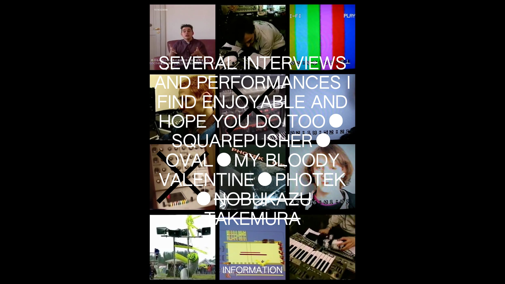

# Simple Sites

I want my sites to be focused and simple. Just a bunch of plain text files, some images. I want to turn those files into a site and update them without having to deal with a server, or apis, or build processes. I want it to be a calm thing. I want to share my site peer-to-peer and not depend on a centralized hosting platform. I want it to be easily archivable.

Earlier this year I began working on [Enoki](http://enoki.site), inspired by a few of my favorite tools. It creates static sites with js, using files and folders instead of a database.

<!-- more -->

As opposed to site-making platforms, the [first attempt](https://github.com/jondashkyle/enoki-starterkit) was meant to be run locally first. I found it useful (I’m using it for this site now), however usage is limited to those capable of installing node/npm.
 
This is of course both good and bad.

The affordances of a tool are different than that of a platform; to learn a skill, and not develop a dependency on a service. Platforms are often designed for maximum usability and infinite growth. I wonder where the middle ground is with accessibility. Something between being unsure what to do when handed an object and the ease of a microwave.

In thinking about this, I began working on a hosted version of Enoki, complete with registration, accounts, and all the functionality you’d expect of a platform. The question of scale began influencing design decisions contradictory to the spirit of the project. It began feeling too much like a microwave.

Around this time I decided to pause and take a step back.

Since then the [Beaker Browser](https://beakerbrowser.com/) team has continued to make substantial progress on their experimental peer-to-peer browser. [Brave Browser](https://www.brave.com/) has also announced intentions for Dat integration, which the Beaker team is using as opportunity to modularize some core functionality, making it possible to use the Dat web protocols within Electron apps.

I organized [Peer-to-Peer Web / Los Angeles](https://peer-to-peer-web.com/los-angeles), which in addition to developers saw a relatively large attendance by people with artistic or publishing practices.

Net neutrality was also repealed.

Not only are there interesting projects creating a functional peer-to-peer and local-first web today, but there is active effort from big telecom to compromise the integrity of the internet, and how it works for people and not just corporations.

I’m optimistic that in time this will create demand for peer-to-peer networking and local-first projects.

With all this in mind, the past few months have been a refocusing for Enoki. Instead of continuing work on something growing increasingly large and complex, I shelved the idea of creating a hosted service for now.

Instead, I’ve been drawing better boundaries around specific functionality within Enoki and creating modules. This not only makes it easier to iterate, but also sets the ideas free for others to use within their tools.

The first two modules to spin out of Enoki are [Smarkt](https://github.com/jondashkyle/smarkt) and [Hypha](https://github.com/jondashkyle/hypha). Smarkt is a hyper-readable structure for defining fields and values in plain text. Hypha transforms a directory of content into JSON.

It was important to me that Hypha works sync/async to be useful in Browserify builds where you must statically incline streams, and Beaker Browser which provides an async Web API for reading Dat Archives.

As a proof of concept, I created an example site which runs inside Beaker Browser. A bundled javascript application reads a `/content` directory to generate a site on the fly, letting you manage your content without needing to rebuild the source. The site is essentially a file browser.

You can access the example by navigating to [dat://beaker-hypha-jkm.hashbase.io/](dat://beaker-hypha-jkm.hashbase.io/) inside Beaker. If you’d like to poke around simply fork the site and make some changes inside `/content`.

To make changes to the app open `/source` in your terminal and run `npm install` and `npm start`. [Choo](https://choo.io) is used as a little front-end framework.

The page content is a collection of performances and interviews I like that have a similar to feeling to how I’d like these tools to feel.

---

I plan in time to re-integrate these tools with the Enoki Starter-kit, and perhaps create that hosted service too (obviously on the peer-to-peer web stack.)