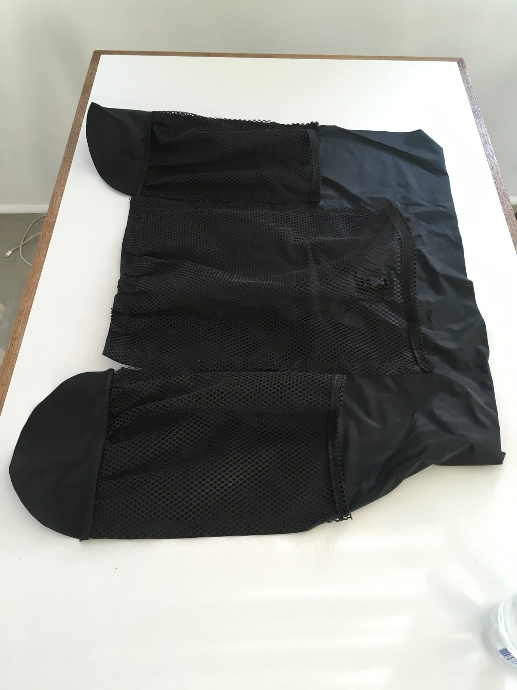

---
tags:
  - walking
index: 
  - Introduction
  - "[Day One](/entries/2018-05-27-trans-catalina-day-one)"
  - "[Day Two](/entries/2018-05-28-trans-catalina-day-two)"
  - "[Day Three](/entries/2018-05-29-trans-catalina-day-three)"
  - "[Day Four](/entries/2018-05-30-trans-catalina-day-four)"
---

# Trans-Catalina Trail

Since moving back to Los Angeles from an extended stay in New York I’ve been out in the forest often. I was there frequently before leaving, too, but it’s different now.

While away I began reading about through-hiking, making your own gear (MYOG), literally watching people just walk around mountains, all to supplement the extreme lack of open undeveloped space. Researching hikes to do once returning home led to rediscovering a multi-day hike across Catalina Island, located just off the coast.

<!-- more -->

Never having attempted a multi-day hike before, and having little camping experience, there were all kinds of assumptions surrounding how involved an attempt would be. Living in semi-rural Tennessee and unschooling when young didn’t provide a wide variety of offline activities. Days were spent online for several hours. One of my favorite alternatives was going on (really) long walks through undeveloped subdivisons.

We lived on the edge of one such development. Walking to the end of the road resembled scrubbing a frozen infrastructural timelapse. First houses, then houses without roofs, then houses without siding, then frames of houses, then foundations, then street signs and sewer covers, then paved road, then smoothed dirt, leading to raw abandoned piles of moved earth.

A hard coordinate where the bubble burst.

Between those long walks and doing healthy day hikes while living in Los Angeles, it seemed likely any surprises before making it home were solvable, especially with my friend [Jon](https://jongacnik.com) doing it with me. (s/o Jon for a bunch of these photos, too!)

## Preparation and Booking

Normally there is a two night minimum stay for campgrounds. To bypass this, simply call the Two Harbors visitor services to book your campsites. Tell them you’re doing the Trans-Cat. They’ll walk you through campsite selection. Talking to someone for 15 minutes is much more enjoyable than clicking around the site’s interface.

We departed on May 8th to complete the trail in three nights / four days. [Blackjack](https://www.visitcatalinaisland.com/camping-boating/primitive-camping/blackjack), [Two Harbors](https://www.visitcatalinaisland.com/camping-and-boating/two-harbors-camping/two-harbors-campground), and [Parsons Landing](https://www.visitcatalinaisland.com/camping-boating/primitive-camping/parsons-landing) are the standard camps for the TCT. With it being our first go prevailing wisdom won out.

Both Blackjack and Two Harbors have potable water on site. For Parsons Landing you’ll want to reserve a locker with 2 gallons of water and firewood. You can do that at the Guest Services building in Two Harbors. Between booking the campsites and the ferry tickets, it was somewhat expensive compared to a typical trip. Definitely worth it, though.

Also, to be comfortable, keep your pack weight down. I was just a little shy of 20lbs at the trailhead, and am aiming closer to 15 next time. For more on my pack just scroll down the page.

### Resources

- [Socal Hiker](https://socalhiker.net/hiking-trans-catalina-trail/)
- [Modern Hiker](https://modernhiker.com/hike/trans-catalina-trail-tct/)
- [Sea to Summit](http://seatosummitultralight.blogspot.com/2014/08/thru-hiking-trans-catalina-trail.html) ([Gear list](http://seatosummitultralight.blogspot.com/2014/02/sul-trans-catalina-trail-gear-list.html))
- [Bison Safety (pdf)](https://www.catalinaconservancy.org/userfiles/files/Bison%20Safety%20for%20public.pdf)

## Equipment

Ok, a quick rundown of what was brought. While in New York I started to research ultralight gear. I got very into it. What really got me going was the Make Your Own Gear (MYOG) community. My first project was a [Ray-Way backpack kit](http://www.rayjardine.com/ray-way/Backpack-Kit/index.htm).

For $70 they ship all the material and expertly crafted instructions on how to assemble the pack. Amazingly it weights only 9.5 ounces once complete. Having never touched a sowing machine before, this was a great first project to learn from.

Sure, it took around 20 hours to make considering my novice experience, but it provided the confidence to then sow the [Yama net-tent kit](https://www.yamamountaingear.com/net-tent-kit/). That was quite simple, although it made apparent how clear the Ray-Way instructions were, as these were lacking somewhat. Still, nothing was unsolvable without a few moments to consider what was happening structurally.

Between those two projects I gained confidence to order some material from [Ripstop By The Roll](https://ripstopbytheroll.com/) and improvise a tarp tent off the dome after a little research. Not many photos of these last two projects, as it was mostly a bunch of jumbled fabric and the nerves distracted from documentation.

I highly suggest giving this a try if you’re interested. It is economical, unless your time is ultra-precious, and even then the knowledge acquired will far outlast the gear you’ve created. The understanding of production provides you with better judgment for any future purchases, too. Making this sort of stuff feels different than a typical DIY project, as it employs advanced technical fabrics and sometimes complex geometry. It’s super fun to learn new shit.

I’ve collected some resources used to create my projects in an [Ultralight MYOG channel on Are.na](https://www.are.na/jon-kyle-mohr/ultralight-myog).