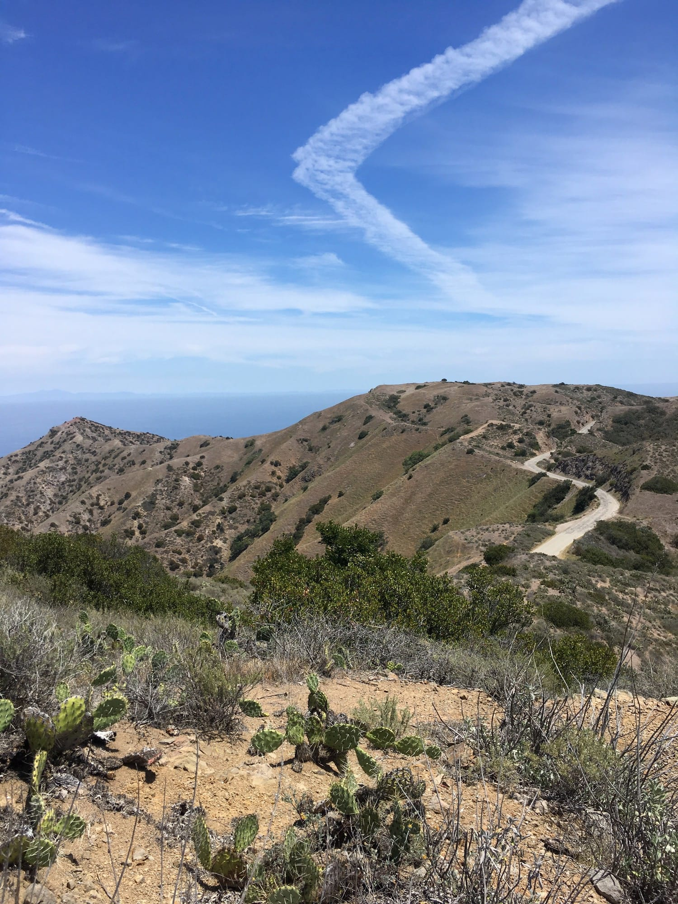
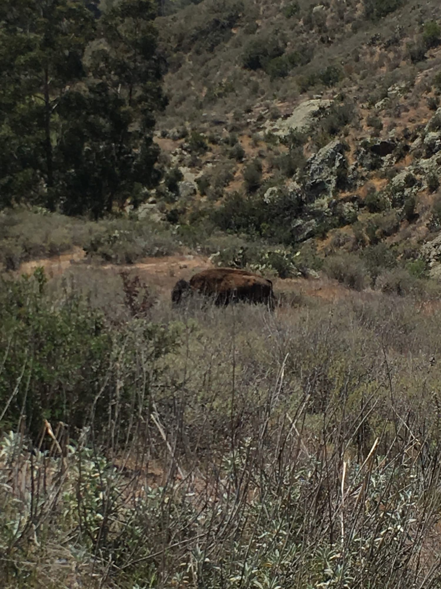
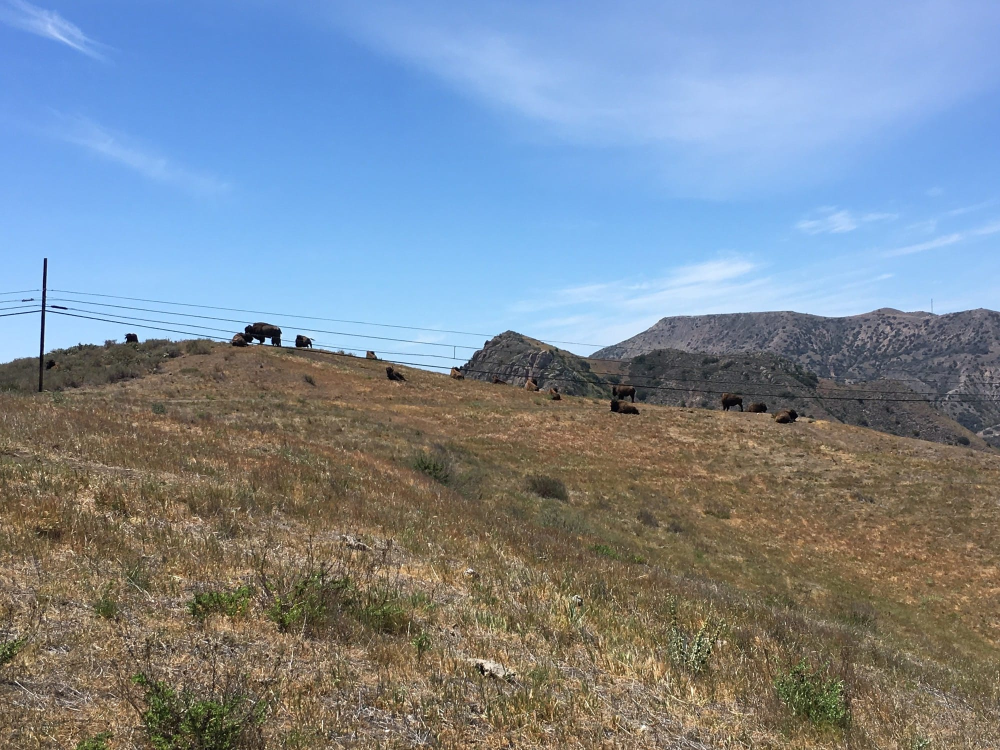
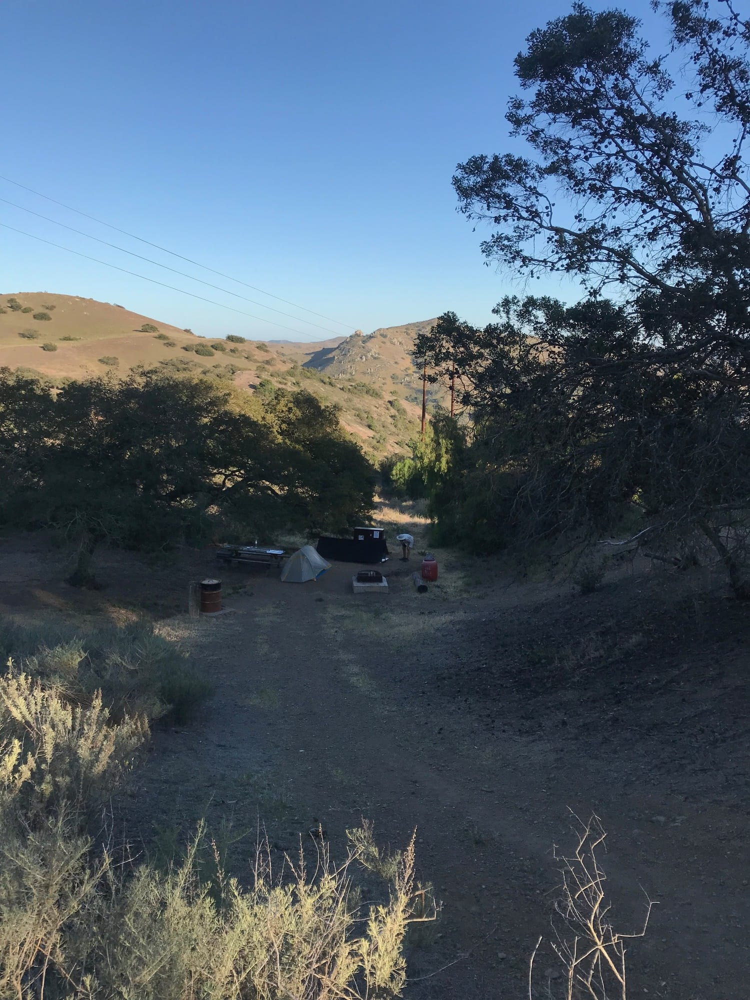

# Trans-Catlina Day One, Avalon → Black Jack, 15 miles

We took the 6:30am Catalina Express from Long Beach. Leaving that early on a weekday didn’t require booking tickets beforehand, though there are few reasons not to.

It takes around an hour and a half to traverse the San Pedro channel. Once arriving in Avalon we waited around to check in, but it turns out this isn’t necessary as the permit is only for the stretch between Two Harbors and Parsons, but a paper map is nice to have, even if there are little Instagram icons all over it.

<!-- more -->

It quickly became clear that most of this first day is simply escaping the infrastructure surrounding Avalon. The up is very up at the start, and it’s mostly on fire road. Approaching a small shade structure around mile 3 we saw some kids, and when saying hello they asked “Did you know you can smoke sage?” Sick.

Before too long we were crossing our first bison gate. Oh yeah, there is a generously sized bison population on Catalina, introduced to the island during the [20s for a silent Western film shoot](https://en.wikipedia.org/wiki/Catalina_Island_bison_herd).

Not much time passed before spotting it; our first bison, relaxing near the edge of a pond, maybe 40 feet from the trail. It’s suggested you stay at least 75 feet away from bison to prevent spooking them.

We decided to go off trail.

This gives the TCT an entirely unique angle. When approaching a blind corner of the trail obstructed by foliage might be a bison ready to trample your ass.

Not long after our first encounter, while approaching a blind corner, I caught what appeared to be a glimmer of bison rear-end making it’s way in our direction… We scrambled up the hill, and sure enough, there it was.

This ensured we were properly paranoid for the rest of the trip whenever approaching blind corners. It was like hiking in Jurrasic Park, but instead of velociraptors there were lumbering furballs with horns.

After a few brief siestas to rest and snack we approached a sizable hill where three or four *more* bison were hanging. Unable to determine if the trail passed within the Bison Bubble (75ft) we continued ahead. It became clear that, yes, the trail ran directly adjacent the bison and within The Bubble. The trail followed a ridge line, requiring either a scramble down an uncomfortably large cliff to an access road, or inch along off trail until clearing the crest of the hill past the bison.

Forward was the way to go.

Cresting the hill, we realized the three or four bison was more like twenty-five or thirty. A few were even laying *directly on the trail*. These things live to fuck with hikers.

The next few miles were super hot. After having started at around 8:30am we had done seven-ish miles and it was about noon, putting us square in the middle of the island at the bottom of a valley with very little air circulation.

We made it up the last little bit of trail and got to camp. Ate some cold-soaked lunch (no stove to keep weight down) and walked around the camp, which was entirely empty save one other solo hiker.

After a minute it became clear there was a *lot* of bison shit around camp, which got me a little anxious about waking up in the middle of the night to a stampede. I digress. 

With sunset approaching, a quick walk before dinner sounded good. Following the path out of camp we’d take tomorrow morning led to an expansive view. Looking to our right we noticed a small structure which seemed to have *the best* view.

Upon approaching the structure we were greeted by, yeah, you guessed it, another bison giving guard. Fuck! We headed back to camp as the fog rolled in. In the next life I want to come back as a bison on Catalina.

After getting a fire going I finished setting up camp. This was the first time I pitched the self-made tarp, which uses two trekking poles and tension from tie-outs to stay taught. Was happy to find it worked. Aside from the satisfaction of making something, the possibility to modify and improve a project from knowing the construction makes it worth the time investment. There were already a few small adjustments to make once home.

### Tips

1. Don’t get too discouraged by the amount of infrastructure and fire roads. Tomorrow is much better. Just get to camp and enjoy the down time.
2. We didn’t realize it, but there is a point to fill up on water halfway through the hike. Check the map before setting out.
3. Campsite number three has pleasant shade in the afternoon.