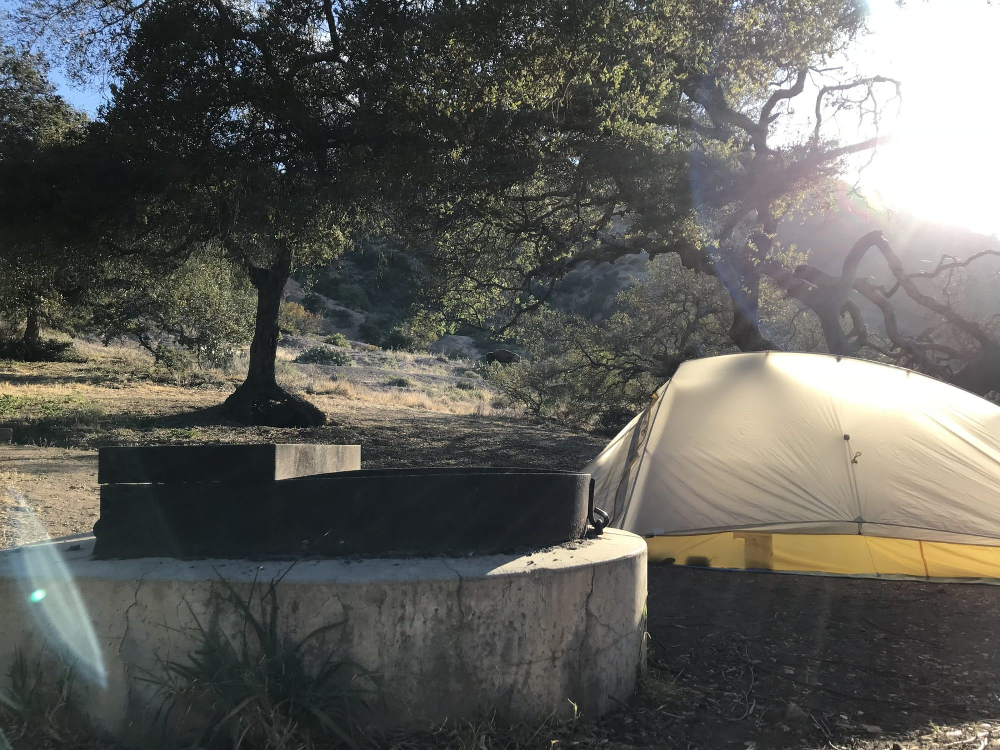
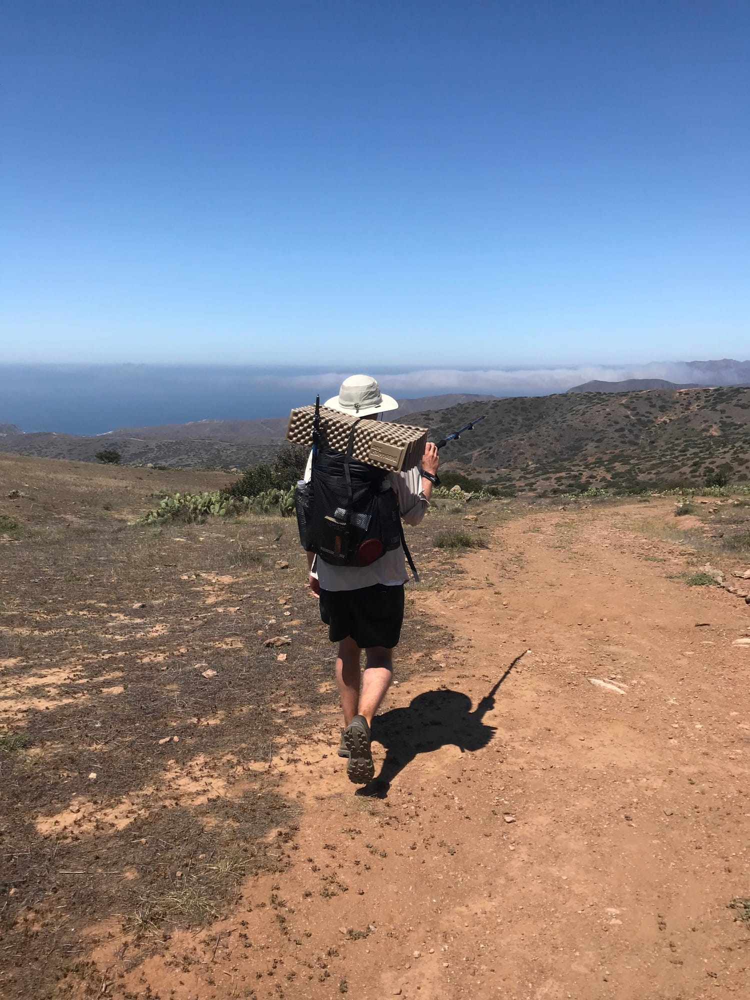
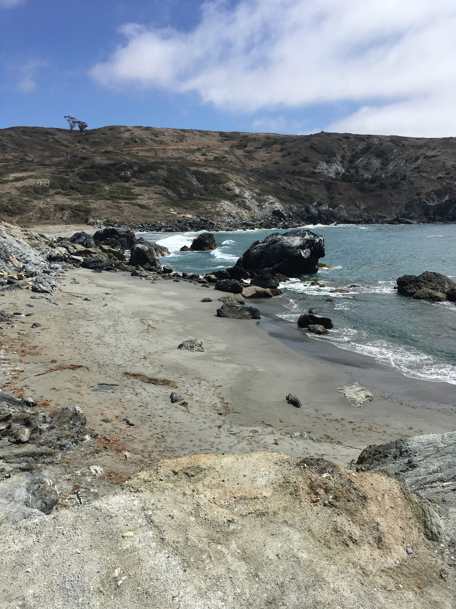
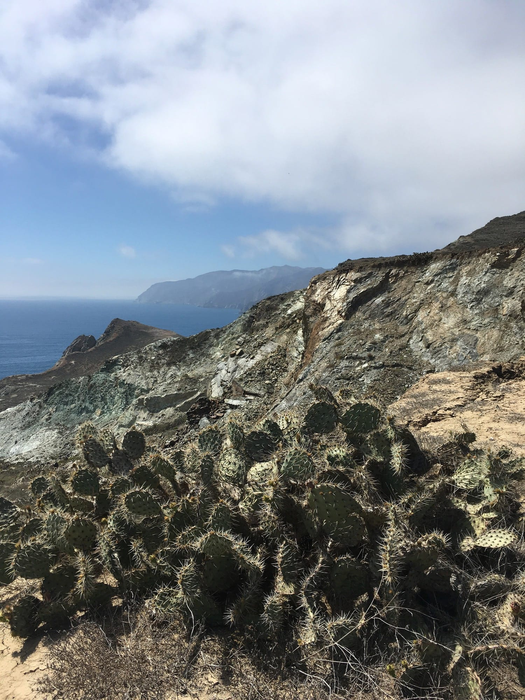
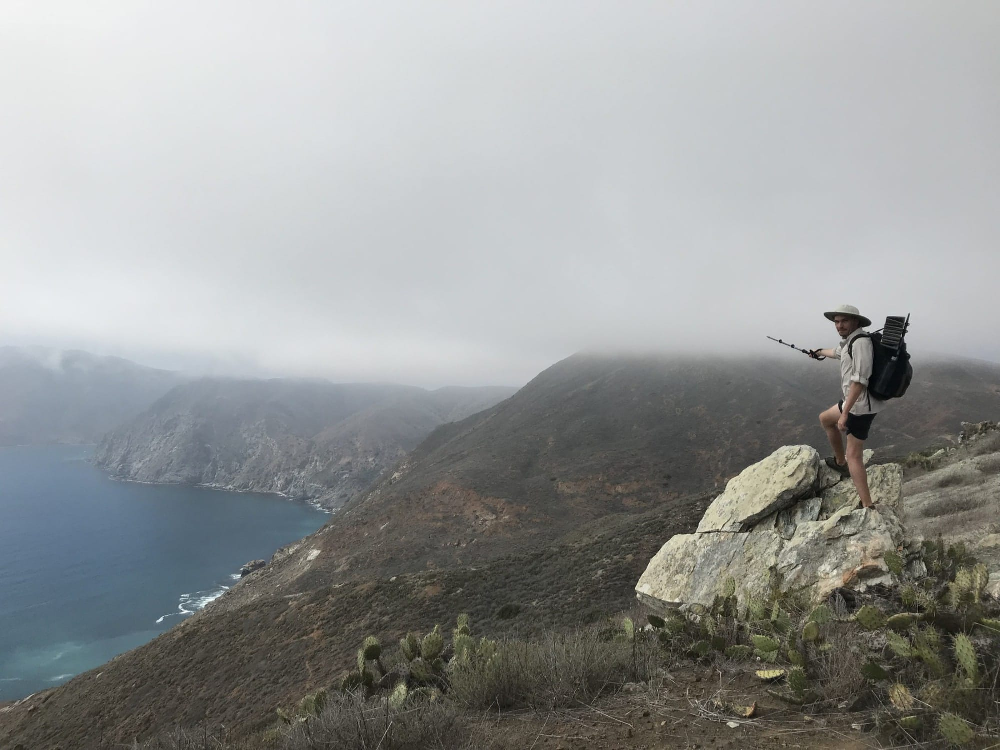
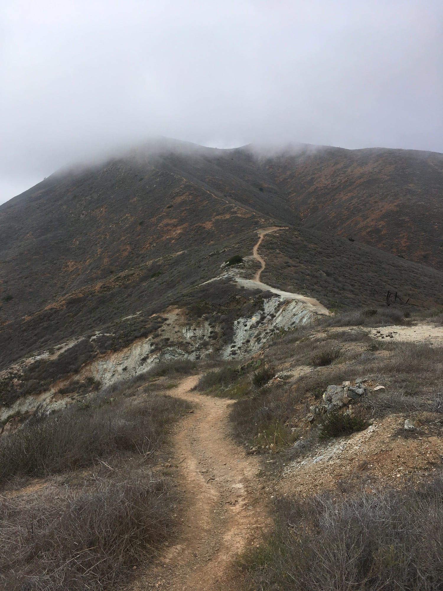
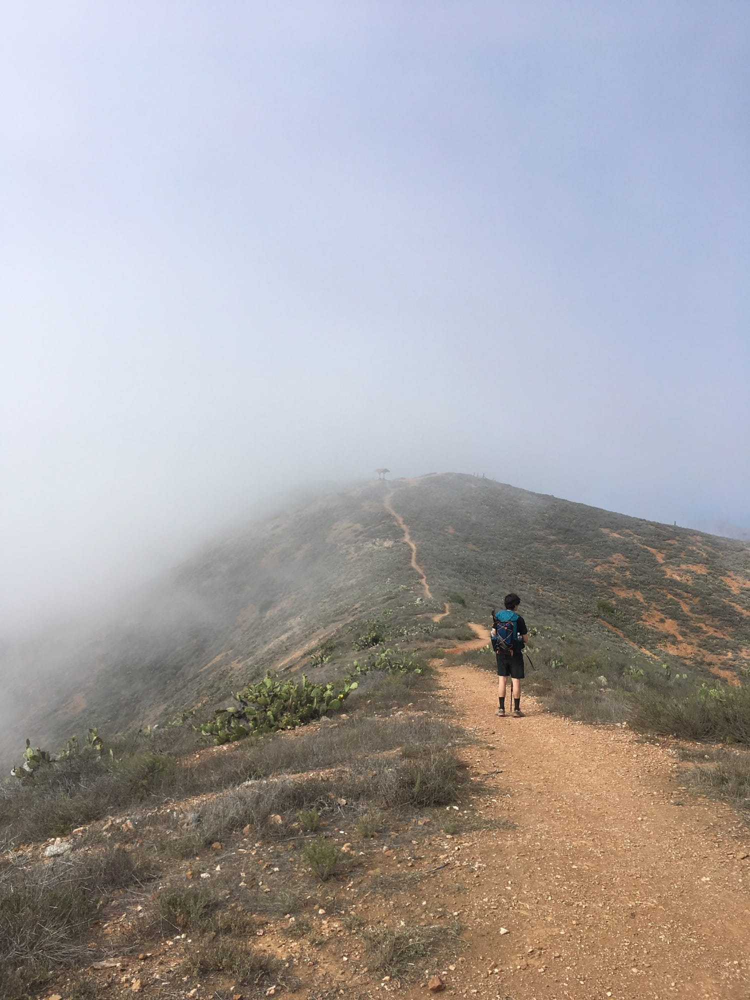
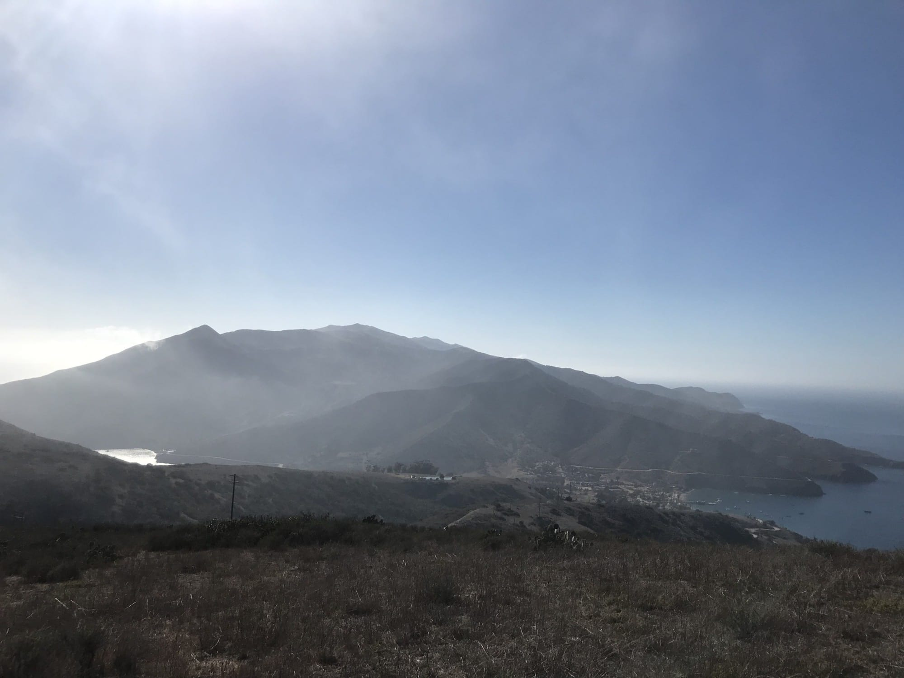

---
tags:
  - #walking
index:
  - "[Introduction](/entries/2018-05-26-trans-catalina-intro)"
  - "[Day One](/entries/2018-05-27-trans-catalina-day-one)"
  - Day Two
  - "[Day Three](/entries/2018-05-29-trans-catalina-day-three)"
  - "[Day Four](/entries/2018-05-30-trans-catalina-day-three)"
---

# Trans-Catlina Day Two, Black Jack → Two Harbors, 12.5 miles

The day started with Jon tapping on my tent. “Not to freak you out, but there is a bison right next to the campsite.”

It kept distance for a while until disappearing. I wandered around the campsite—it couldn’t be found, but after several minutes there was a loud “HRUMPH.” It had wandered behind the tree in our campsite (pictured above), and started walking towards us, conveniently oblivious (as bison usually are) to the fact that we weren’t ready to leave.

We grabbed the last few things off the table as we were casually chased out of camp.

<!-- more -->

The first two miles of day two takes you down a canyon where a currently dry stream sometimes runs, providing a water source for the densest foliage we had yet encountered. A quick jaunt back up through fields of cactus brings you to The Airport in the Sky, infamous for it’s bison burger. I guess there has to be a payoff for flying into the airport, and that’s entirely condensed into (arguably) one of the best burgers I’ve ever had—the ultimate [$100 hamburger](https://en.wikipedia.org/wiki/$100_hamburger).

After properly smashing the burger it was time to put the boots (or trail-runners) back on the trail. Soon a fire road gave way to some welcome single-lane trail. Little Harbor came into view before too long, and speculation began flying about where the trail continued after that. Spotting a shade structure perched high above the valley, peaking in and out of cloud cover created by the sea-breeze rushing over the cliffs, it looked, as they say, “hella steep.”

Little Harbor was pretty amazing; a secluded pair of coves with particularly calm waters. We kicked it for around 30 minutes, wanting to hop in, but knowing we needed to stay on schedule for the day. Ended up skipping stones most of the time. Tbh could spend the rest of my life just skipping stones.

After our siesta we headed off towards what appeared to be a considerable climb. Turns out it was. When hiking the TCT you experience a bit over 10,000ft of aggregate elevation change. This checks out considering the amount of ups and downs. The climb took us past areas of massive erosion, the Pacific swallowing up the coastline as huge chunks of cliff collapse, some taking sections of trail along with them.

As we approached cloud-base it *really* began to feel otherworldly, or at least no longer like a short ferry ride away from every day life in Los Angeles. Up ahead was the shade structure spotted earlier, where we gladly caught our breath and snacked as the clouds rushed past and threw undulating patterns of sunlight on the valley below.

Beginning the descent into Two Harbors, the naming became clear when the vantage point provided a view of the narrow strip of land separating two harbors upon which the small town sits.

We ate and drank at the single restaurant open on weekdays. Most overheard conversations revolved around how long the year-round residents and staff of the bar have lived on-island. After eating 10x our capacities the half-mile walk back to camp felt longer than the climb earlier.

I set up my net-tent sans-tarp to have a view of the harbor and evening sky. While dozing off I heard some footsteps. It was a small (and grotesquely adorable) Catalina Fox, staring at me, perhaps 15ft away. Closing my eyes again, it took only a few minutes before the sound returned, this time the fox’s face literally pressed against my net. Clearly this called for a photo. Awakening my phone the bright screen instantly startled the fox, and it yelped the most high-pitched and panicked yelp as it high-tailed it out of sight.

### Tips

1. Eat a light breakfast and scarf down a burger at the airport, even if it’s only 10am. You’ll be glad you did.
2. Pace yourself up the climb after Little Harbor, it’s deceptively long. Fortunately the air is much cooler here than the valley.
3. If staying at Two Harbors, try to get campsites #1–5. They’re right on the water. #6 is next to the toilets. Skip that. #11 is nice, and where we ended up, as the wind was really howling at the first 5 and we didn’t want to wake up in the harbor.
