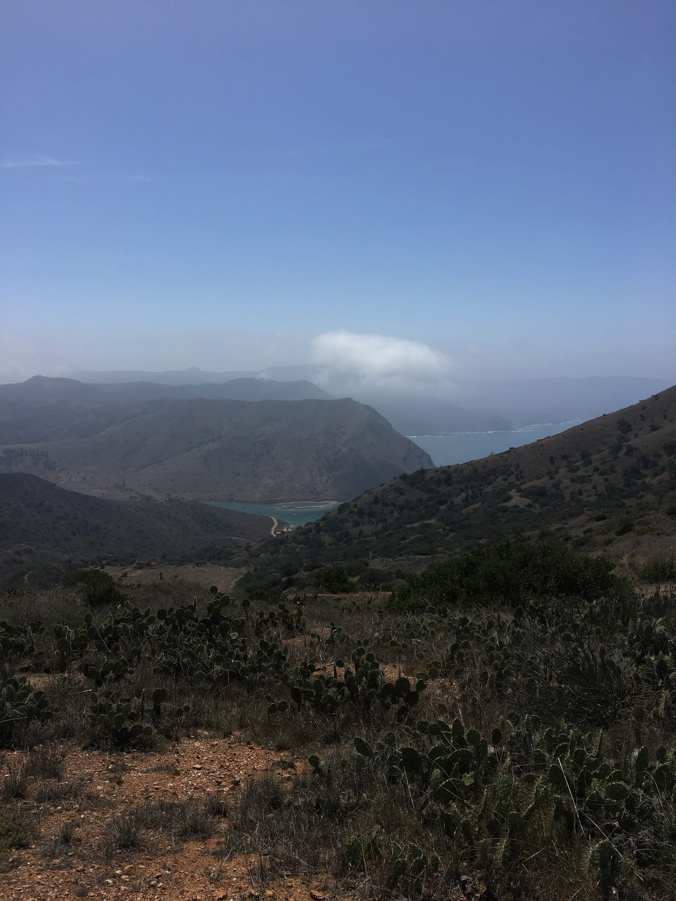
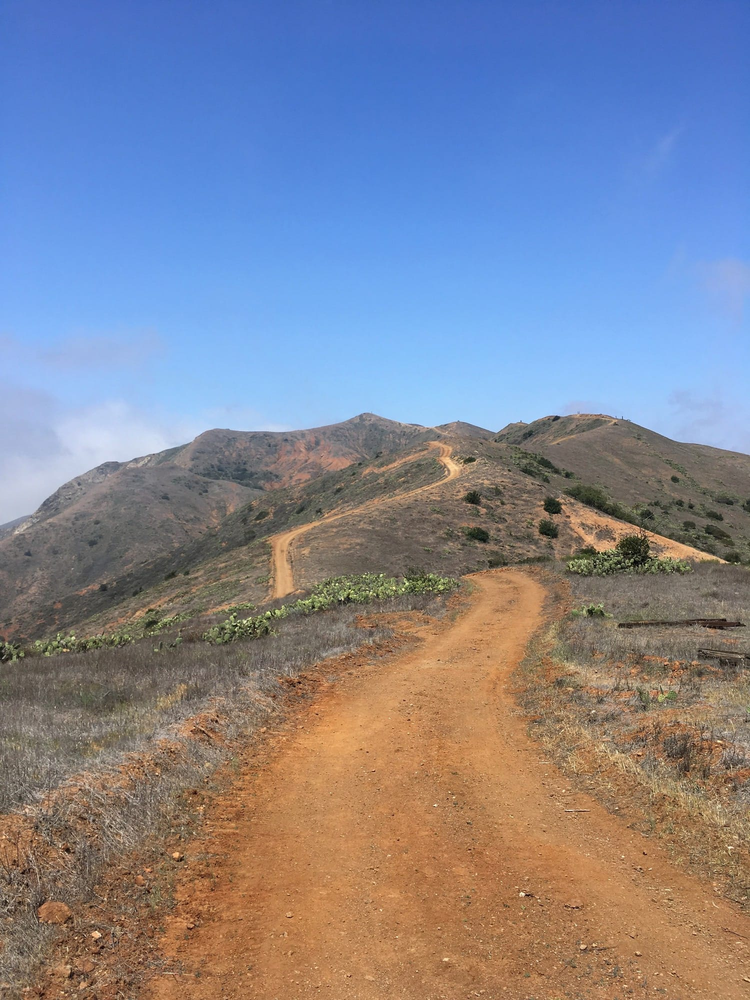
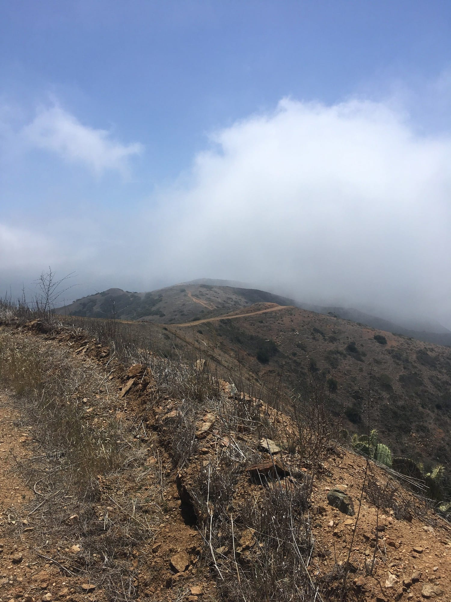
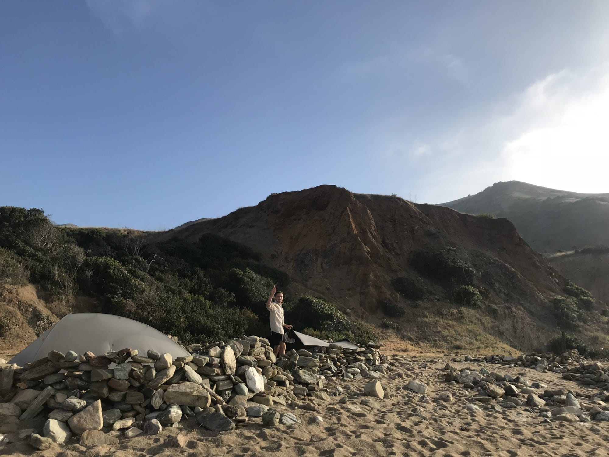

---
tags:
  - hiking
index: 
  - Introduction
  - "[Introduction](/entries/2018-05-26-trans-catalina-intro)"
  - "[Day One](/entries/2018-05-27-trans-catalina-day-one)"
  - "[Day Two](/entries/2018-05-28-trans-catalina-day-two)"
  - Day Three
  - "[Day Four](/entries/2018-05-30-trans-catalina-day-three)"
---

# Trans-Catalina Day Three, Two Harbors → Parson’s Landing, 7 miles

Breakfast came and went quickly, followed by a stop at Island Services to pick up the permit and reserve our locker with water and firewood for Parsons Landing. Seeing as there would be a fire, we grabbed some bites from the grocery store for grilling later that evening.

You start the trail on day three back-tracking briefly down a road the first mile past a small port at the other harbor. Our timing coincided with a barge bringing supplies to town, and several trucks drove past, throwing dirt into the air. The industry, though modest, was such a contrast to the previous morning.

<!-- more -->

The first three miles go UP. *FAST*. You’re totally exposed and it’s hot as hell. You’re so miserable you can’t help but appreciate how bad it is. Nothing redeeming about this, other knowing it’ll be over soon.

After the worst of it things start to level off, and we were pleasantly surprised to spot cloud cover forming over the cliffs ahead, a welcome reprieve from the direct sunlight that had just fried us.

A few miles pass and you’re up there. [Stony Peak](https://www.ngs.noaa.gov/cgi-bin/ds_mark.prl?PidBox=DY3012) is the second highest point on the west side of the island, the first being Silver Peak. This was such a welcome break form the climb up, and we hung out in the clouds for a while. Good thing considering how intense the trail down to Parsons was about to be.

Simply put, the way back down is, as they say, “hella steep.” My tarp-tent requires two trekking poles, and this was the only section of trail where both were useful while hiking to stabilize. My knees are glad I did. The views were absolutely unparalleled while looking back up towards the peak we had just descended from.

Just prior to arriving at Parsons there is a plaque for the Propst Prarie.

> Dedicated to A. Douglas Propst, a transplanted Colorado grass man who came to Catalina Island in 1953 and spent the next forty years restoring the island’s ecosystem. His labor of love helped insure this native landscape.

This got me thinking about the internet as landscape, or open space within network infrastructure. The internet was once a wilderness, but has been over-developed, and because of this we’ve lost areas to simply exist. Tools for sharing photos have turned into platforms for sharing things that more closely resemble personal ads. Tools for communicating with friends are used to extract taste profiles and create filter bubbles to encourage constant consumption and endless engagement. I wonder what a conservationist movement for the open web could look like, and if there is room for analogue efforts to Propst’s preservation of the Stipa Pulchera grasslands for the connecting together online.

We got into Parsons. The verdict? Totally amazing. Our campsite was on the sand, maybe 10ft from the Pacific’s edge. Each site is denoted by small rock structures to assist in the persistent against the wind. I pitched my tarp low and we spent the rest of the day relaxing intensely.

The fire turned out great despite the breezy conditions. Eight dogs and tomato paste down. We turned in after finishing the whiskey and hoped for the best come morning.

### Tips

1. Don’t get too discouraged on the way out of Two Harbors. Yeah, it sucks, but you’re headed towards remarkable areas.
2. Kick it up top, no need to rush.
3. Bring trekking poles for heading down to Parsons—shit is no joke!
4. Ensure your tent is properly staked with heavy rocks once at camp. The wind really picks up as the sun sets.