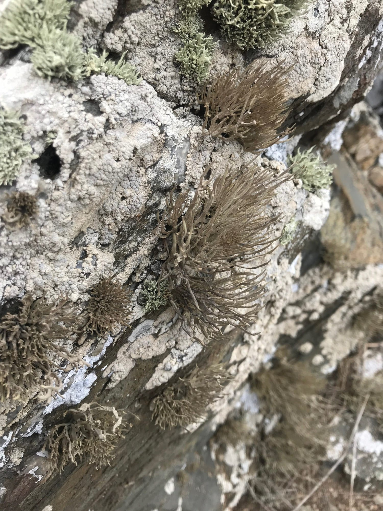
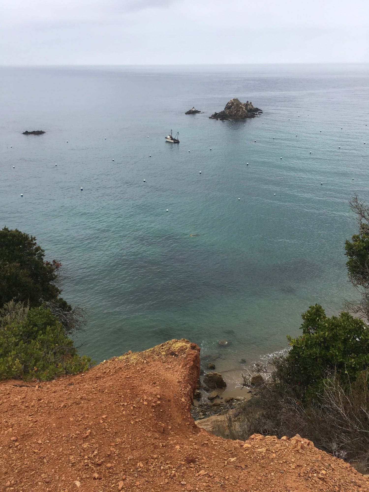
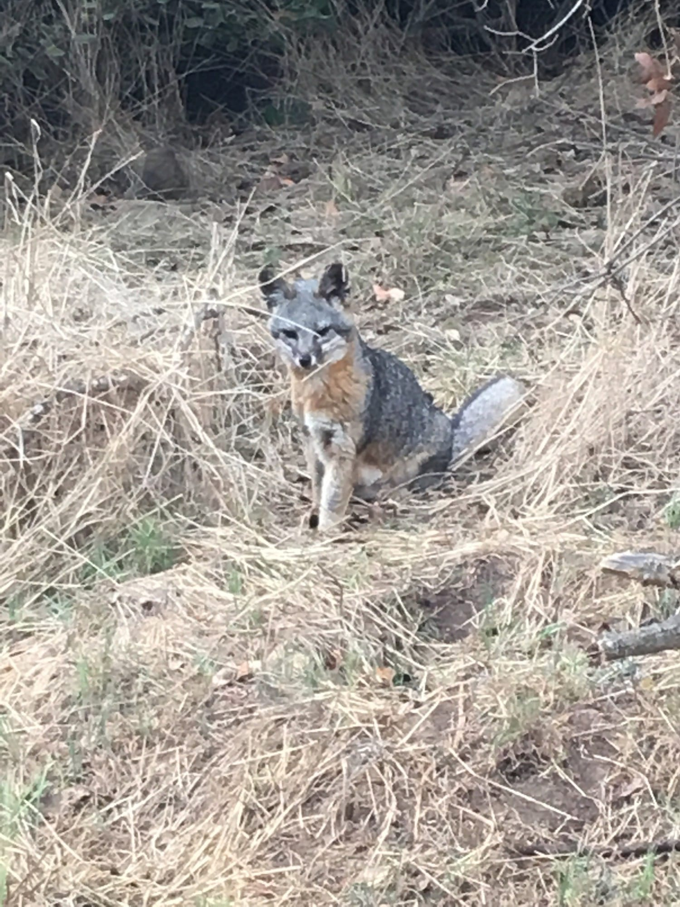

# Trans-Catalina Day Four, Parsons → West End → Two Harbors, 16 miles

Technically, the terminus of the TCT is at Parsons, but this is a recent revision. The original end is at Starlight Beach, another 4 miles out towards the western tip of Catalina. After packing up camp we decided to drop our packs in one of the metal food boxes, bring some water and snacks, and head for a quick 8 mile jaunt to West End, which is, yeah, the end of the island out near Starlight.

The hike out was super pleasant and a bit overcast, making things cool off. A very mellow last day. Approaching Starlight the trail makes a rapid descent. We decided against that and continued along to an unmarked side-trail heading towards the very tip of the island.

<!-- more -->

It was impossible to comprehend the scale of the landscape there, all collapsing into the water. After hanging for a while we hiked the 4 miles back to camp, picked up our packs, and continued on the additional 8 miles of dirt road to Two Harbors, where we’d catch the 9:30 ferry back to San Pedro. It’s a deceivingly long 8 miles, as two harbors always appears quite close, however the coves send you in and out a few times, making it seem to take forever. The drizzle turned into rain. It was a nice way to end the trip.

There isn’t a sign commemorating the end of the TCT, you just end up back in Two Harbors, which feels a little funny. Overall, super satisfying to have completed the trail, and we celebrated with more food and drinks at the single restaurant. One drink which stood out was the “Bison Milk.” You’ll have to experience it for yourself. The patrons we had seen last time were now staffing the bar, and the staff were now patrons.

We waited around for the ferry, for what ended up being a somewhat miserable return trip with it being a smaller ferry at night (no horizon line) and choppy waters (properly raining.) Despite this, damn, solid first through hike.

### Tips

1. Definitely hike out to Lands End. Follow the trail to the left you’ll spot from about where the trail forks off to Starlight. Much more enjoyable considering Starlight is a rocky little beach, and the trail is super steep.
2. DO NOT have a few drinks, a burger, “Bison Milk”, and onion rings before boarding the ferry back. It’s rough.

### Thoughts

This was the ideal first through-hike. You’re never more than a few miles away from help, and not once did I have to dig a hole and shit in it. Quite easy in that sense. We definitely packed the miles on, though. The TCT itself is 38, but we did closer to 48 going out to Lands End.

Generally speaking:

1. Keep your pack weight down, but don’t go crazy. Try to stay under 20lbs.
2. I brought two Smart Water bottles, each holding one liter. This was plenty, as you can always re-fill at least once a day. Just ask for a map in Avalon and check it in the mornings.
3. Don’t bring more than two days worth of food, as you can eat at the airport the morning of day two and resupply that night (or the next morning) at the grocer in Two Harbors.
4. If you want to do a two-day version, take the ferry from San Pedro to Two Harbors. Hike Two Harbors to Little Harbor and camp there, then do the return hike the next morning. A ton of climbing, but it’s the best stretch.

Having seen Catalina from Los Angeles for so long, I’m glad to have gotten out there, even if it took a while. A good reminder to simply go for it and then begin figuring out the details.