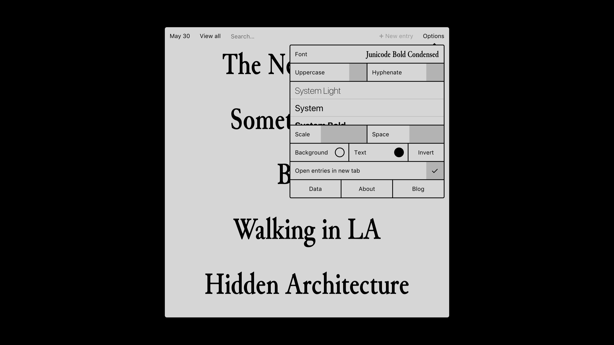
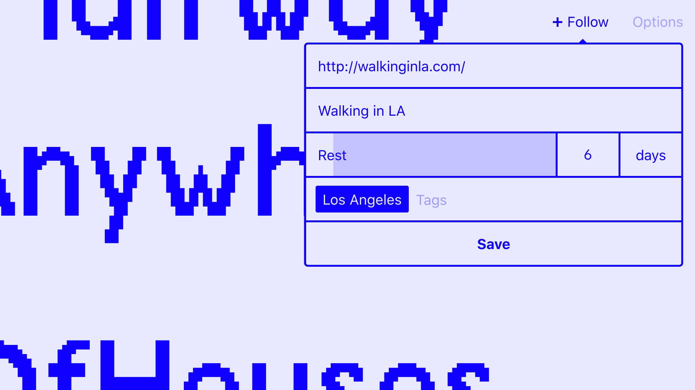
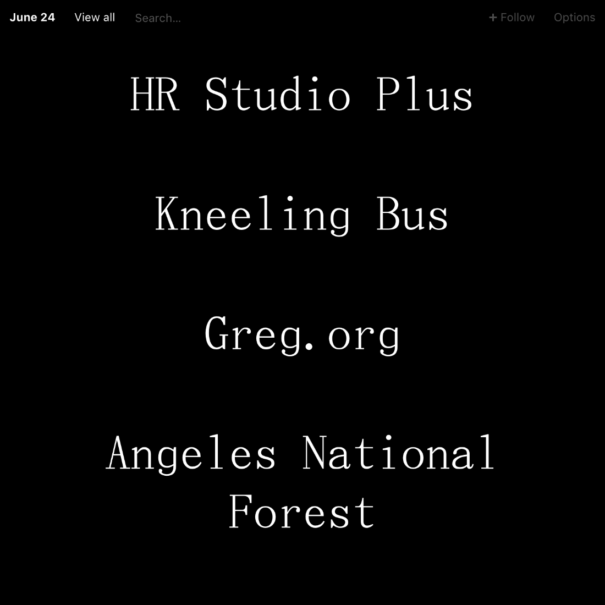
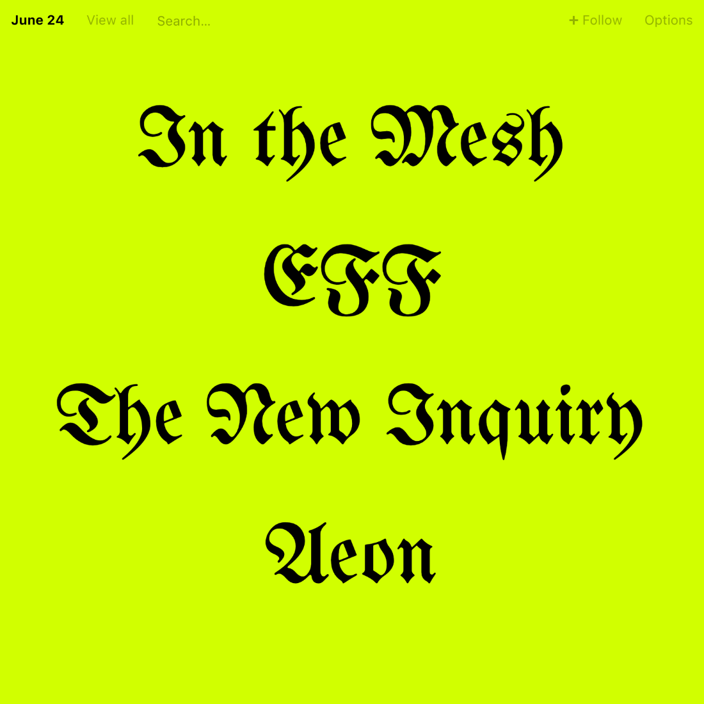

# Hardly Following Anything

Often I’ll sit down to write something to publish here, but find my attention drifting elsewhere. Social media platforms and their feeds are a huge personal distraction day to day. So, after fully deleting my Facebook and Instagram accounts about a year ago, I just unfollowed everyone on everything else. I’ll still be checking in on everyone, but at my own speed, and I’ve updated a tool for making that easy.

In the future I’ll be using those platforms for what they have become; essentially personal ad networks. Will continue sharing the more interesting things, but through my mailing list (in the nav above.)

<!-- more -->

I’ve sometimes depended on blockers, applications which limit access to the internet, like [Self Control](https://selfcontrolapp.com/), for impulse management to varying degrees of success, but actively *disabling* something feels like masking the issue, and creates self-consciousness about my own naïveté considering the privilege of having constant access to “universal knowledge.”

Who would consciously disable that connection, you know?

Makes me ask, can a tool be actively *enabling* in it’s approach to navigating constant connection, not restrictive or limiting?

About this time a year ago I released a project called [Hardly Everything](https://hardlyeverything.com). It introduces a simple change to a familiar interface; the passing of time to the Feed. It essentially allows you to follow anything you can link to at your own pace.

When following a link you prioritize it by choosing how often you want remember it. Important to you? Once every 3 or 4 days perhaps. Unimportant but don’t want to forget forever? Maybe once every 3 or 4 months. I’m sort of strict, and after visiting a link I do not return until it reappears in my feed, although there is nothing preventing you from simply visiting the url. This is *not* about creating a dependency on a tool, but establishing cadence for how your mind craves content.

The passing of time is a subjective experience; pleasant moments are gone as soon as they arrive, while the unpleasant seem to linger. When following links, rarely did something appear important enough to view more than once a week, although just seven days is an eon relative to the pace of the Feed.

A year after releasing it, I didn’t use it often. My attention seems to crave distraction. Reasons why my usage waned are plenty, but one stands out.

When opening Hardly Everything in the morning and it appearing blank, I don’t know what to do with myself, other than compulsively search elsewhere for something to consume. The Ultimate Content Consumers among us will find this emptiness an *extremely unsettling experience*.

The empty page is also unchanging for the entire day, as Hardly Everything updates only once at midnight. If it is empty in the morning, it will remain so until tomorrow. Seen as a problem to be fixed suggests a cognitive hook, or a reason to keep returning. Clearly a compromise. Instead I think of this as one of the primary features.

With this rhythm established, each link being a loop, and the interval being 24 hours, a cadence emerges not bound to determined sequence but instead overlapping durations. Rather than “show me this every second Thursday”, you say “show me this every five weeks”, allowing for slippage or phasing between links, a relation more organic and less rigid.

Over the past few weeks I’ve returned to using it, both in the morning and throughout the day to follow new links. This led to some improvements, like removing the Google Fonts dependency in exchange for a fresh selection of HOST (*Hot Open Source Type*).

There was also a moment of downtime a few months ago, and I was surprised that several people got in touch about it. The peer-to-peer space is very exciting, and anyone keeping up with my current work knows I spend a lot of time there. 

To avoid outages in the future Hardly Everything is now deployed with [Dat](https://datproject.org). This makes the site available offline with [Beaker Browser](https://beakerbrowser.com), includes the full source, and saves your links into a Dat Archive instead of localstorage.

There is also a [blog](https://hardlyeverything.com/blog) collecting lists of links from contributors covering what they visit each day, week, month, and year. Visit whenever, but not too often. If you’d like to contribute your own list, feel free to do so via the [Are.na channel](https://www.are.na/jon-kyle-mohr/hardly-everything-lists).

Above:

- Ume Mincho, #000000, #FFFFFF
- UniFraktur, #D1FF00, #000000

That’s about it. With the whole Twitter thing, for many of you, instead of linking directly to your Twitter profile I link to your personal homepage. I like sites and the context they provide.

If you have any ideas feel free to open up an issue on [the repository](https://github.com/jondashkyle/hardlyeverything). To stay in the loop with what I’m up to subscribe to the mailing list, sent out once every month-ish at the most.

---

I’ve archived the [video from the release hang](/hangs), if you’d like to hear me stumble around articulating these thoughts in video form.