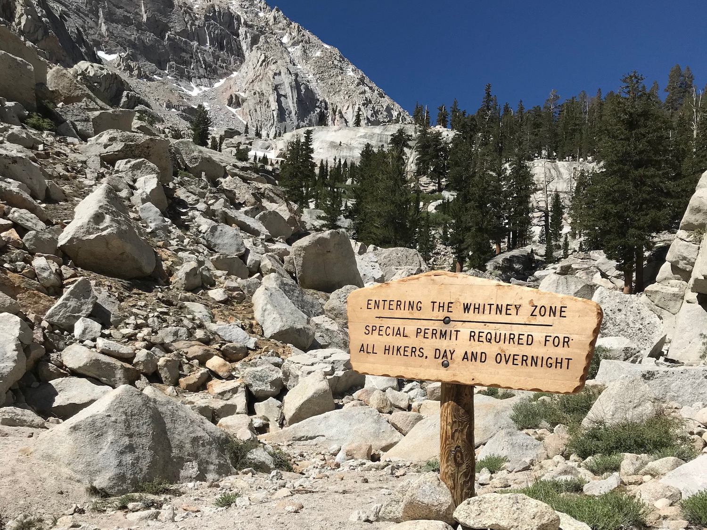
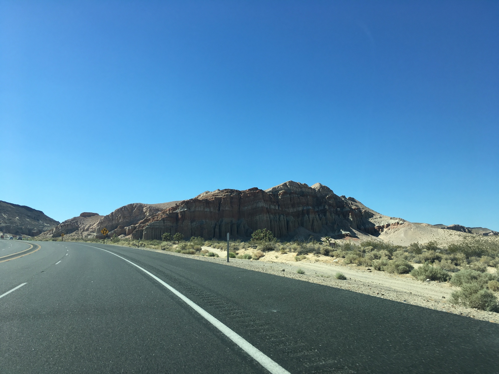

# Mount Whitney: Introduction

Like most trips, there is an option for the drive between San Fransisco and Los Angeles: the scenic route or the fast route, depending upon your disposition.

The former takes you meandering along what is often labeled “the most scenic stretch of highway” in North America, assuming of course the road hasn’t collapsed into the Pacific during one of the frequent landslides, creating a state of seemingly perpetual repair.

The latter provides an expedited corridor via Interstate 5—colloquially “The 5.” Novel the first few times, perhaps if viewed abstractly as an 800 mile line endlessly terminating just out of sight for example, but ultimately a route lined with franchise convenience and designed for speed, traffic willing.

<!-- more -->

My trance when driving this stretch only subsides while passing the distant Sierra, their peaks in view for a while to the east. This was as close as I had gone before, my head wandering there when reading up on the John Muir Trail as a source of afternoon escapism.

You can imagine my excitement, after returning from the [Trans-Catalina Trail](/entries/2018-05-26-trans-catalina), when a trip began to form around summiting Mount Whitney. At 14,505ft not only the tallest peak in the Sierras, but the entire contiguous States. My anticipation stemmed not from it being “the highest”, but simply an excuse to finally visit those mountains regardless of the superlatives.

## Preparation

Although never having visited the Sierras, they’ve played a critical role in my living in Los Angeles. Leaving LA headed north along The 5 an anomaly appears just before crossing the San Fernando Valley border. Cascading down the hillside is the [Los Angeles Aqueduct](https://commons.wikimedia.org/wiki/File:Second_Los_Angeles_Aqueduct_Cascades,_Sylmar.jpg). The annual snow melt makes it’s way to the Owens Valley, where a substantial volume enters the aqueduct to be transported hundreds of miles south to Los Angeles for drinking water, as famously depicted in [Chinatown](https://en.wikipedia.org/wiki/Chinatown_(1974_film)).

Seeing as none of us had winter mountaineering experience, like self-arresting with an ice axe, this trip was planned to coincide with that annual snow melt. A funny habit of checking the Mount Whitney Forum every other minute developed in the weeks leading up to the trip. When the snowpack is still deep the primary ascent is via the chute, a few thousand feet tall, quite steep, and prone to turning into a hellish ice slide.

Despite that it’s entirely manageable, but in part due to the popularity of the summit by being the tallest it’s not uncommon for people to be plucked off the mountain in compromised condition due to inexperience. Not only that, some climbers in the weeks leading up to our visit became involuntary human projectiles and took out a group below by failing to properly self-arrest. As if becoming a statistic is not enough, the risk of unwittingly contributing to the tally because of the negligence of others wasn’t an enticing prospect.

This in mind, our only plan to summit involved taking the ninety-nine switchbacks up from trail camp provided enough snow had found it’s way off the peak and into the valley. Luckily a few days before departing some folks from [Altra](https://www.altrarunning.com/) reported the all clear. Nice.

Our permits allowed us to split the trip over two nights. This provided adequate time to acclimate to the increased elevation, and cuts the summit hike from 22 miles to 7—making it an overall more enjoyable experience.

## Getting There

Our route out of Los Angeles largely paralleled that of the aqueduct, with one brief divergence. After leaving the LA basin behind us for the open desert past Palmdale I looked down and did a double take. Before leaving for any trip I compulsively re-pack my belongings several times to ensure everything is there. Sure enough, the pack was fine, but I had forgotten to put on my hiking shoes!

A quick search led to a Dick’s Sporting Goods, the only viable option provided the uncertainty of if there would be anything suitable between here and Whitney.

Our trip up The 14 took us past a number of geologically fascinating areas. Just a week before I had caught a lecture at [Mount Wilson Observatory](https://www.mtwilson.edu/) by accomplished geologist [Tanya Atwater](http://emvc.geol.ucsb.edu/1_DownloadPage/Download_Page.html), who has contributed immensely to research on plate tectonics, specifically around southern California and the San Andreas fault. She mentioned often taking fellow geologists to the northern terminus of The 14—just off the highway are seemingly frozen snapshots of [undersea fissures](https://en.wikipedia.org/wiki/Submarine_volcano) bubbling up out of the desert floor.

Before too long we arrived in Lone Pine, a town located at the base of Mount Witney, and clearly centered around supporting the associated activity. We spotted an airstream trailer with the words “Ultralight Backpacking” on the rear. Sure enough, it was fully stocked with all the best equipment, including Altras. I grabbed a pair of Timps, merino toe socks (why the hell not?), and placed the pair from Dicks back in the box. Huge shout out to [2 Foot Adventures](https://2footadventures.com/)!

We met up with the rest of the group for dinner at Bonanza then headed up to Whitney Portal at 8,364ft. The plan was to acclimate to the elevation over the next two days leading up to summit to avoid acute mountain sickness. With camp setup we went to sleep without much fuss.

### Tips

1. Speaking of scenic routes, take The 2 to Upper Big Tujunga Rd instead of The 5 to The 14.
2. Keep an eye out for the Mojave DWP building.
3. Keep your pack weight down; every pound counts and you’ll be glad you did tomorrow.
4. Don’t forget your shoes ffs.

### Tips

1. For sure stop by the Portal Store for breakfast. If the flapjacks tickle yr fancy consider splitting with a fellow hiker.
2. Save Lone Pine Lake for the return trip—the move is to get camp setup sometime in the afternoon to afford a few hours to simply hang out.
3. Trail camp can get busy, consider setting up at Consultation for a nice alternative which puts you perhaps 20min from the switchbacks in the morning.
4. There were plenty of places to fill up on water along the way. Bring whatever you consider to be proper capacity for a full day tomorrow, but today simply filter as you go. Less weight yo.

## Digest

It was difficult to gauge how extensive Whitney is prior to leaving as there was a range of involvement described in trip reports leading up to our departure. People do get injured, and we said hello to a few people who did need to turn back because of complications with the altitude.

In general, if the snow has melted, you’re doing greater than ten mile hikes semi-regularly, and can summit over two days, I doubt you’ll encounter any issues.

This in mind, it was rather crowded. While the permit system does help to keep numbers down, I had an awareness of my own effects on the ecosystem around the trail. The feeling of appreciation for something you’re contributing to damaging (in aggregate) are complex to navigate. Everyone should spend time there, but if practical that would of course create irreversible harm as is already happening on a smaller scale. 

No good answers there, apart from promoting best practices such as leave no trace, etc… and if you do check it out, be sure to stay on trail (or at least on granite) and pack out your wag bag ffs!

Shoutout [Jon](https://jongacnik.com/) for contributing about half the photos!