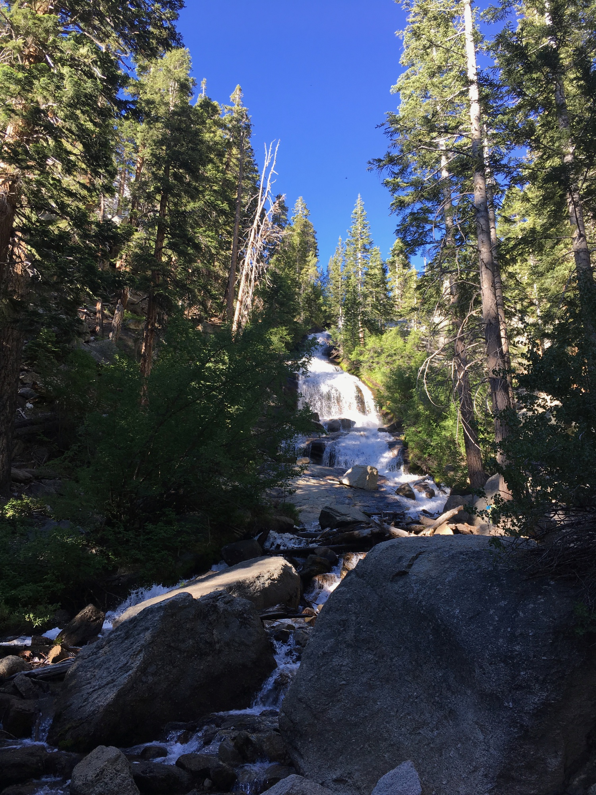
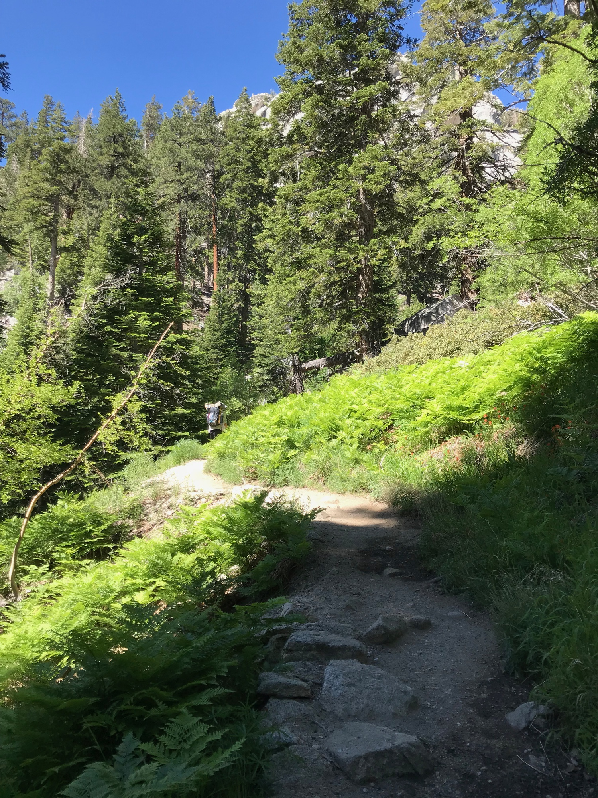
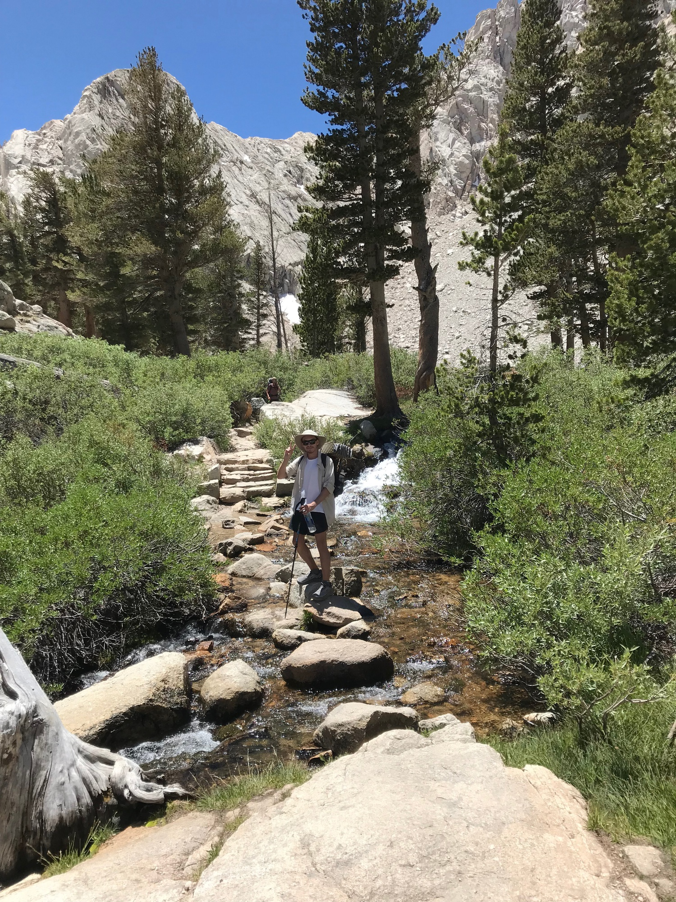

visible: true
index: 
  - [Introduction](/entries/2018-07-01-mt-whitney-day-intro)
  - Day One
  - [Day Two](/entries/2018-07-03-mt-whitney-day-two)
  - [Day Three](/entries/2018-07-04-mt-whitney-day-three)
---

# Mount Whitney: Day One

The day began by breaking down camp and heading to the Whitney Portal Store for breakfast. Jon ordered a pancake the size of a medium pizza and about as thick as your fist. We made our way to the trailhead after securing the permits to our packs, gave them a weigh (I was 24lbs fully loaded w/ water) and started the 7 mile hike to trail camp.

Things start off amongst the pines, still dense at this altitude. Streams of snowmelt from several-thousand feet above provide abundant water, and when mixed with the shade create extremely lush pockets of ferns and resident insects.

As the sun continued rising so too did the heat. The base of the mountain is located in the desert where it was quickly approaching 100°F. Even with the altitude we were feeling it, especially as the treeline approached and the trees and shade thinned out.

A fork in the trail went to Lone Pine Lake. Although not in the plan for today, we did intend to visit this on the return trip. The water looked incredibly inviting.

As the trail ascended each turn seemed to out-do the last. Maybe this was an effect of accumulation, but the “wow”s did not stop.

One thing was becoming clear: there was going to be a lot of water on the switchbacks tomorrow, ultimately a good sign—indication of ample snowmelt which gave us some confidence considering the range of reports online.

Passing through the treeline the altitude was becoming apparent. A dull headache. We took a break adjacent the first sizable trailside snowbank. It’s difficult to grasp size out here. Metaphors of scale fail to accurately portray the magnitude. The artist [Michael Heizer](http://doublenegative.tarasen.net/), known for his massive earth works, dismisses the notion of scale in his work in favor of size, scale being relative and size being absolute.

Hours of hiking behind us, the peaks in the distance still appeared just as large as they did that morning, which I suppose to say they were “as tall as mountains in scale.” Tomorrow was going to be involved.

After the meadow we crested a ridge and damn, Consultation Lake is gargantuan. A little exploring was a must, and revealed several campsites along the bluff. Knowing we were near trail camp, and how that tends to get crowded, we opted to stay here for the night.

After setting up camp there were a few hours to kill. Despite the excessive weight of a hardback book, I couldn’t resist bringing [Aereality by William Fox](http://www.counterpointpress.com/dd-product/aereality/), whose work often explores how cognition transforms land into landscape. 

The reflexive sense of sublimity when zoning out at landscape around us subsided only when falling asleep that night, the silence sometimes broken by the roar of jet engines overhead. Military training flights out of Edwards AFB to the south-east. First you’d hear them, and only after a few moments of of listening would you be able to estimate the direction they were heading. Spotting them required tracing that perceived path across the sky some distance to catch up with the speed at which they were moving, and if you were lucky they’d come into focus.

We turned in early to thoroughly rest up before departing for the switchbacks at 6am the next morning.