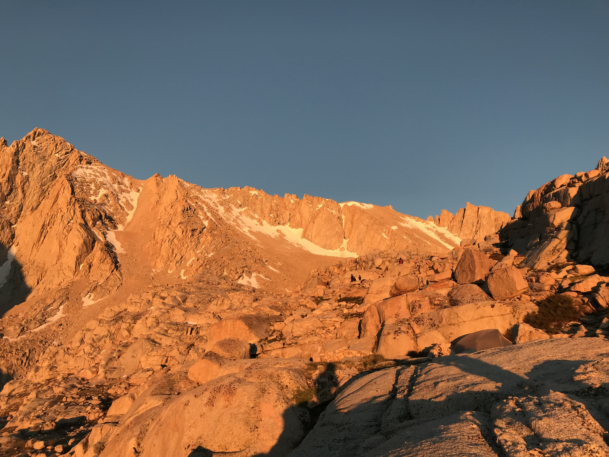
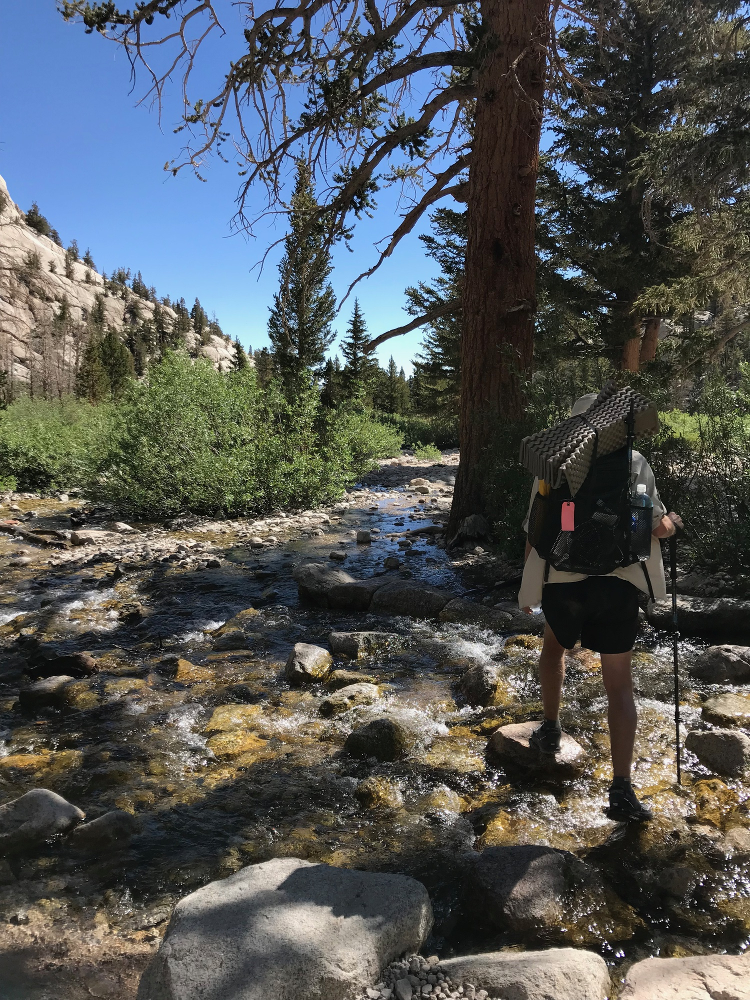
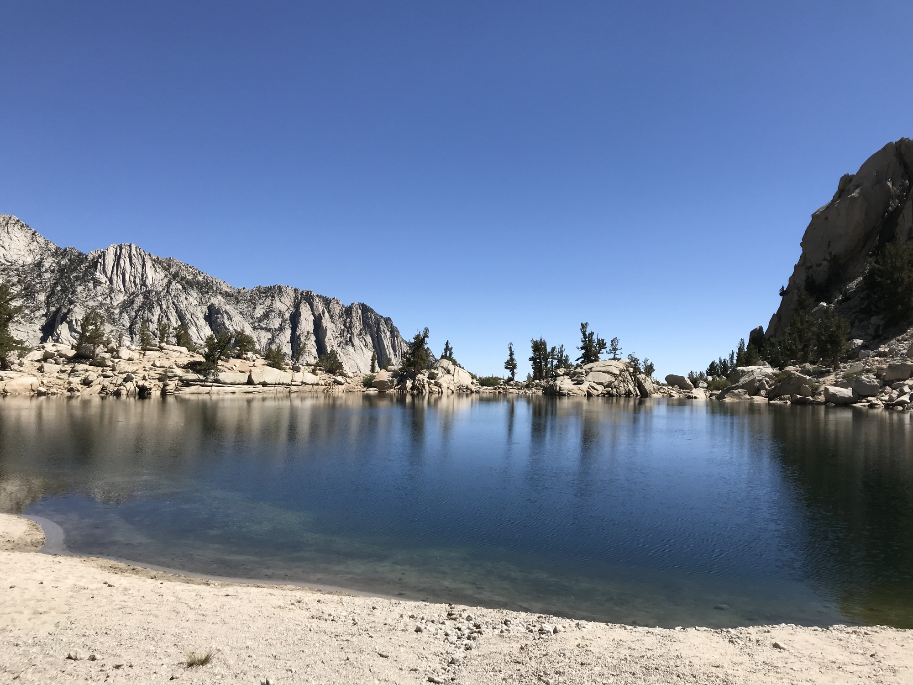
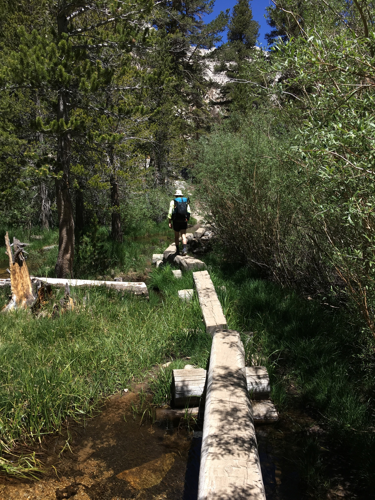
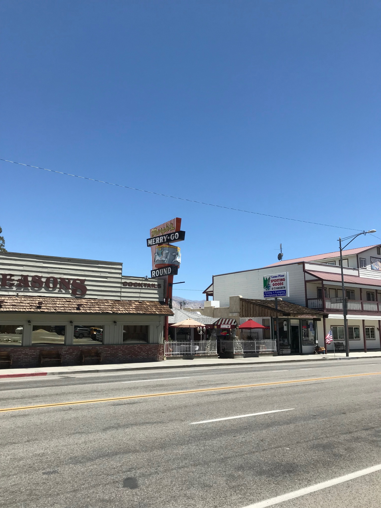
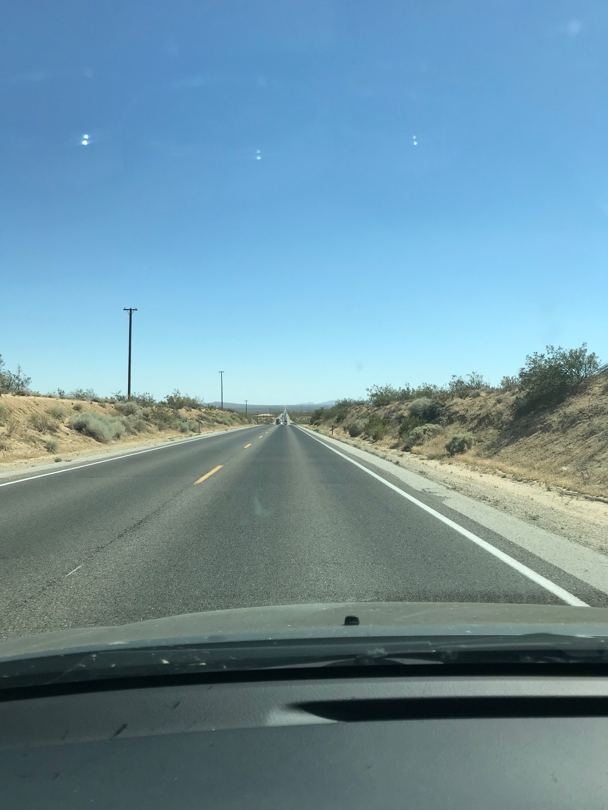

# Mount Whitney: Day Three

We slept in a bit, ate breakfast, and broke down camp. The additional weight of the tent back in the pack didn’t feel great, but it was good to know the day was all downhill.

<!-- more -->

As planned, we stopped by Lone Pine Lake. The water was perfect, and we spent quite a bit of time both relaxing by it’s edge and wading around. The surface of the water constantly rippled due to the sheer number of trout swimming around. This area does not require a permit, and I’m certainly planning on visiting again to camp sometime this summer.

The last few miles went quickly. Looking around me to take in the last moments of the trip the crumbling granite appeared in motion. What looked to be still was actually falling to the valley below, albeit on a geological timescale. 

After finishing the hike and reaching Lone Pine we stopped at Merry-Go-Round, a Chinese spot located in a wood-paneled octagonal structure with a central column clad in mirrors and a $10 afternoon buffet that I absolutely wrecked myself on. 5/5 stars.

Following the aqueduct back to Los Angeles I thought about how the time had passed simultaneously slowly and quickly. What had been a three day trip felt like both *three weeks* and *three minutes*, and continued to make me want to better understand my own sense of time passing.

Back at home I spent the next few days completing an update to [Hardly Everything](https://hardlyeverything), a project meant to effect the passing of time in how it relates to our habits of consumption online by introducing cycles and cadence to the feeds we use everyday.

## Digest

It was difficult to gauge how extensive Whitney is prior to leaving as there was a range of involvement described in trip reports leading up to our departure. People do get injured, and we said hello to a few people who did need to turn back because of complications with the altitude.

In general, if the snow has melted, you’re doing greater than ten mile hikes semi-regularly, and can summit over two days, I doubt you’ll encounter any issues.

This in mind, it was rather crowded. While the permit system does help to keep numbers down, I had an awareness of my own effects on the ecosystem around the trail. The feeling of appreciation for something you’re contributing to damaging (in aggregate) are complex to navigate. Everyone should spend time there, but if practical that would of course create irreversible harm as is already happening on a smaller scale. 

No good answers there, apart from promoting best practices such as leave no trace, etc… and if you do check it out, be sure to stay on trail (or at least on granite) and pack out your wag bag ffs!

Shoutout [Jon](https://jongacnik.com/) for contributing about half the photos!