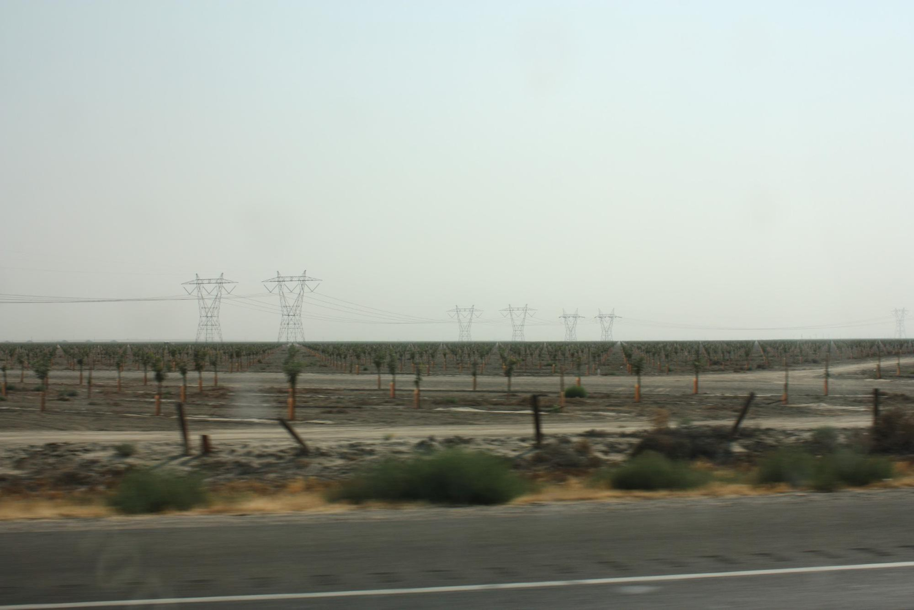
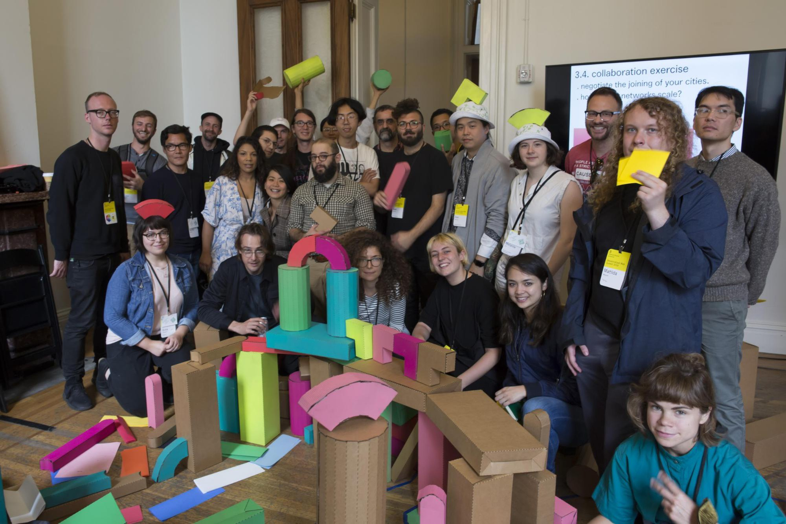
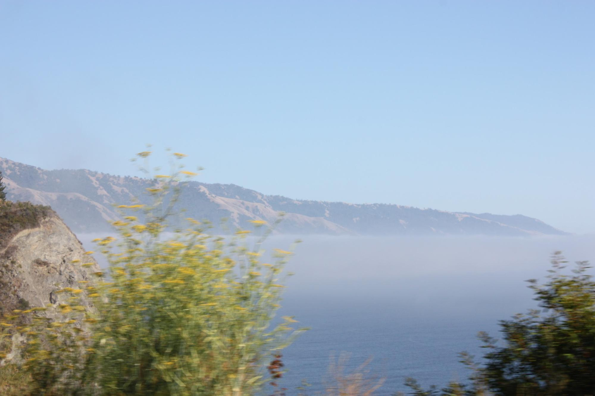

# Decentralized Web Summit 2018

For those of us who grew up connected to the Internet, to say the neighborhood looks a little different now is an understatement. There has been unabated progress. Explosive development. Things are a little broken. The possibility of a future techno-pastoralism continues along the cliché of an epic edenic narrative... but perhaps not?

](image7_56.jpg)

The Internet Archive is a church, both figuratively and literally. Founded by a ragtag group of custodians to the preservation of an earlier web, it's a retrofitted place of worship whose facade is perhaps most recognizable as the white-columned favicon of [Archive.org](https://archive.org). It's located on sacred ground in San Francisco, halfway between The Golden Gate Bridge and its namesake park. Here you won't find any future billionaires rich off an IPO outfitted in [Acronym](https://acrnm.com)[^1] and rolling up in Teslas. Instead, the archive is run by volunteers preoccupied with a history of people using technology to connect to each other, regardless of individual ideology or belief.

<!-- more -->

It was in the Internet Archive space that the first Decentralized Web Summit took place in 2016. In an effort to preserve the open web and evolve the discourse, the summit assembled participants inside of the sanctuary to ruminate on the theme of [Locking the Web Open](https://2016.decentralizedweb.net).

Two years have passed and much has happened. Many came down with crypto-fever. Grassroots communities interested in data-as-environmentalism sprang forth via Google Docs. America voted. Zuck (sic) went to Capitol Hill.

This year the summit moved from the church to a bank, a facade of columns in common. The substantial increase in participants and programming necessitated the additional space. The theme was similarly located elsewhere: [Global Visions/ Working Code.](https://decentralizedweb.net)

## Day One, July 31st

We left from Los Angeles as the sun was rising. After a week of 100°F+ days I found myself wondering when the “Excessive Heat Warning” will no longer be included as an exception in the daily forecast.

Interstate 5 (“The 5”) connects Los Angeles[ to San Francisco by cutting through one of the most productive agricultural regions of the world, which provides a significant amount of the country's nutrition. Handmade signs line the interstate along the edges of fields—commentary on the truly scarce resource in the region.

“Food Grows Where Water Flows!!!”

The opening party was held at The Archive, and upon arrival, that particular type of anxiety produced by seeing a sea of faces a little too much like your own began to set in. The reaction is twofold; it's unsettling to realize both how generic you are, and how homogeneous the people involved in the discourse continue to be.

With this in mind, it was perplexing to many why the kick-off party featured an [interview with Mike Judge](https://www.youtube.com/watch?v%3DB-5HXDOveGM&sa), creator of the popular HBO show Silicon Valley. Granted, the current season features the cast attempting to “drain the cloud” and overthrow the archetypical platform (Hooli) by creating a peer-to-peer protocol. Bringing the participants down a notch through self deprecation was welcome. However, shortly before reflecting on his inability to strategically manage wealth, Judge went ahead and squeezed in a quip about female underwear models and female programmers, prompting everyone's eyes to roll in perfect unison. Judge appeared visibly uncomfortable, and so were we.

Afterwards a friend summarized her reaction perfectly. “I sure hope they didn't pay him to attend after having asked for a list of (and then not inviting) several POC who were unable to afford the $1400 ticket.”

My bubble of friends dispersed and we all headed off to our respective Airbnbs by taking Ubers and Lyfts after Yelping a place to eat.

## Day Two, August 1st

The day began in the courtyard with an introduction from the organizers and a playful exercise in networking by [Taeyoon Choi](http://taeyoonchoi.com) before his [Distributed Web of Care workshop](http://taeyoonchoi.com/soft-care/distributed-web-of-care). At any given moment several workshops, panels, or talks were happening concurrently. Although the intent was to meander more, I quickly realized which rooms contained the programs I found fascinating, and frequented those. (The hardcore cryptography workshops and panels on governance were simply outside my generalist range of understanding.)

](image5_56.jpg)

First up was a workshop on [Beaker Browser](https://beakerbrowser.com), an experimental browser that supports the peer-to-peer [Dat protocol](https://datproject.org). It was my first exposure to p2p publishing several months ago, and is the environment I find most enjoyable to work in.

Just down the hall were [Laurel Schwulst](http://laurelschwulst.com/) and [Kyle Mock](https://www.instagram.com/mocknotes) with their p2p2p2p[^2] workshop, which guided participants through publishing a personal website on the peer-to-peer web with Beaker Browser. Participants completed a short survey about “virtual houses” to generate content that would popular their new personal sites. It included questions such as what happens in your space, and who is there? Laurel and Kyle then provided a simple template site [to fork](https://beakerbrowser.com/docs/tour/%23forking-or-copying-a-website), and we customized our cyber-abodes. In an age of personal brands, there's a clear richness to understanding personal online presence through the lens of domestic space and how we inhabit it.

Afterwards I wandered down to the basement of the bank. Tucked into one of the vaults was Distributed Gardens[^3], a site-specific installation designed to exhibit the technical and creative output of the summit. It also functioned as a critical breath of fresh air, as the room was mostly occupied by fellow misfits.

My day rounded off by catching a surreal interview of [Ted Nelson](http://www.hyperland.com) by Arena co-founder [Charles Broskoski](http://charlesbroskoski.com), which began with Ted theatrically checking his mic by reciting a full several minutes of Hamlet from memory. Charles asked about Ted's Xanadu project, the perpetually-in-progress [origin of hypertext](https://www.are.na/blog/are.na%2520influences/2017/08/01/visions-of-connection.html){.c2}]{.c10} and precursor to Hypertext Markup Language (HTML). One question that stood out was that of being burdened by a good idea. There is a certain weight in feeling the responsibility to execute. To solve problems.

Next was a lively conversation between hypertext researcher [Cathy Marshall](https://en.wikipedia.org/wiki/Cathy_Marshall_(hypertext_developer)) and the musician and journalist [Claire Evans](https://clairelevans.com), during which they reminisced about early hypertext culture and non-linear poetry; the social stigma attributed to contracting for the CIA; and other [memories of Cathy's time at Xerox PARC](https://www.are.na/blog/case%2520study/2018/06/12/women-in-hypertext.html). At the end Cathy quipped on what her mother's reaction would be to her speaking in front of an audience with unbrushed hair. “But it’s important to be authentic.”

My day ended back down in the garden basement with many others from the creative track, a portion of programming that grounded decentralization in creative thinking. Co-organized by [Mindy Seu](http://www.mindyseu.com) and [Sam Hart](http://hxrts.com), it involved many familiar faces from the Arena community. The number of talks, panels, and workshops at first appeared overwhelming, but ensured everyone had some way of fitting in—something I was thankful for.

## Day Three, August 2nd

The previous evening's festivities had me running a bit behind, and I arrived back at the bank around 10:30 am. After some coffee and reconvening with others in the basement garden, I headed upstairs to attend the “Internet as a City” workshop.

Organized by a group[^4] of students and teachers from MIT's Media Lab and Architecture departments, the workshop viewed network connectivity through the lens of the built environment. [From the workshop page](https://decentralizedweb.net/internet-as-a-city/):

> If the Internet were a city, what would be its roads, buildings, and parks? How do people, businesses and governing bodies produce insights into the qualitative characteristics of distribution beyond the tired triptych of centralized, decentralized, and distributed?

Network as environment. This has been on my mind a lot, as it has many others. Is it possible to set aside digital areas as open space, similar to public parks surrounding urbanism?

The workshop involved three exercises, the last of which required the use of a few hundred cardboard boxes of varying shapes, colors, and sizes—all having been laser-cut at MIT and flat-packed in luggage to the summit.

Everyone reassembled into new groups of five, and was delegated a collection of cardboard blocks and colored paper. Each participant in the group had to pick from a stack of cards which would assign them a responsibility: the state, the private interest, the user, the architect, the anarchist, etc. Each member would take a turn in constructing the city by placing a few blocks and explaining the rationale.

Collaboration and friction between members emerged, and quickly spread to other “cities” throughout the room. Some built close to the masking-tape river, others built public parks, and there were even a few toll-roads.

We took a break and evaluated our progress by sharing our processes. One group put most of their effort into building the tallest structure in the room, a narrow cardboard skyscraper reaching several feat. It's role was that of panopticon, sucking up data and piping it back to partner cities.

The mood was jovial—it was play—but ultimately the cities took a very centralized form. Perhaps these monolithic tech platforms we are so critical of are not so much out to get us, but rather are the manifestation of these same decisions being scaled up. It's all fun and games, relatively speaking.

”Your task is to now decentralize the cities.”

Some cities began talking to each other in attempts to broker agreements amongst themselves. Others went straight to the panopticon tower to set up remote locations in an effort to reduce the height of the tallest structure. One began investing in missiles.

The workshop acted as a sort of therapy. Rather than construct a utopian city built upon a foundation of decentralization, most participants seemed to LARP what they perceive around them in their daily lives, exaggerating the wrongs to a comedic degree. “Let's gentrify the areas around the train station to raise rents!”

After the last of the sessions many of us in the basement garden went out for burritos. Later we migrated to a mansion near Nob Hill for an after party. Perched high above the city, we sat around and drank, surrounded by a panoramic view of downtown. A book on the shelf next to the grand piano detailed the nuances of navigating life as a founder. How to keep your money. How to grow your money. How to learn who to trust. It felt like a continuation of the somewhat dystopian outcome of the workshop earlier that afternoon: *You* are the tech billionaire outfitted in Acronym who drives a Tesla.

## Day Four, August 3rd

We left late in the morning for the drive back to Los Angeles, this time opting for the slower route down Highway 1 (“The 1”). It had just reopened after a section was taken out by a landslide more than a year ago.

The drive along the coast takes several more hours than driving up The 5. There would be plenty of time to reflect on the past few days.

Nearing the city's edge, we hit dense fog along the coast—it would stay with us in patches the rest of the trip. My path through the summit felt similar. We talked about how there was a heavy amount of solutionism[^5] hanging over the summit. “In the future we will look back on someone, somewhere, who while at the summit wrote on a napkin the solution to save the world.” This attitude feels somewhat dated considering the state of the industry. To say these issues are to be solved by technology is naive at best. At moments during the summit, it was difficult to see through the clouds of hype, but it was encouraging to encounter those who continue quietly doing the work to understand these complicated issues comprehensively.

There is always palpable energy coming off a gathering of people this size who share a common goal. It creates a sense of infinite possibility, which I believe to be accurate. But what happens the next day, week, month, or year? What do we do with that inertia?

---

Members of the Are.na team and I have had conversations for some time about ways in which to progressively introduce parts of the peer-to-peer web to the platform. Even when your intentions are to make the Internet a better place, many questions still arise when considering the possibility and how it relates to *actually making something*. Does the common person care about data ownership? Is the time better spent elsewhere solving less esoteric problems? Is the timing right? Is the culture there? This is to say nothing about the pragmatics of making a company financially sustainable, invisible geopolitical forces at play, etc...

Ultimately the realities of these questions are slowly revealed only through active engagement. At a moment overwhelmed by speculation, a thoughtful gesture goes a long way. That is to say, progressively gaining understanding through experience.

We continued our drive south towards Los Angeles, the fog thickening during sunset. When considering the seemingly infinite variables affecting the peer-to-peer/decentralized/distributed movement within the environment at large, the summit appears to me as an atmospheric condition. A high pressure system pushing through an upper level low.

---

This written for publication on the [Are.na Blog](https://www.are.na/blog/scene%20report/2018/08/13/decentralized-web-summit.html) as a scene report. Shoutout [Meg Miller](https://twitter.com/megilllah?lang=en) for her patience while editing. I’ll be reading this and having a quick dialog during a [hang session](/hangs) on August 15th.

[^1]: The Urban Outfitters of crypto elite.
[^2]: dat://p2p2p2p.p2pforever.org
[^3]: [Callil Capuozzo](http://www.callil.com/), [Melanie Hoff](https://melanie-hoff.com), [Arkadiy Kukarkin](https://www.instagram.com/parkan), and [Dan Taeyoung](http://dantaeyoung.com)
[^4]: [Agnes Cameron](http://www.agnescameron.info), [Kallirroi Retzepi](https://kalli-retzepi.com), [Sam Ghantous](http://samtous.wtf), and [Gary Zhexi Zhang](http://zhexi.info)
[^5]:  > ...All these efforts to ease the torments of existence might sound like paradise to Silicon Valley. But for the rest of us, they will be hell. They are driven by a pervasive and dangerous ideology that I call “solutionism”: an intellectual pathology that recognizes problems as problems based on just one criterion: whether they are “solvable” with a nice and clean technological solution at our disposal. — [Evgeny Morozov in the New York Times](https://www.nytimes.com/2013/03/03/opinion/sunday/the-perils-of-perfection.html)
