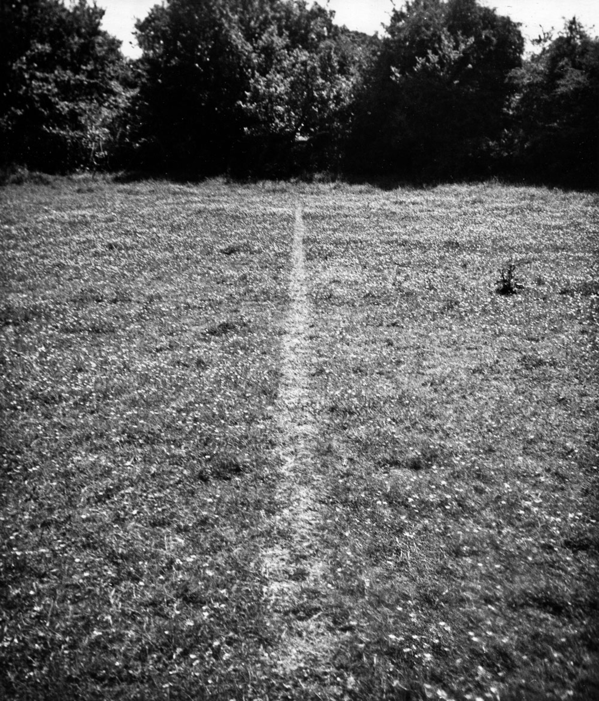
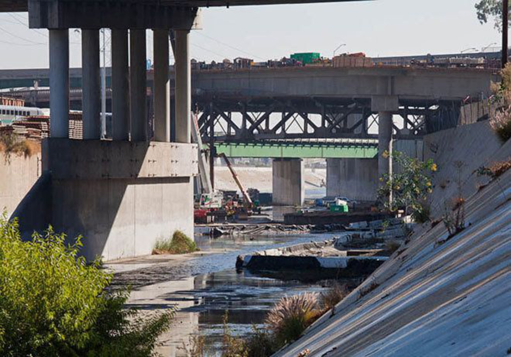

# Walking the Arroyo

It’s late afternoon in Los Angeles, and my sight has been focused on a screen for a few hours. The same was likely true of yesterday, a choice to manipulate bits of material acting as memory distributed across oceans. Within an environment so abstract there is sometimes difficulty placing oneself within it, both in time (*where did it go?*) and space (*where is here?*) It’s hard to pull yourself away. It goes against the use-case.

Five minutes of distraction-free time is difficult when it’s easy to get sucked back in. Taking a break often brings me out to the San Gabriel mountains, visible from my front door some 20 miles away. Being in the mountains deters the impulsiveness. With this being Los Angeles, the distance between my place and a hike is traversed by car and freeway, creating a separation between *here* and *there*.

<!-- more -->

Of course, nature is not somewhere we go to, but something we live within, urban condition and all. William Cronon hits on this particularly well in the essay [The Trouble with Wilderness; or, Getting Back to the Wrong Nature](http://williamcronon.net/writing/Trouble_with_Wilderness_Main.html).[^1]

To better understand the relation between here and there for myself, I began to think about a walk through the threshold of my front door to the foothills of the San Gabriels, creating a sort of symbolic link between the two.

When conceiving of any project involving sight I find myself sketching in the browser. Everything today ultimately becomes a two-dimensional image on a screen anyway—it makes for an obvious starting point when considering form, and I find programming the medium most conducive to capturing ideas.

(Above, “A Line Made by Walking”, Richard Long, 1967 and “In Search of the Miraculous (One night in Los Angeles)”, Bas Jan Ader, 1973)

The work of Richard Long and Bas Jan Ader have been sources of continual interest, both of them having generated work involving walks. Although they were not directly incorporated into the process of considering my walk, it’s worth looking at them again here.

Through repetition Long leaves a mark on the landscape by walking a line, a modest physical intervention. The temporality of the work is made permanent by image making, a photograph on film, the line centered in frame.

Ader is perhaps best known for his gravity works, short video pieces provoking anticipation from the viewer of an ultimate fall. Often using film as his medium of choice, he instead captured his own walk across Los Angeles with a series of fourteen photographs depicting a lone figure, starting in the Hollywood Hills and ending at the Port of Los Angeles. The representation of continuity has [come into question](https://willcenci.com/projects-2/in-search-of-in-search-of-the-miraculous/), as the locations span some 32 miles, requiring a generously brisk pace to be completed in a single evening on foot. This doesn’t bother me—the work is about the resulting imagery produced, not the walk itself.

Looking back, clearly extensive change has occurred in the intervening years. The internet, GPS, and a camera in everyones’ pocket has drastically altered image making and distribution. How would Bas Jan represent his relation to the city today? What would Richard Long’s line look like in the era of “big data?”

Instead of a line left in the grass, my walk will be marked by the resulting metadata produced while snapping photos.

In addition to the goal of better understanding what generates the subjective perception of “there”, the notion of self-surveillance became central to the walk. Watching oneself traverse a landscape, and exposing this stream real-time to others. A continuous redefinition of “here” marked by points along a path for anyone to see.

The page began as a line indicating the intended path along the [Los Angeles river](https://en.wikipedia.org/wiki/Los_Angeles_River) and [Arroyo Seco](https://en.wikipedia.org/wiki/Arroyo_Seco_(Los_Angeles_County)), both channelized after a series of floods, the concrete snaking through the natural contours of the area and providing a clear route when freeway construction began. The path overlaid a tile layer of shaded relief, the rivers appearing as deep cuts through the sprawl.

(Above, Shaded relief of the confluence of the Los Angeles River and Arroyo Seco)

At this point the page was heavy with features. The map would pan and zoom when new points were added. It began to feel like a poorly implemented mapping application, not a personal exploration in place. Also, a side-effect of having pin-point accuracy when sharing a location on a social network is the subsequent attention it draws. Areas once requiring effort to locate are now disclosed to whomever bothers to scroll, leading to crowds, increased erosion and other issues. “Digital leave no trace” is a popular phrase promoting geographic ambiguity when sharing a photo, and borrows from a term suggesting you leave a spot as you found it when camping. This is a complex issue requiring careful consideration regarding accessibility, conservation, and the specificity of a pin drop.

Considering this led to removing most of the functionality, the terrain map, and substituting pins for circles denoting approximate locale. Clearly I’m not concerned about foot traffic damaging an environment which sees hundreds of thousands of cars per day, but it was useful as a focusing mechanism.

The page became blank, marked only by a red line indicating the intended path from here to there, devoid of meaning without depiction of surrounding urbanization. This meaning would be later assigned by an underlying feed of messages, their position on the page mapping to the path through the landscape, and giving form to the trail of metadata left behind in the concrete channels.

The walk began, and after a few minutes I changed my mind about the route. The markers began deviating from the line on the page, the difference between intention and realization. This difference became a theme and stayed in mind as I neared the confluence of the Arroyo Seco and Los Angeles River, an area also occupied by the intersection of the 110 and 5 freeways.

The 110, spanning the distance between Downtown and Pasadena, was originally conceived as a parkway, the “goal was nothing less than the display of the physical and historic landscape of the region through windshield.”[^2] Parkways were popular on the east coast, the first having circled around Prospect Park in Brooklyn, and the regional need for enhanced modes of transportation provided an opportunity to connect with the surrounding environment.

> Transportation efficiency and aesthetic delight were considered inseparable goals of parkway design, which in the early 20th century was described as “bioengineering”—a marriage of architecture, landscaping and civil engineering in a three dimensional design. These dual values which resulted in the design of a road as both a route and a place were carefully incorporated in the design of the Arroyo Seco Parkway.

The image above depicts the confluence of the rivers and the intersections of the freeways separated in time. An overpass in 1938 at what was Dayton Ave, only two years prior to the opening of the Arroyo Seco Parkway to the left, the Riverside-Figueroa bridge just prior to demolition[^3] to the right. Anecdotally, there was an effort to save the bridge from demolition for its historic value and the possibility of becoming [open green space](https://www.youtube.com/watch?v=ei1K9kz_2ns) [spanning the river](http://www.theeastsiderla.com/2013/09/is-it-too-late-to-save-the-riverside-figueroa-bridge/)—Los Angeles’ “[answer to New York’s High Line](http://laist.com/2014/06/03/sorry_la_wont_get_its_own_awesome_h.php),” an inaccurate and unfair comparison.

On an afternoon of festivities meant to bring awareness to the possibility for a park the impossible happened: rain in LA, a foreboding omen, it having washed out several bridges prior. Ultimately the effort was [not feasible](https://la.streetsblog.org/2014/06/02/judge-denies-demolition-injunction-for-riverside-figueroa-bridge/) [within the master plan](http://www.latimes.com/local/lanow/la-me-ln-riverside-bridge-challenge-20140530-story.html). The story remains the same(ish)!

I’m uninterested in urban oddities and cute stories, nor am I trying to point out how strange any of this is—rather, it’s incredibly common. The question is how a historical perspective of the built environment can inform an understanding of unbuilt virtual environments, or that of non-material space afforded by network infrastructure.

> Today, the Arroyo Seco Parkway stands as a representative example of an urban parkway still in use but fraught with problems due to its disjuncture between its original conception and ultimate evolution.[^5]

There are apparent parallels between the evolution of the parkway to the freeway, the web page to the web platform. I can only assume some of the key figures responsible for creating the internet would sympathize with those who advocated for a parkway, as seemed evident through brief encounters when attending the Decentralized Web Summit this summer.

My walk began with the intent to better understand the “here”, “there,” and how freeways and cars generate a perceptual separation between my everyday and the relative sublime of *not staring at a screen for a minute*. I arrived at a place of greater confusion, in the foothills, deep into the feeds. 🙃

Not really a conclusion, but a continuation of a line of thought.

- Visit the project at [arroyo.jon-kyle.com](https://arroyo.jon-kyle.com)
- Complimentary Are.na [research channel](https://www.are.na/jon-kyle-mohr/walking-the-arroyo)
- Please [say hello](contact@jon-kyle.com) if the ideas connect

[^1]: Published in , published in the book [Uncommon Ground: Rethinking the Human Place in Nature](http://books.wwnorton.com/books/Uncommon-Ground/)
[^2]: A Road as a Route and Place: The Evolution and Transformation of the Arroyo Seco Parkway
[^3]: [https://www.are.na/block/2795273](https://www.are.na/block/2795273)
[^4]: Unrelated, but before the parkway or any of these spans were constructed there was an elevated bicycle path, the “[California Cycleway](https://en.wikipedia.org/wiki/California_Cycleway)”, which ran through this area.
[^5]: [Curbed LA](https://la.curbed.com/2015/8/19/9936922/la-river-before-concrete-after)
[^6]: Henri Focillon, via [The Shape of Time](https://en.wikipedia.org/wiki/The_Shape_of_Time)
[^7]: [The Arroyo Seco Watershed Restoration Feasibility Study](http://s3.amazonaws.com/arena-attachments/2753184/131c9d72030337c959626b5bacdf957d.pdf?1537672328), Tim Brick