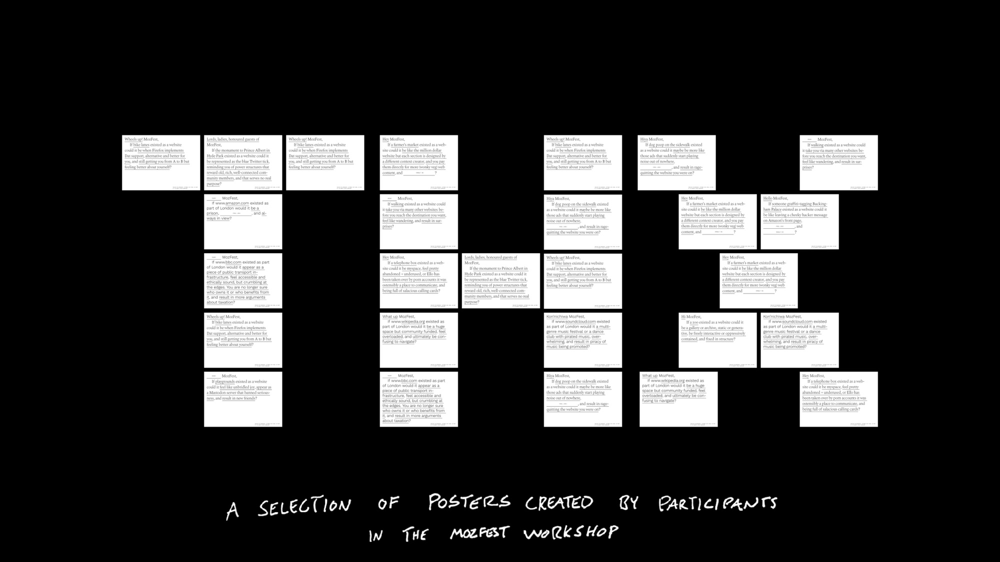
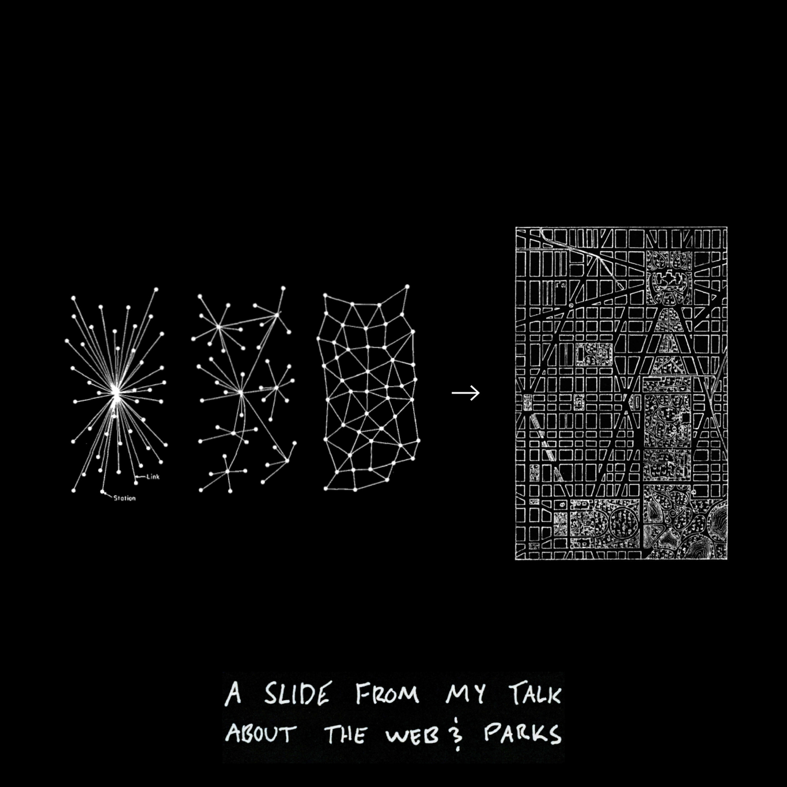

My friends from [Code for Science and Society](https://codeforscience.org), who are behind the [Dat protocol](http://datproject.org), invited me to lead a workshop at MozFest 2018 in London. I’m an outsider[^1] at conferences, but learned MozFest isn’t very much like other technology conferences, the theme of this year being “your data and you.” There was noticeably less hype and self congratulation compared to similar things.

In the week leading up to the workshop I was excited to have [Andy Pressman of Rumors](https://rumo.rs) working with me to develop the concept. While putting ideas together a source of inspiration was the [Internet as a City workshop](https://internetas.city)[^2] I attended while at the [Decentralized Web Summit](/entries/2018-08-05-decentralized-web-summit) earlier this year. What interests me is the the possibility of gaining insight into something as complex as the internet by looking to the city and urbanism as an analog. Particularly when explaining what it means to *inhabit* networks of both the built and unbuilt environments. I’ve also been reading [Slow Manifesto](https://www.papress.com/html/product.details.dna?isbn=9781616893347), a selection of entries from the Lebbeus Woods blog. While catching a flight from San Fransisco to London I read the [entry about the Buffalo Analog](https://lebbeuswoods.wordpress.com/2009/05/15/as401-buffalo-analog/), fortuitously. This paragraph stood out:

<!-- more -->

> The idea of an analog is to be like something else in some ways but not in others. If the something else is part of a city, therefore too complex for any definitive form of analysis, the analog can make manifest and analyzable some essential characteristics, while leaving others, less important, aside. The analog is not an abstraction, though it uses abstraction as a tool. It is not a reduction or a simplification, for it remains complex in its own terms. Rather it is a shift in the angle of viewing and understanding a situation or complex set of conditions, one that gives the opportunity to see the familiar in new ways. This is extremely important when the familiar is, like a part of a city, overburdened with historical interpretations that inhibit the creation of new ones. By creating a parallel reality, the analog circumvents this historical over-determination and  liberates the imagination in ways that can impact the primary reality under consideration. In today’s world of rapid changes, where history is less and less reliable as a guide to the future, intellectual freedom and inventiveness of the type enabled by the analog are increasingly important.

This was something the Internet as a City workshop did well—define new space to reveal something hidden through play. Oftentimes workshops attempt to provide an answer or conclusion, and those involving technology almost always descend into some degree of solutionism.

As counterpoint, the output of our workshop would ultimately be an open question generated by posing a series of prompts about websites and cities, collecting answers, and inputing them into a simple format. I created a tool for doing this, a peer-to-peer application running inside Beaker Browser. We focused on language and vocabulary in order to create a typographically focused set of prints.

The workshop began with a quick intro by [Danielle Robinson](http://www.daniellecrobinson.com) and [Joe Hand](https://jhand.space) of CS&S about Dat. [Olly Broham](https://ollybromham.com) then shared some of his work, and how he has involved the peer-to-peer web in his practice. Next was [Gina Giampaolo](https://whoisgina.com) of [Rumors](https://rumo.rs) who expanded on her introduction to the web and why it’s necessary to challenge users just enough. Last was [Darius Kazemi](http://tinysubversions.com), CS&S’s Mozilla Fellow, who gave a brief overview of decentralized networks.

I gave a quick talk looking at how large tech platforms use the language of urbanism in ambiguous terms, and looking at public parks as a way of contrasting their tendency to think of themselves as “global town squares”. This led into the workshop, and we collected contributions as they were made.

The next day we printed the contributions and taped them up for display everywhere across the nine floors of the conference building. There were lots of other posters promoting talks and panels. Ours existed more as artifacts, asking the viewer to pause for a moment and consider shifting their perspective on the activity around them. 

Of course, the workshop didn’t run without a little difficulty. The network in the building was blocking the port Dat communicates over. These moments aren’t a source of much anxiety, personally, as they reveal certain truths—and also a moment of theatrical drama.

Since I was already in London, it made sense to do an auxiliary repeat the next day for anyone unable to attend MozFest. Fortunately [Gemma Copeland](http://gemmacope.land) is a member of [Evening Class](https://evening-class.org), was able help set something up very last minute.

The format was similar to that of the conference, but became more conversational towards the end. There were about twenty of us, and rather than centering the workshop around language we reverted to the original prompt of an exercise in the Internet as a City workshop, asking participants to write down three websites on cards, shuffle them, pick one at random, and “illustrate the website as a feature of a city.”

This exercise led to a lengthy conversation as people shared their cards, and it was interesting to see the differences between the group at MozFest and Evening Class. [Harry](https://lachenmayer.me) picked a card with [evening-class.org](https://evening-class.org), so he punctured two holes in the card to look through. Good one. One of my favorite contributions was a mistake—Andy inputed “content creator” as “context creator.” Might be my new title.

All in all, a good trip, and I’m hoping to hone in the workshop over time to repeat elsewhere. If there’s any interest in accommodating that, feel free to [say hello](mailto:contact@jon-kyle.com).

[^1]: When I was young I’d go to the *National Association of Music Merchants* (NAMM) conference, as my father is a music engineer and producer, and it was fun to tag along as a kid. Imagine a Guitar Center the size of a stadium. It brings out a lot of the crazies, but at some point you have to respect the dedication. One time, when [attending for RBMA](http://daily.redbullmusicacademy.com/#!/2013/01/namm-2013-anenon) in Orange County, I got lost in the basement. What must have been tens of thousands of off-brand metronomes pulsing all at once, available in every color and pattern, phasing in and out of sync. The strategy for making it out alive is to register the total dissonance as a single drone, like when speeding up a series of individual impulses until it becomes an uninterrupted tone.
[^2]: Created by Agnes Cameron, Kallirroi Retzepi, Sam Ghantous, and Gary Zhexi Zhang