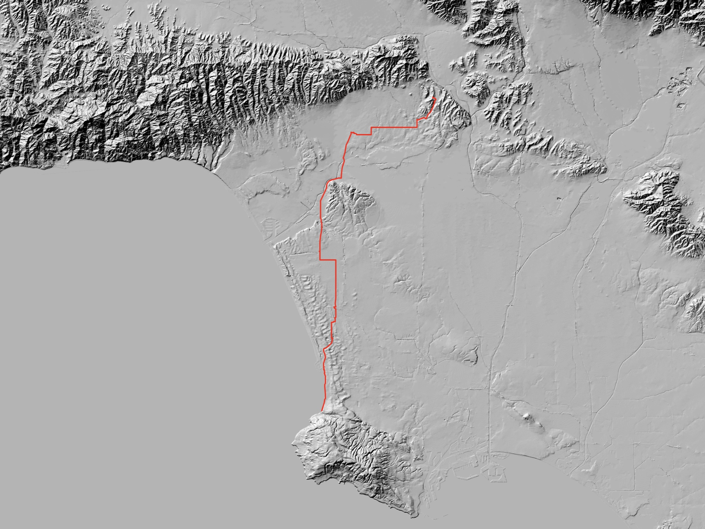

# Los Walk

This video documents another walk across Los Angeles, starting on March 16th (2019) at my front door in Silverlake and ending at Palos Verdes. It lasted 11.2 hours and covered an improvised path of 34.3 miles.

While reading the accounts of a few people who have walked the Pacific Crest Trail it stood out that most of them covered about 30 miles a day. As these walks take place in areas perceived as wilderness, places of immense scale, it was difficult to grok. I wanted to substitute the geologic with the urban to relate the distance to something more familiar. Not just as a line on a map, but to spatialize it by placing it within a familiar environment.

<!-- more -->

Transposing a behavior which is normalized in one context (that of the 30 mile walk in “wilderness”) and placing it within another (that of Los Angeles) contains a degree of absurdity. For instance, when realizing a walk to LAX from the east side is only halfway there.

This durational absurdity makes the walk different from a situationist dérive or other form of [psychogeographic](https://en.wikipedia.org/wiki/Psychogeography) play.

The walk began on my street, cutting down a staircase to Silverlake Blvd. Cross over to 3rd st. Across Wilshire. Down Fairfax to Jefferson to Sepulveda. LAX In-n-Out. Halfway there a decision had to be made.

Going south down Sepulveda was not an option. It ducks under the runways at LAX through a tunnel with no pedestrian walk way. I could go west and walk along the beach, or east to cross along the fence separating the tarmac from the parking lots.

One of my interests in these walks is to observe negative spaces between major thoroughfares or zones where walking is to be expected. Avoiding areas of concentrated pedestrianism. The beach was out.

The stretch along LAX via Aviation Blvd was during the hottest part of the day, and was the only unpleasant point of the walk, though the unpleasantness brought its own realizations to distract from the physical discomfort.

This line of walking led to thinking of the premise for  [*Machine Landscapes: Architectures of the Post Anthropocene*](https://strelkamag.com/en/article/machine-landscapes-architectures-of-the-post-anthropocene):

> The most significant architectural spaces in the world are now entirely empty of people. The data centres, telecommunications networks, distribution warehouses, unmanned ports and industrialised agriculture that define the very nature of who we are today are at the same time places we can never visit. Instead they are occupied by server stacks and hard drives, logistics bots and mobile shelving units, autonomous cranes and container ships, robot vacuum cleaners and internet-connected toasters, driverless tractors and taxis.

The area I found myself in surrounding LAX has the infrastructure for walking—sidewalks enforced by building code—but clearly it was never intended for anyone to actually *walk* this particular stretch of the city.

In this sense it is possible to view Los Angeles as a proto-machine landscape. A landscape not absent of humans, but absent of humans unaided by machines. A point within the gradation from life in the city to life in the cloud.

The title *Los (Walk)* is an homage to James Benning’s [*Los*](https://www.youtube.com/watch?v=SXffOiDPNO0). The concept of “landscape as a function of time” and his emphasis on looking and listening are constant sources of inspiration.