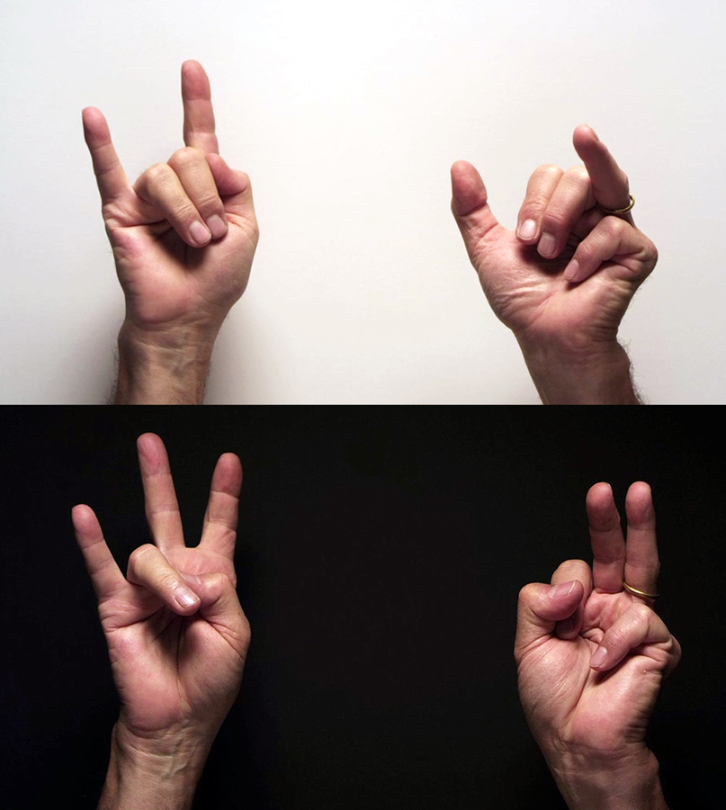

# Sitting in a Room

I was recently invited to see an evening of work by [Alvin Lucier](https://en.wikipedia.org/wiki/Alvin_Lucier), the  sound artist. His work centers around physical properties of sound, and involves phasing and resonance. All of the pieces but one that evening were performed by an ensemble. After an intermission Alvin walked onstage, sat down, and performed [*I am Sitting in a Room*](https://www.youtube.com/watch?v=fAxHlLK3Oyk).”

Lucier records himself narrating a text, and then playing the recording back into the room, re-recording it. The new recording is then played back and re-recorded, and this process is repeated, emphasizing certain frequencies as they resonate in the room, until eventually the words become unintelligible, replaced by the pure resonant harmonies and tones of the room itself.[^1] Slow motion feedback.

> I am sitting in a room different from the one you are in now. I am recording the sound of my speaking voice and I am going to play it back into the room again and again until the resonant frequencies of the room reinforce themselves so that any semblance of my speech, with perhaps the exception of rhythm, is destroyed. What you will hear, then, are the natural resonant frequencies of the room articulated by speech. I regard this activity not so much as a demonstration of a physical fact, but more as a way to smooth out any irregularities my speech might have.

The afternoon before the performance I revisited [an interview](https://www.redbullmusicacademy.com/lectures/alvin-lucier-lecture) Todd conducted with Alvin a few years ago. On Sitting in a Room, Alvin had to say…

> In those days, if you wrote atonal music, you’d write these complicated tone rows. You’d never hear the tone. Everything is hidden. The technique of the composition is hidden. … I thought, “I’ll tell people what I’m doing. That’ll be the subject matter.” I didn’t want to use a poem or a text or anything hifalutin. I’m sitting there in that room, probably not the one you’re in. I’m recording this sound and I just wrote it out. I recited it into the microphone, went out in the room, made sure that the tape wasn’t saturated. Spent the rest of the night outside the room re-recording that. That’s how I did that. Very simple.

This reminded me of when I had first moved to Los Angeles, and not knowing anyone outside of my project I made a solo stop by LACMA—locals were granted free admittance after certain hours. On view was Bruce Nauman’s *For Beginners (all the combinations of the thumb and fingers)*, a large scale video and audio installation, recently acquired as part of the permanent collection.

Centered in the large reverberant room was a scrim, image visible on both sides, and in each of the four corners were loudspeakers. The piece involves a projection of two stacked videos, each containing two hands.

> Left hand, fourth finger, first finger  
> Right hand, second finger, thumb  
> Left hand, fourth finger, second finger, first finger  
> Right hand, second finger, third finger

Each hand is assigned a channel of audio, and the two videos play simultaneously, phasing together and interfering with each-other as spatialized by the image and sound.

By the time I walked into the room in which the work was installed it was night, the only illumination being a diffuse glow of the projection. A small bench was positioned halfway between the scrim and the wall.

I sat down, and only realized having lost track of time when the docent announced the museum was closing.

---

Self-describing processes are the highest form of work. It states the obvious, creates a point in which you can relate the work, and hints at what lies beneath.

- work as communication
- little patience for intentionally obscuring

- self describing systems

[^1]: [Wikipedia](https://en.wikipedia.org/wiki/I_Am_Sitting_in_a_Room)
