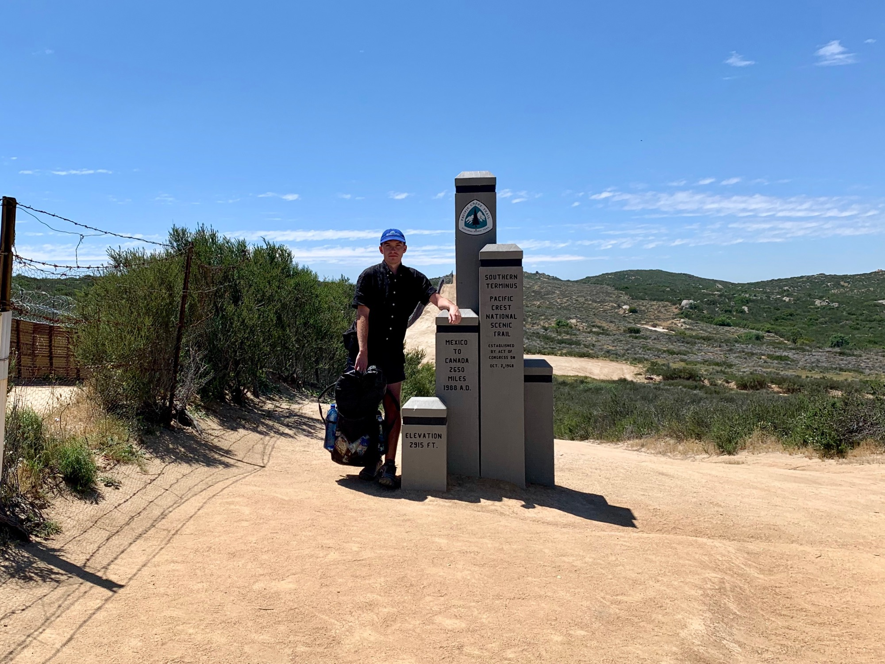
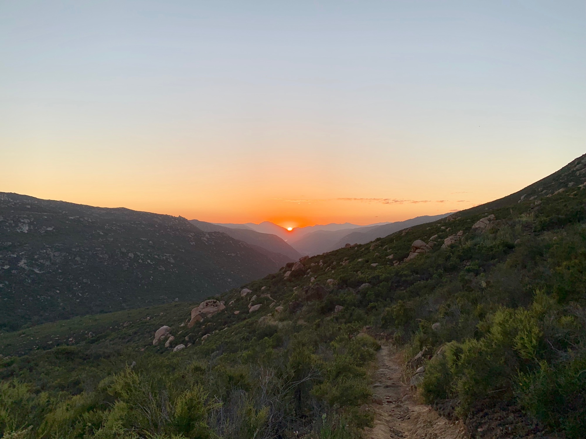

# Day One

By the time we made it to the monument marking the start of the Pacific Crest Trail it was already mid-day. 50 people are starting a day, many of them flying in from elsewhere and beginning in the early morning after staying with a local host.

After more than a year of kicking around the idea, and months of planning, here I was occupying the familiar image of the hiker beside the monument. Once I had shown even a passing interest to YouTube and Instagram my feed had been flooded with images of people in the same photo. Am I here because of the relentlessness of their algorithms, amplifying my passing interests back at me until they become this sort of moment?

<!-- more -->

Inhabiting this image, I look to see the border wall behind me. On two opposing hills marking the horizon are equipment used to identify and track individuals as they cross the border, another invisible layer I inhabit, occupying space above the sandstone.

Last year, two hikers set out to be the first to [walk the length of the US/Mexico border](https://www.outsideonline.com/2333816/two-women-just-completed-first-border-thru-hike).

> Americans of all political leanings seemed to view the border as a kind of war zone, and the hikers constantly had to square their preconceptions and fears with what they discovered on the ground. Repeatedly throughout the trip, they would hear that the really dangerous area started 50 miles ahead. When they reached that section, the locals there would say the same thing.

A cloud appeared on the horizon near one of the hills as a border patrol vehicle approached. Embodying the image of a young ultralight through-hiker he didn’t bother to blink an eye when seeing me and continued on.

The afternoon was full of familiar images taken by excited walkers on their first day. Eventually the details outside the frame begin to appear, and it feels less like you’re walking through the uncanny valley. The unusual abundance of water. The rock formations beneath my shoes, mostly Tonalite dating back 145–100 million years ago.

By 6pm I had put in about 12 miles, and there were several campsites, a few still open. My goal had been 15, so I continued down to a valley below. It was suggested not to camp there as to not disturb a species of increasingly rare frog, and the only option was to begin scaling the 3000 feet of elevation up to Lake Morena.

I found a single site positioned on the side of the ridge overlooking the valley. As I made camp a Blackhawk came screaming up the valley, below my elevation and barely clearing the gap.

To wind down I read the first few pages of Assembling California by John McPhee, my one “luxury item” as books weigh a bit. The sun set and I went to bed, helped along to sleep by [Budd and Eno](https://m.youtube.com/watch?v=ZvUQmEqOAUQ).