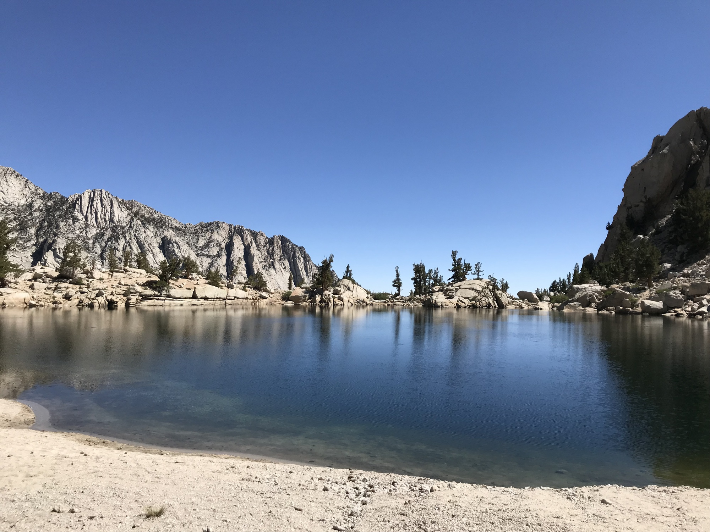

# Day One

Things begin amongst the pines, still dense at this altitude. Streams of snowmelt from several-thousand feet above provide abundant water, and when mixed with the shade create extremely lush pockets of ferns and resident insects.

As the sun continued rising so too did the heat. The base of the mountain is located in the desert where it was quickly approaching 100°F. Even with the altitude we were feeling it, especially as the treeline approached and the trees and shade thinned out.