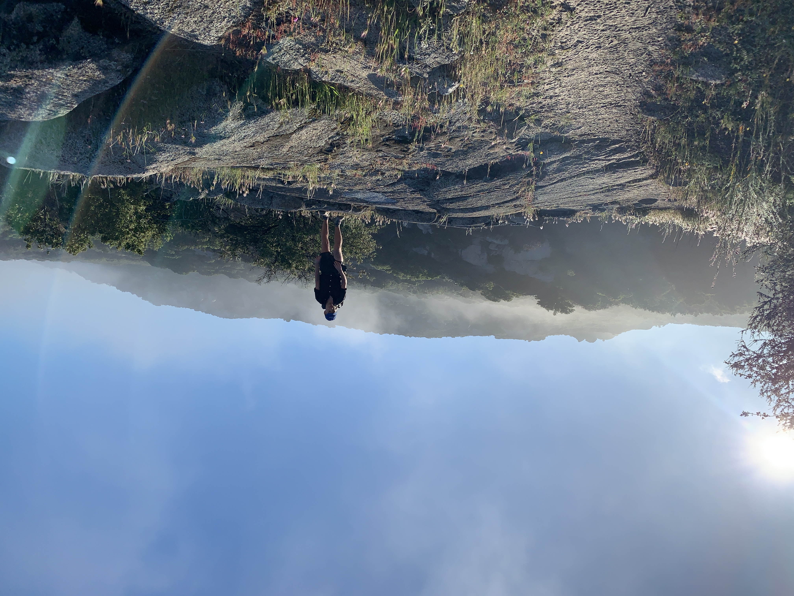

# Day Two

Woke up at 6am to fog covering the valley below. By the time camp was packed most had burnt off and I could see the trail heading up to Lake Morena.

After getting into town I had a breakfast burrito and ice cream sundae—the hunger is real. The shelves were lined with snacks, and I made the mistake of buying some even though I had more than enough food for the carry.

<!-- more -->

The afternoon continued, walking above a stream carving out a canyon along the seam separating Tonalite from the Cretaceous and Granodiorite from the Jurassic. The division was clearly visible in the cold grey of the Granodiorite to the west and vibrant reds of the Tonalite to the east.

Eventually the stream turned to cascades, and a trail (or more like a scramble) appeared, offering the option of resting and wading in the water. I had wanted to continue getting miles in, but thought nothing is guaranteed—I might twist my ankle tomorrow and that will be the end of my walk, so might as well enjoy it.

I was glad I did, and ended up staying for about three hours, sitting a rock with my feet in the water and making a dent on the only thing sweating more than me; a sizable block of gruyère I had packed in.

I had considered making camp there for the night, but. Hose to continue along. A few miles up the trail a truck was parked ahead on a dirt road, the driver and passenger waving in my direction. They told me they had reserved several sites at the campground a mile from here, had plenty of food and beers, and a few hikers were already lounging around.

They handed me a beer and I hopped in the back of the pickup bouncing around d as we descended the “road.” As we pulled up I recognized a few faces from earlier in the day on trail. The left handed Belgian drummer and I talked most of the time over an essentially unlimited supply of free carne asada burritos and beers.

Although the campground was a little loud, I went to bed with a maxed out stomach. The bar is set high.
