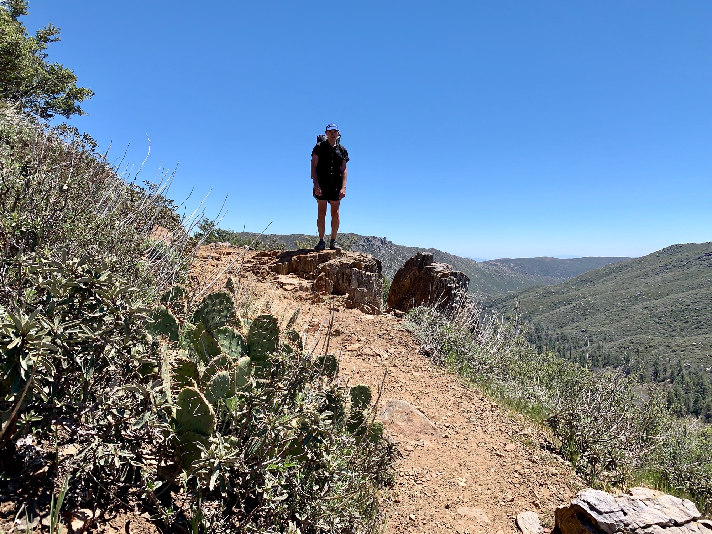
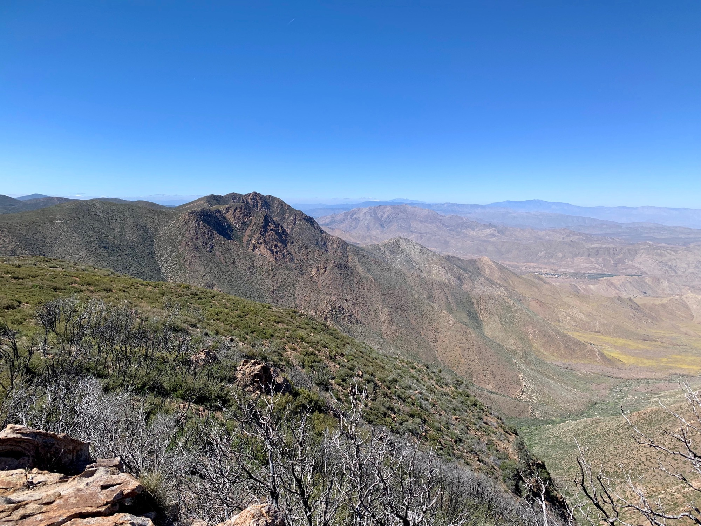
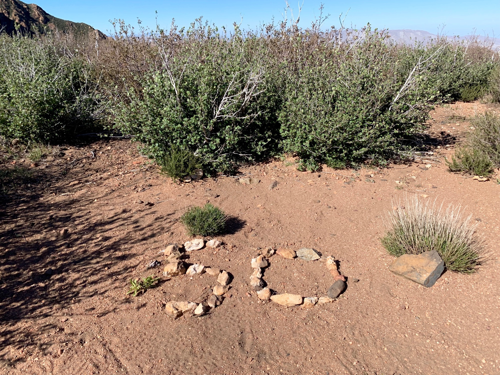

# Day Three

I woke as the sun came up and nodded back off for no more than 5 minutes before the wind ripped out one of my tent stakes, slapping one of the corners against my face. Time to get up. Another hiker was awaking at the same time, and one or the hosts drove us back up to the trail.

The day began with a 10 mile climb up to Mount Laguna. In the desert the morning is the best time to get miles in while the air is still cool. Aiming to do “10 by 10” was the aim today.

<!-- more -->

The miles flew by, the grade of the trail never too extreme as to accommodate those on horseback. Getting into Mount Laguna there was one destination in mind: the lodge where food was served.

I had a huge plate ordered from the “Easter specials” which required a brief intermission. The ordeal was more physically demanding than the 10 mile walk uphill.

The next 10 miles were all downhill, so I put it into high gear and began the descent. I was looking down to spot my footing, and when I looked up I had an expansive view of the valley all the way to San Jacinto and Big Bear, the former with an ETA of a week plus a few days.

This section of trail is notoriously windy, the flatness of the high prairies terminating at sheer cliff plunging to the desert floor below. Not long afterwards I spotted a few ravens above relaxedly soaring in the ridge lift.

In the middle of the windiest stretch I looked down to see rocks organized into a welcoming marker indicating the first 50 miles are behind me.

Camp ended up being a day use area. The rules are a little vague about where it is ok to camp when holding a PCT permit—technically it is anywhere with flat ground along the trail. Just to be safe those who arrived set up in an area difficult to see from the road.

The sunset cast apenglow on the Sawtooth Mountains and I turned in for the night.

