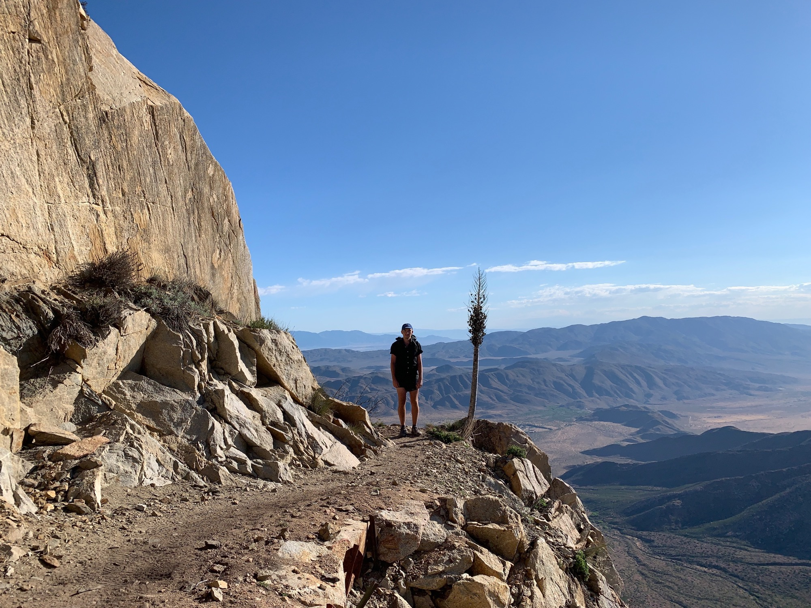
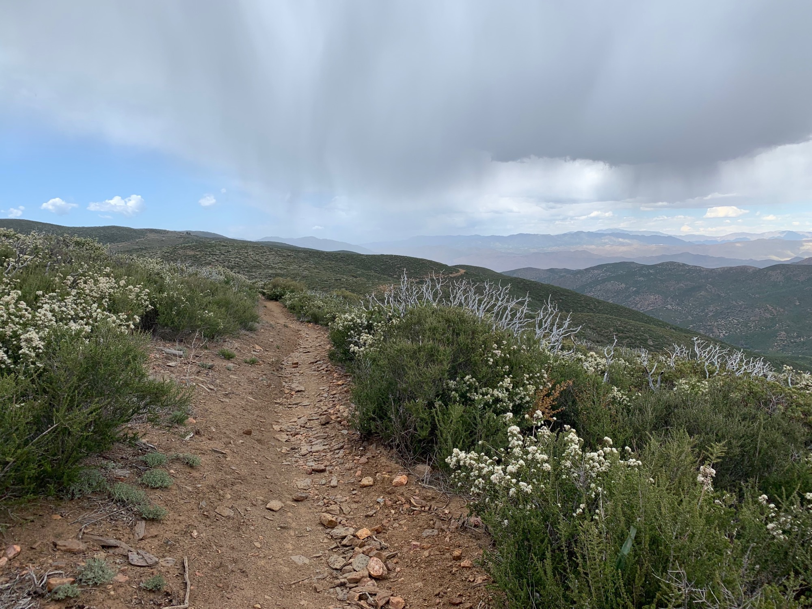

# Day Four

After filling up on water at a nearby spicket I began heading up trail. This section was once a seasonal path taken by the Kwaaymii and Kumeyaay as they made their seasonal traverse from their summer dwellings in Mount Laguna to those of the winter in the desert below.

I was feeling great, and the view of the lenticulars popping off the early morning mountain waves created a dynamic scene.

<!-- more -->

Ahead of me was a 20 mile dry stretch of no water, as indicated by the available map and most recent comments. This required filling up a few liters at the “Sunset Trail” cistern.

After nearing about where I anticipated the turn off for the water to be in saw a sign indicating “Sunset Hwy” was 0.5 miles off trail. That sounds right. I decided to double check on the map and gps, the which indicated the actual water source still some of age off.

Sometimes the gps takes a moment to update, so I waited a few minutes, yet my indicated position did not change.

Reluctant to trust instinct I decided to follow the map onward. As my legs and feet felt good I was cruising along. Eventually I paused, certain that I would’ve hit the turnout by now.

> 2 miles past cistern

What the! Turns out I had been at the turnout as figured, and now I what had all been a pleasant downhill now needed to be backtracked as mildly daunting uphill. Annoying: yes!

I returned to the water to eat lunch and noticed those lazy lenticulars had developed into puffy cumulus, some with darkening cloud bases.

Maybe we will get a little rain?

I continued entering into the 20 mile dry stretch with 4 liters of water in tow. A big portion of downhill made my left shin become progressively sore to the point of a mild hobble.

Somewhat fortunately a substantial dirt road uphill followed, often a drag, but now a nice means to stretch out this stubborn foot.

After reaching the peak of the hill I looked around to notice more grey just above the trail ahead. Not the the west. Not to the east. Just where I was headed, and it looked to be moving my way.

I began heading along a ridge line that would soon drown to the desert floor, but for now continued along at around 5000ft.

Then that 10% chance of rain became 100% as it began pouring. This was somewhat welcome as the temperature was at the upper end of “hot”, but quickly became a real bummer as the first clap in of thunder echoed off the canyon walls.

After taking a pause at a campsite I decided to continue on. The rain was heavy, but thunder seemed some ways off. Just shy of a mile later looking at the trail ahead a sudden flash shortly followed by a sharp boom. Cloud to ground lightning directly in trail. There was barely time for two “Mississippis” before the sound made its way to me.

For the second time today I backtracked to that campsite from before and setup camp in heavy rain and lightning. It was only around 4:30, cutting the day short.

Rain continued to intermittently fall as night set in, and down in the canyon far below a sports car revved and set off what sounded like hundreds of coyotes. There were so many at such a distance that it took on the sound of one continuous drone.

I fell asleep, but only after realizing the snoring coming from one campsite over was indeed not a bear.

Total mileage was a modest 13.5, but with all the backtracking the total was closer to 18.
