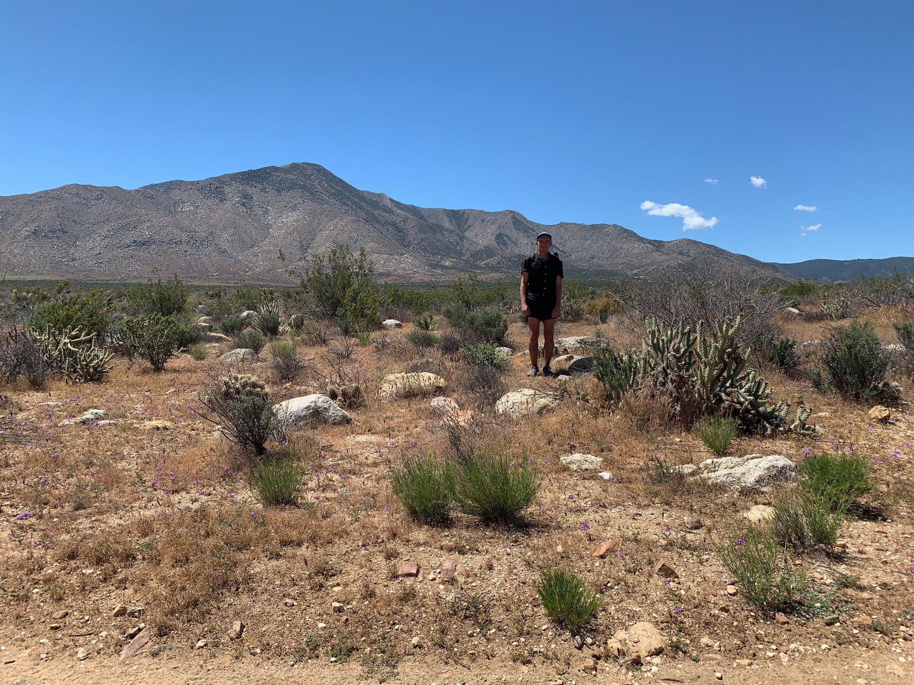
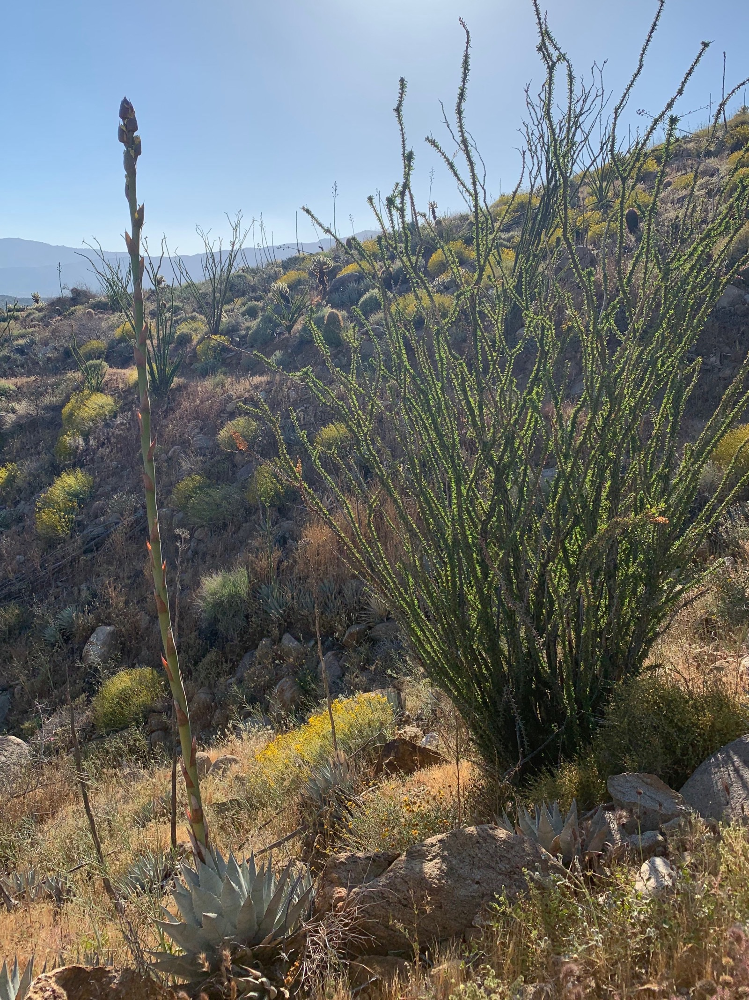

# Day Five

I saw the sun peeking out from beneath the walls of my tent. I’m tired from last night’s intermittent rain, but decide to break camp and get moving. Whatever unpleasantries lingering from the preceding day evaporate with the morning dew.

The first several miles took me from the ridge at around 4100ft down to 2000ft, the trail hugging the canyon side and dodging gigantic round monzogranites until bottoming out.

A water cache was hidden under a bridge, and I had heard a rumor of free pie in town, 13 miles away, and if tempted required me to hitch hike into town.

I stood with my thumb out with one other hiker, and after 10 minutes a nice lady in a mini-van pulled over. “Hop in! No seats in the back though.” She explained how she lives in San Diego and drives for a food delivery app—a few regulars order fresh groceries once a week as it’s cheaper than what is available locally. I don’t understand the economics, but assume it’s all subsidized by venture capital while losing money, like most similar bets.

She drops us off and the town is covered with banners declaring “Welcome PCT Hikers.” We go to Mom’s Pie and see a few familiar faces at a table. I order a free pie (apple caramel crumb), free ice cream (vanilla cinnamon), and a free drink (coffee.) Insanely delicious.

After this we ate $10 calzones weighing 10 pounds each. I took half of mine with me.

The hitch back to trail was non-eventful, and took perhaps another 10 minutes. Once at the trail we began on up, gaining elevation. Along the way someone ahead spotted a large rattlesnake, my first one trail.

I eventually picked a site also occupied by a hiker I had met at the water cache earlier. We turned in a bit late after talking, and planned to eventually catch up tomorrow.
