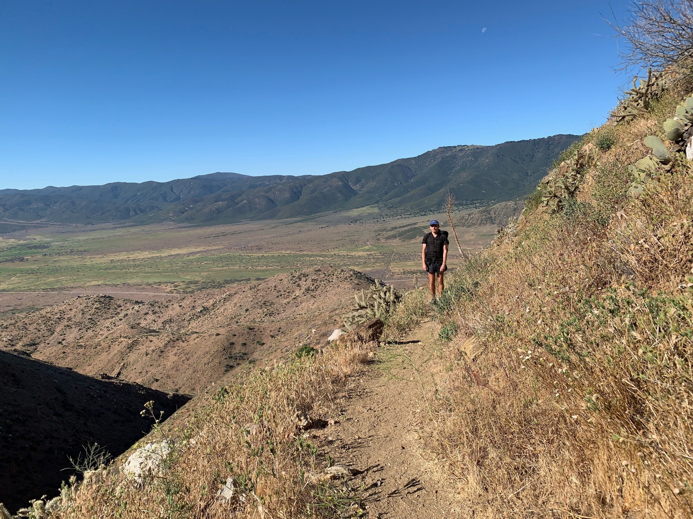

# Day Six

Morning quickly came and I was off at around 5:30. The first half of the day involved mostly graded but consistent up. The terrain rolled along, bringing me up and down a few distinct hills and canyons. The PCT is anything but a straight line, meandering in unclear ways.

There was a long water carry, and everyone I ran into was heading towards the same water cache. I arrived around 11 and made my way down a dirt road to one of the most beautiful sights you’ll ever see while walking through the desert at high noon: hundreds of one gallon water bottles tucked under some trees.

The heat was extreme, and after filling up a few of us found a generous patch of shade for a siesta. I did a little due diligence on my feet (still no blisters or anything) and then kicked back.

I waited until 3pm to until getting back on trail, trying to let peak heat past, but it was still very hot.

With a few miles out from camp we reached a milestone: mile 100. It seemed to have taken both no time and all the time simultaneously. My goal was to hit at least 100 on the first week, and here we were on day 6.

Camp for the night was the sandy wash at Scissors Crossing. A few of us were hanging around the water source when I made a crucial contribution to trail culture; giving someone their trail name. Everyone agreed it was suitable and headed for their respective tents.
