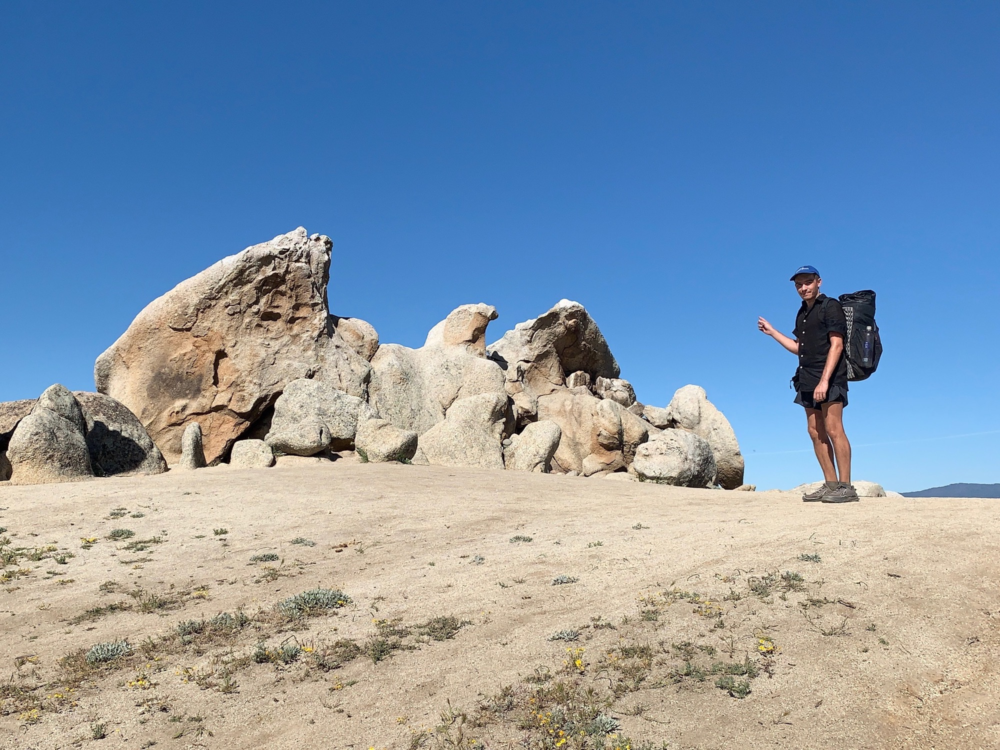

# Day Seven

It was late, relatively speaking. I had slept in till around 6:30 and was the last one out of camp. Today would be an easy push into Werner Springs, the first “hiker community” on trail.

The first few miles were through sprawling green meadows, some wildflowers from the rain earlier in spring lingered. In the distance I could see Palomar Observatory.

The trail running through the field created a single vanishing point on the horizon, continually renewed after cresting the one immediately ahead. In scenarios like this I like to really focus on my peripheral vision, staring into infinity at that single point, and paying as much attention to things exiting my field of vision as those at the center of it. It creates a shallow depth to the surrounding landscape, almost turning to it into an image I’m walking through.

Before long I reached Eagle Rock, another pin on the PCT map. I’m unsure how this formed, but it almost appears as a stack of erratics in s glacial depression. Anyone know?

The last few miles paralleled a tree-lined spring, shading me from the afternoon sun. It felt less like a “hike” and more like a stroll.

I arrived at the community center. Around forty hikers were hanging around, and an air stream trailer equipped with much of the best gear was parked ready to satisfy the itch for an upgrade.

Some familiar faces from the trail and I walked a mile to the club house of a golf course. I ordered the carne asada burrito and talked another hiker into splitting a bottle of white from a local vineyard.

Another hiker had mentioned being unsatisfied with her sleeping pad. Luck would have it that she wanted to try mine, and I her’s, so we swapped.

I quickly fell asleep to the sound of forty hikers tossing and turning to get comfortable as cattle stampede in the distance.

