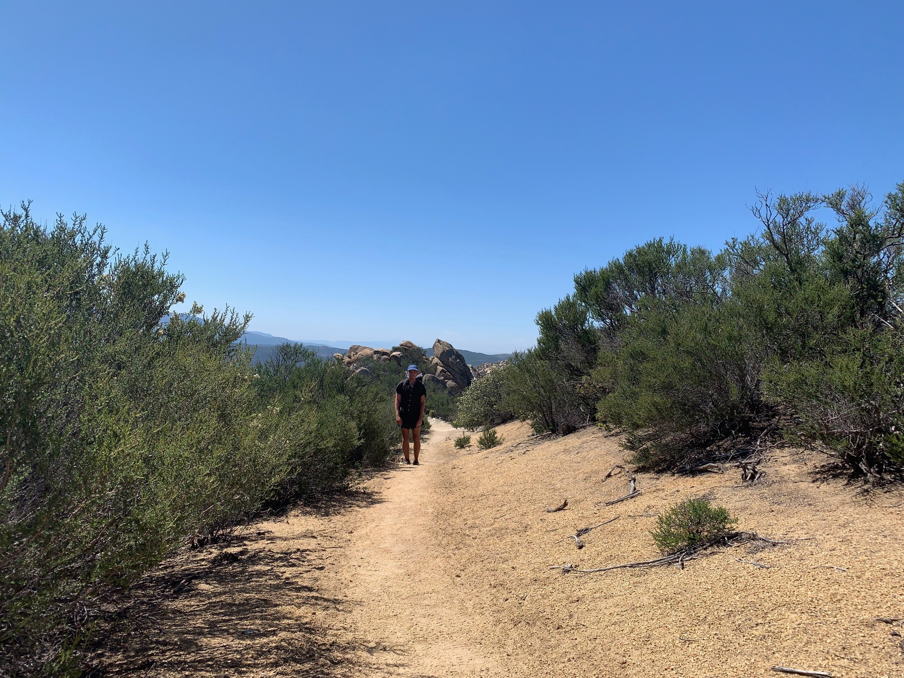

# Day Eight

I woke up early after my best sleep yet thanks to the pad swap and realized I had forgotten to square away my resupply, requiring me to wait until 8am when the community center opened. When it did I scored some free meals from the hiker box, the got on my way, albeit a little later than intended.

An issue with my water filter system, a Sawyer Squeeze, prompted me to take 3 liters of water from the center with me, postponing my first stop of the day.

<!-- more -->

The day was hot and me headed upwards. In an effort to avoid the annoyance of filtering with a leaky filter I was not drinking enough water. Normally I would take a break during the afternoon to let the hottest stretch of day pass, but there was a plan to swap back sleeping pads at a certain water spot, and so I hiked through the heat.

The combination had me feeling fatigued. I should have stopped to filter despite the annoyance. Luckily I ran into the loaner, and we decided to continue the swap for a while—fortuitous!

The day ended with a push to “Mike’s Place,” a holdout in the desert owned by a patron of the PCT who purchased property near the trail to offer hikers free drinks, food, and a place to make camp in an otherwise empty stretch.

Rolling in some things seemed off. There were some attitudes, and a few seemed to be there as a form of escapism. Those making decisions seemed to get off on being in the position of instructing others.

Some hikers had made pizzas and prepared them in the pizza oven onsite. I had a few slices and whatever drink was available.

Puns, who I had been frequently running into in trail and hiking with a bit, was there too. We decided to camp elsewhere after contributing to the clean up effort.

We night hiked around 5 additional miles along a ridge, the lights of a town glowing ahead of us. We made camp and called it a night.

We would later find out a fight broke out at Mike’s this night. The trail and the culture surrounding it are full of great people. Maybe skip Mike’s.

