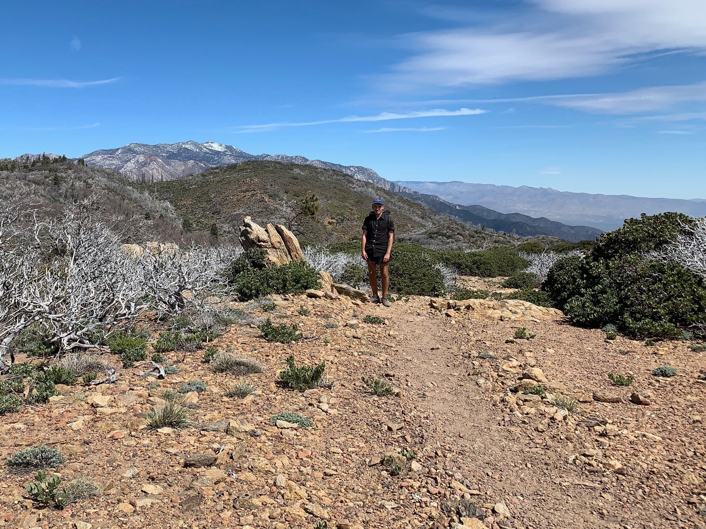
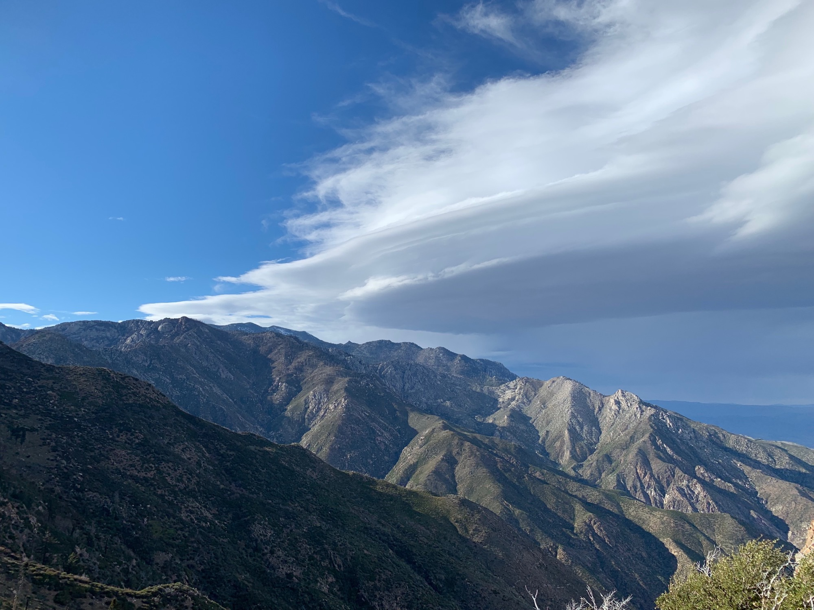

# Day Ten

Huge lenticulars glowing orange over Jacinto indicated the imminent sunrise.  The trail began by taking us past huge round granites, up a bit, then back around past the same rocks. The PCT loves to meander. It’s less of a walk from Mexico to Canada and more of a walk around the west coast which happens to trend northwards.

Fortunately the trail rose upwards following the west side of a large ridge, keeping the rising sun off my neck and the temperature cool.

By 10am 11 miles were in the book. Not bad considering it had all been at a steep grade, now finding myself looking far out over the valley where camp had been and the snow capped peak of San Jacinto getting closer and closer.

<!-- more -->

Soon the chapperell faded into alpine foliage and pines, the air getting crisper by the mile. A hard line marked the edge of a huge wildfire a few years ago, everything around now charred. This is the first year officially back open, and the loose group of people I’m with are one of the first to do it in that capacity.

After a few hours of up a very sharp drop of 1200ft was just ahead. All the time and effort put into gaining the elevation, gone in a fraction of the time. Of course, what immediately follows is even more elevation to gain at a higher grade. It’s not worth getting frustrated by—this is an essential quality of the trail.

While resting the saddle talk turned to weather. I had heard there was a chance of rain at 4pm, and we were racing against the clouds to get to a spot which stood out to make camp.

Beginning the uphill stretch, I couldn’t imagine what shape the trail must have been in prior to being opened. Huge burnt trees forced walking uphill to the point of scrambling several times. Huge shoutout to the amount of work which must have gone into it if these few outliers are all that remains.

Finally Puns and I reached the junction at the top of the climb where you can go off-trail for half a mile to get water. Of course, that half mile includes a 500ft elevation drop. Campsites and water were sparse for a while after this, and we knew if weather did hit that wind and rain would be worst on the ridge and western face.

The question was: do we shoot for Idyllwild, making it a 35 mile day of insane elevation change, or do we set up camp now at around 4pm and wait out the weather? It quickly became an obvious decision.

Bringing out packs down to the water source we saw several campsites, though only four or so provided ample cover in case of high winds. The water source was just a trickle, snow melt caught deep in the mountain making its way down the ridge.

As we questioned our decision a familiar face appeared, reinforcing the hope that we made the right call. Then another. Then another. Quickly there were several of us in the area as we setup camp, trying to outpace a nasty wall cloud making its way over the ridge to our direction.

With the wall cloud came huge gusts of wind. The forecast estimated 50mph, and I wouldn’t hesitate to suggest it was at least that. Suddenly blue sky flooded the area behind the cloud as the sun poked through and bathed Palm Springs below in warm light. The anvil of the clouds began to glow and virga teased of showers above the high desert.

The chance of rain became almost a party as then sun began to set, creating a light show in the desert below. A rainbow even appeared in the virga far off near the Salton Sea.

The lights came up in Palm Springs, the headlights of cars coming in from Los Angeles along the 10 reminded me of how close to home I was.

We all turned in as the winds picked up and held on for a bumpy night.

