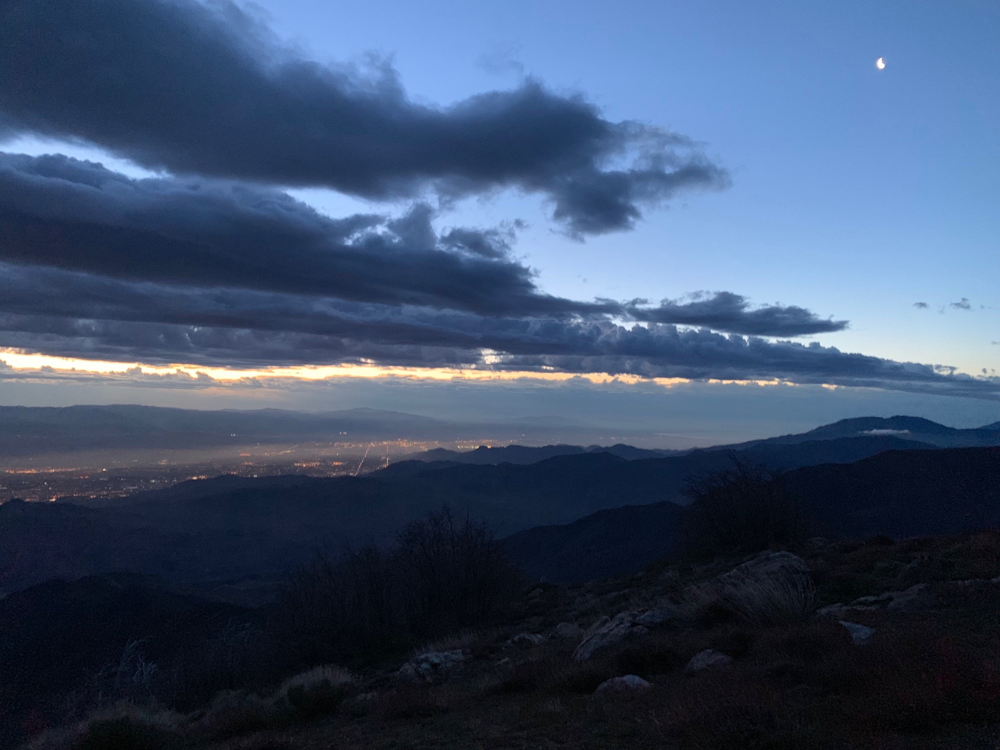

# Day Eleven

(I forgot to take a portrait today—instead here is the sunrise above Palm Springs.)

Sleep was a little elusive last night. The wind picked up again and a light rain began around 2am. A huge fog bank rolled over the ridge ahead. Conditions were poor—there was a chance of calling it and returning to the saddle a few miles back if the fog was too thick at the upcoming junction.

After slogging it back up the half-mile from camp to the junction a hiker told of his eventful night. Apparently the wind was so strong it ripped the webbing tabs off his tarp, ripping it from the ground and almost carrying it off the mountain.

<!-- more -->

Fortunately the fog wasn’t too bad, and the wind, though cold and gusty, didn’t seem bad enough to call off the push forward, although the forecast called for more rain at 11am—a good reason to not dwell on the decision and start getting miles in quickly.

Before long the first snow on trail appeared, nestled into a slow curve along a steep ridge. Nothing too bad with careful footing. It was a shock to go from the north to the south face of the mountain. While the north was relatively calm, and even had patches of sun, the south exposed you to gale force winds and piercing sleet pellets.

A substantial portion of the trail went through more burn areas from previous years. I was thinking about [Mountain Fire Personnel](https://m.youtube.com/watch?v=S7GX-4CgfIE), a short documentary by Alex Tyson in which he [snuck onto Jacinto](http://www.vdrome.org/alex-tyson-mountain-fire-personnel/) during the fires and documented the crews responsible for containing the damage. The film is a collage of found video from social media and scenes Alex’s time on the mountain. Highly suggested watch.

After what seemed like quite some time  the trail junction for Devil’s Side down to Idyllwild appeared. It was noon and fortunately the heavy rain had held off.

A 2 mile sprint down the trail and a brief hitch into town signaled the start of a much needed break. A few of us pooped together and quickly locked in a house to split, complete with a hot tub. We then headed out for pizza and a resupply at the market.

As the lazy day continued the rain picked up. Our timing couldn’t have been better, all things relative.

Later in the evening a few of us hopped in the hot tub and had a few beers as the cold rain continued to fall. What a contrast to last night. I was glad not to be on the mountain in these conditions.

The forecast showed a possibility of rain the following morning into afternoon. Talk of staying and entire day began. They say towns suck you in, and while I didn’t want to idly hang around, there seemed very little point in subjecting myself to bad weather on the mountain. Waiting to see how things were come morning was the best option, and with that I went to bed.

