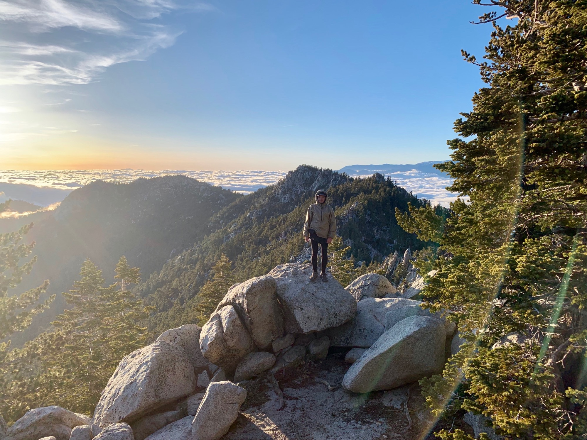
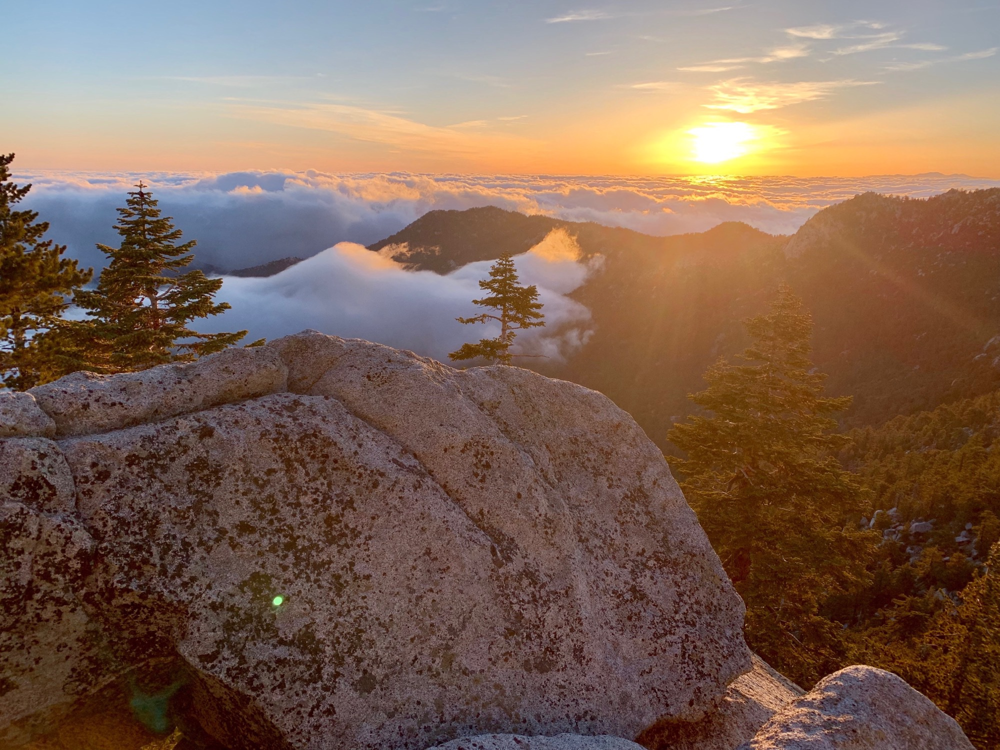

# Day Twelve

Slept like granite. The window was a field of blue, a good sign that the weather would hold out for the remainder of the day. The decision was made to get back on trail, technically making yesterday and today both “neros”—days where you nearly hike zero miles as you’re in town… although I would argue a 10.5 mile slog uphill is a fair bit of walking. Obviously this makes a “zero” a full day in town with no miles walked.

I called a number passed around for a local who gives rides to hikers. “Can you give us a lift to the trailhead?” “Sure, give me 15 minutes.” Amazing.

Puns and I were back on trail before noon, and the weather was great. Before long the lower elevations started to cloud in, but we stayed far above them as we continued to climb.

While heading up we noticed a helicopter hovering above the trail junction. A basket dropped, and after a moment was hoisted. There had been several fire trucks at the trailhead and a group of search and rescue personnel hanging around. “Sounds non-life threatening. They’ve been up there for a while.” I guess whoever it was took the scenic route off the mountain.

I was feeling great and reached the junction in no time. Before long the first of the snow passed by. The decision was made not to summit Jacinto, as it would deviate a few miles off trail and involve a lot of snow, slowing things down. Plus, I live nearby and can do it any time.

Eventually the snow became more concentrated, so I put on my microspikes, having purchased them this morning before heading out at the suggestion of Jon from the [Jacinto Trail Report](https://sanjacjon.com), a great resource. He hikes the mountain three or four days a week keeping conditions up to date—super handy when they change so rapidly.

At one of the streams channeling snow melt from the summit I stopped to fill up on water. The sun was ahead of me, and granite downstream broke the course of the water, throwing droplets into the air and refracting the sunlight . The water seemed excited to be heading downstream.

Looking at the horizon across the sea of clouds I could make out the San Gabriels, my home range in Los Angeles. The snow cap of San Gorgornio was just to the right.

A gap between two peaks on the ridge frames clouds which were moving so rapidly as to create the illusion that I and all of San Jacinto was in motion. Like when you’re at a stoplight and the car next to you begins moving, creating the illusion of you moving backwards.

Amazing day.

