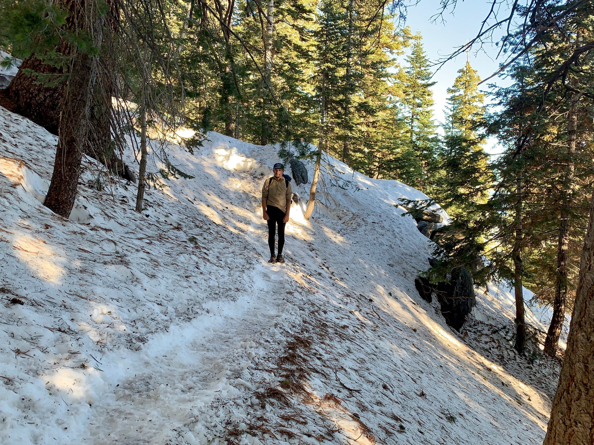

# Day Thirteen

Last night the wind was so loud it sounded like sleeping inside a jet engine at full throttle. It was just about freezing, my elevation being around 8600ft. Still, I stayed nice and warm all evening, the only difficulty sleeping coming awe of the sheer intensity of the sound.

Foregoing breakfast, as a cold soak in cold temperatures is a little uninspiring, I packed up camp and shortly afterwards put the microspikes back on. The icey snow provides better traction than the slush of yesterday afternoon. Although likely passable without spikes, they made it pure fun, even though the trail often forked and was generally undefined, the result of improvised scrambles down the constantly changing snowpack.

<!-- more -->

As the snow and pines gave way to chaparral I removed the spikes and had a snack. The cars in the valley below were becoming more defined as I lost elevation and the temperature began to rise.

While filling up on water someone stopped and said to have placed the emergency call which prompted the helicopter evacuation. “Yeah, blown way out of proportion. Twisted their ankle and couldn’t walk. Lazy firefighters so they flew her out.” Hmm.

Halfway through the descent and my legs were jello, lazily kicking rocks and sometimes giving out in the switchbacks. The 200 mile marker! After another 3500ft I was off the mountain and standing on a large wash made of granite dust. There was a steady head wind, at least 30 knots, and enough to send the hundreds of windmills whizzing around at speeds which appeared close to critical.

I took shelter with a few others under an overpass of the 10 freeway shuttling weekenders between the green yards of Palm Springs and Los Angeles. Most of your day in the desert is organized around water, where it is and where it isn’t. Fortunately this dry stretch was punctuated by some water bottles stashed under the bridge. The walk wouldn’t be possible without people volunteering to maintain these caches out of goodwill.

The underpass was very loud, and the vibe a little off, so a few of us decided to add another 5 miles to an already lengthy day to sleep on property owned by a windmill farm. Getting there took me from the entrance of a suburban grid full of tract houses, to houses half finished, to frames of houses, to foundations, to overgrown pavement—each block a step in a developmental gradation into the mountains.

The canyon leading to camp was lined with windmills, some broke, some whirring in the evening breeze and generating sine tones slipping in and out of polyrhythmic phase with their neighbors, each having its own unique pitch—the invisible currents of air generating an ambient soundtrack to walk through.

I found a nice level site and made camp. A cooler contained ice cold bottles of water, which I greedily took two of. These instant mash potatoes really make you thirsty.

The sun finally set and the coyotes harmonized with the drones of the windmills, the buzz of electric current flowing through the substation created a tonal bed. The lights came up in the city over the ridge.

25.6 miles. 7500ft of elevation loss. A big day.