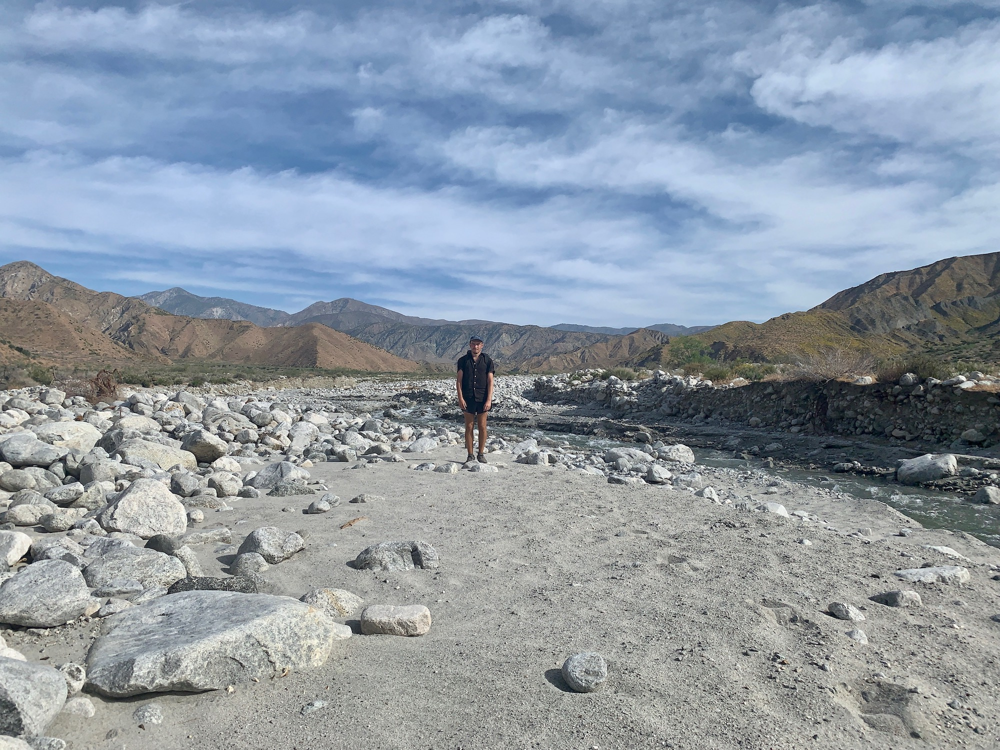

# Day Fourteen

The day abruptly began as a white truck drove up the dirt road to the wind farm office blasting music at 5am. Might as well get going, but first a stop by the office to investigate rumors of free coffee. Sure enough, about ten hikers were piled in the conference room with coffee and donuts in hand.

One of the managers was hanging around and I asked “what’s on the agenda for today?” “Robbing for parts. There are around 400 windmills we operate. We try to keep 120 functioning.”

<!-- more -->

I started off from the windmills, making my way up the  deceptively mild canyon incline. The layer of high cirrus clouds diffused the sunlight and softened the harshness of the rays, the atmosphere matching my drowsy state. Some mornings it’s difficult to dismiss the possibility of sleepwalking. This was one of them.

The trail quickly descended, beginning its meander along Mission Creek and the snowmelt of San Gorgornio.