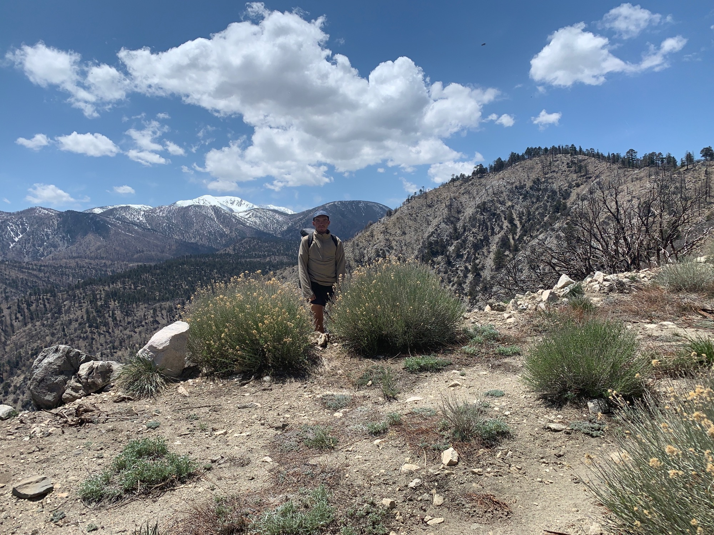

# Day Fifteen

Great night of sleep after the difficulty of the stream yesterday. Overslept by around twenty minutes. After packing everything up, a process typically taking about 20 minutes, I started off… in the wrong direction. 

The difficulty of navigation was quickly back in the front of my mind, and around half a mile later the trail was back under my feet.

<!-- more -->

The theme of today; up. Gorgornio loomed overhead with its snow peak. The vastness of forest scared by fire was immense. At one point there was an 18 mile water carry. The sun was overhead in full force, although as elevation was gained the cool mountain air soon came to offset its intensity.

The trail into big bear was perfect, the kind of stuff you dream of; pine needles finely packed but porous enough to provide the perfect cushion.

The ritual afternoon siesta brought about a new face going by Elusive. He rode his bike hundreds of miles to start the trail in campo, and has done a number of exceptional trips, such as walking the entire west-east length of Texas.

Mile 250!

After some sizable downhill I set up camp, but not before a quick beer and some watermelon some people had kindly brought to the trailhead. Tomorrow would be an easy 10 miles.

