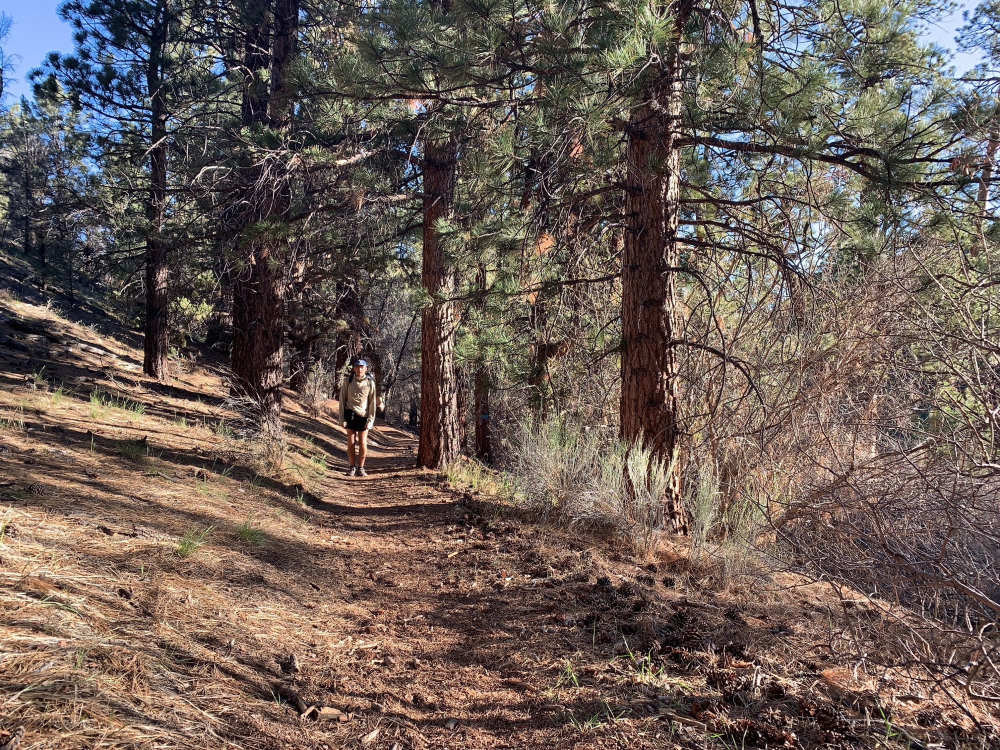

# Day Sixteen

So began an easy one, a morning meander into the town of Big Bear. The morning was crisp, and the trail was everything you’d hope for. The morning light through the pines encouraged a sensitivity to how and when things passed from my focus to outside my field of vision.

Catching a hitch proved a challenge, and one of the other hikers, Oracle, went ahead and called a Lyft. The infrastructure of convenience in our daily lives translates to the trail, too.

<!-- more -->

Accommodations for the evening were basic, an inn focused on facilitating those on the PCT during the hiking season and winter sports enthusiasts during the winter. Though modest, it checked all the boxes: bed, shower, laundry.

A late lunch was had at the Himalayan. Who knew some of the best Indian and Nepalese to have in the Los Angeles area would be found here. The masalas and lamb curry were out of control.

The rest of the day was filled with catching up—on writing, on emails, on nothing. A few of us went to dinner, then two of us headed over to Murray’s, one of the best karaoke dives I’ve been to. We stayed way too late, and had some memorable interactions with locals.

We were the last ones into the inn, and careful not to wake anyone else, decided to call it a night.