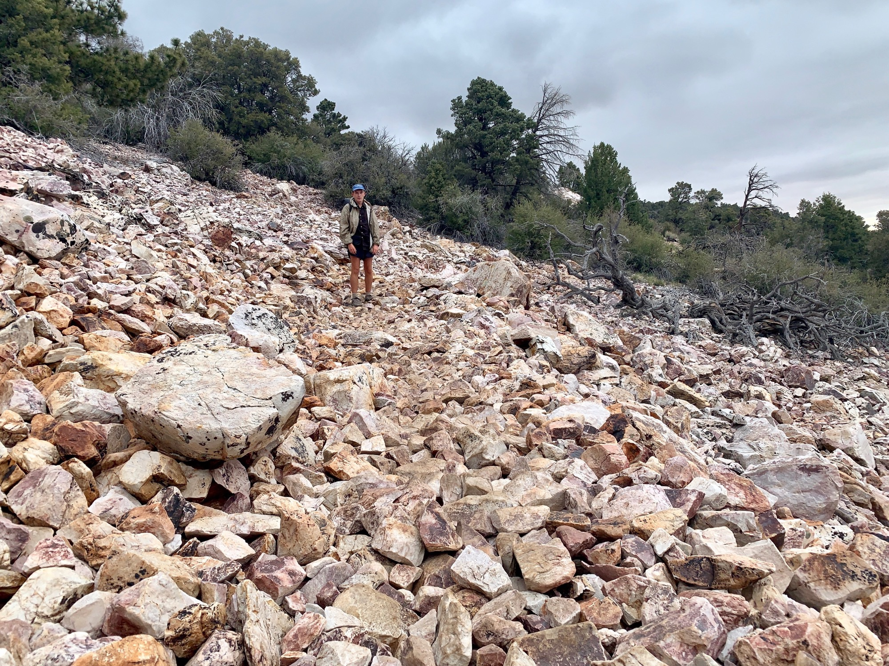
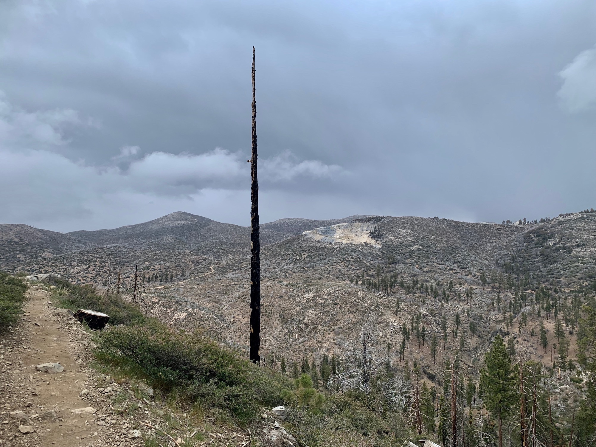

# Day Seventeen

I woke up to blue sky outside the window, a similar story to that of Idyllwild. Back on trail it is, although the forecast spoke of continued chances of inclement conditions. Still, my gut said to go for it.

Lily and I had a lazy morning, and after double checking my supplies we made our way to the trailhead. It’s always very hard to say goodbye for a while!

<!-- more -->

It was noon, and my goal was to hit 20 miles. Already clouds were gathering to the west. It felt like a race to put in miles before the weather began. The weight of My full pack, containing 5 days of food, only added to the situation.

By 3pm I had done 10 miles, and managed to outrun increasingly grey clouds building behind me. The cold and overcast kept me moving to keep warm, whereas sunny days require pausing for at least an hour midday.

My constant motion caused me to erroneously head down the wrong trail at one point. By the time I noticed almost a mile was behind me. After backtracking I was surprised at how rapidly the weather had changed—where it was once sunny there was now light virga falling from dense stratus. 

Moving uphill, it became clear weather was imminent. I was soon surprised by not rain, but snow! Clearly I had gained some elevation in these past miles. I’d take dry flurries over cold rain any time.

My hopes had come true; that by pushing quickly to the east face of the mountain all the heavy precipitation would be trapped towards the west. Behind me were dark grey skies above a charred landscape. Ahead were light patchworks of cumulus suspended in hazy sunlight. A nice affirmation.

I made camp near a stream just beyond Little Bear Camp and called it a night.