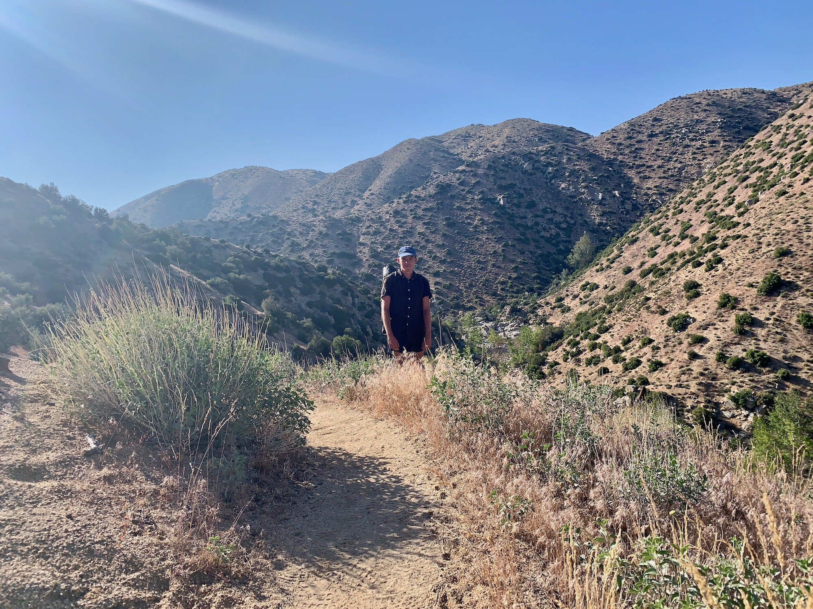
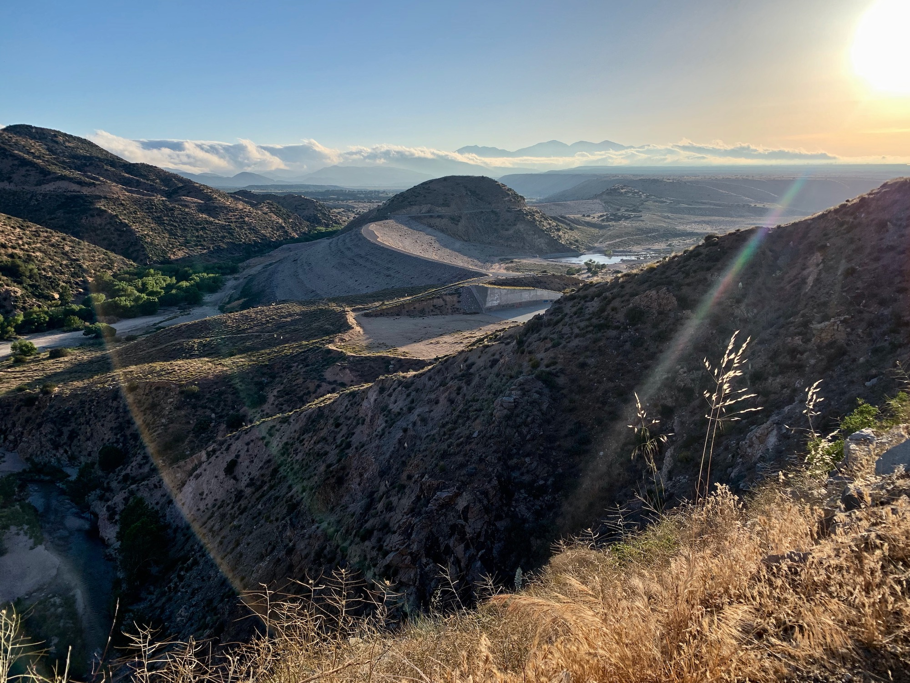

# Day Eighteen

I looked around my tent and noticed a fair amount of condensation. Camping low in the valley next to a stream increased the chances of this happening, but I didn’t anticipate all the frost on the outside of the tent. Must have been a cold one last night.

After a modestly lazy morning I shook as much of the water off my belongings as possible and got back on the trail. There were a number of stream crossings as the trail meandered alongside Holcomb Creek.

<!-- more -->

Before long it was about noon, and I found myself standing on a sandy bank of Deep Creek. Siestas alongside a stream are a highlight of any day on trail. Today my left hip was annoyingly sore, so the break was all the more welcome. Likely pushed too hard to try to stay ahead of the weather yesterday. After laying out my tent for it to dry I ate a quick lunch.

After a quick snooze I started off again into the midday heat. Fortunately my hip was feeling much better after the break. This morning frost coated my tent, but now after shedding some elevation the surrounding ecosystem wouldn’t hint at the possibility. Properly hot.

Mile 300!

I caught up with someone just ahead of me who looked familiar. A few days before he came through camp as tents were going up, but he had decided to continue pushing on. We started talking. He had just finished high school out in Montana, where he has lived all his life. He talked about the kids there, how they shape their identities, and the passage of time. We talked about growing up on the internet.

He asked if it was a big departure to go up from being so embedded within technology to being on the trail. “They’re super related.” We talked about environment and interface, the scroll and the walk.

It’s possible to look at the trail as a whole. A continuous line. But this line is composed of a series of smaller lines. And those lines of smaller lines, and so forth. A walk from Meixco to Canada. A walk from Campo to Kennedy Meadows. A walk from today’s campsite to tomorrow’s. A walk from this valley to that ridge.

This is all to say, the walk as bounded by our conversation was a good one.

The trail through this section along Deep Creek didn’t provide many opportunities to make camp. We decided to push for the [Mojave Forks Dam](https://en.wikipedia.org/wiki/Mojave_Forks_Dam), about five additional miles from our current position near a series of hot springs. The hot springs, although inviting, have a reputation which discourages overnight use, as evidence by the nude “slackliner” bouncing around. This is less of a prejudice against nudity and more so slacklining in the nude.

The sun made its way to the horizon ahead of us as we walked the path through the canyon, the light becoming increasingly cinematic as we make our way towards the Angeles National Forsest mile by mile. Finally we round a ridge to see the huge earthen dam, a thick layer of clouds slowly dissipating as it hit the hot desert air.

“Whoa.”

We watched the sun dip below the desert floor and made camp behind the massive spillway in a level opening within a dense group of trees.
