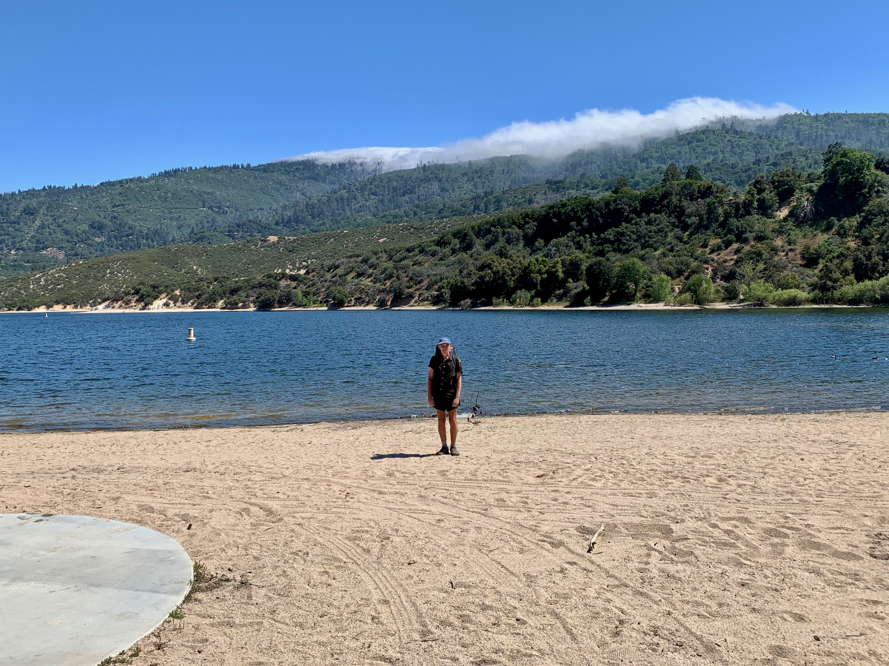
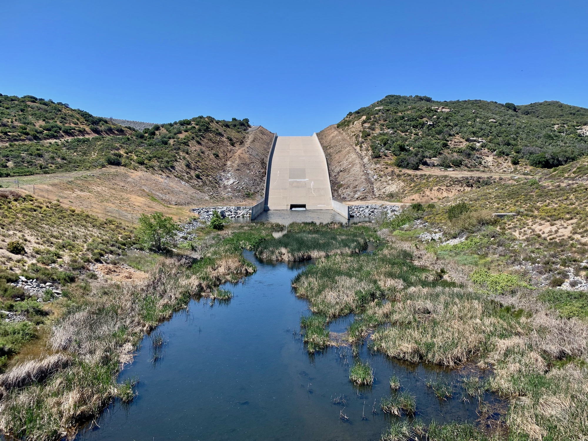

# Day Twenty

Time to get moving again! After topping of two liters of water in Deep Creek I waded across the shallow water at its confluence with the West Fork Mojave River. My hip felt a little tender right away. It would be important not to compound the stress by doing another big mile day.

Each morning is a fresh start out here. Since I try to get walking as soon as possible my mind is very much still in wake up mode for the first few miles. It feels less like continuing yesterday’s walk and more like a nice morning stroll.

<!-- more -->

The trail eventually leads past the huge spillway of Ceder Springs Dam, another huge earthen dam. Whereas the Mojave Forks is strictly for flood control, Ceder Springs creates a massive reservoir known as Silverwood Lake, a forebay of the California Aqueduct and critical component of the [State Water Project](https://en.wikipedia.org/wiki/California_State_Water_Project). My days on trail are involve strategizing around water; how much do I need, when is the next source, etc… Much of the infrastructure serves the same questions on a much larger scale for the region’s population.

After a few miles walk along the shore of Silverwood a sign indicating free burgers and drinks convinced us to deviate from the trail and down to a shaded pavilion. Although the food was welcome, it was a little jarring to have a camera put in my face and asked “what’s your name and where are you from.” Cameras were always out, and monologues into the camera about the trail by those providing the food made me a little self-conscious about being there. Undoubtable the intentions were good, but the performative atmosphere was somewhat uncomfortable.

The four sodas left me feeling like a balloon, not the best place to be in while slogging it uphill and out of the Silverwood Recreation area. Regardless, it was good to be back on trail and the cool winds provided relief from the afternoon heat.

Once again there were very few campsites ahead. I located something flat along a creek and called it a day, choosing to wind down by reading [Geoff Manaugh’s](http://www.bldgblog.com) article on the [Walker Lane fault in Wired](https://www.wired.com/story/walker-lane-move-over-san-andreas-fault/). This passage stands out:

> “To think geologically,” Marcia Bjornerud writes in her 2018 book Timefulness, “is to hold in the mind's eye not only what is visible at the surface but also present in the subsurface, what has been and will be.”

It may sound naive, but I see walking around out here as a form of field work necessary within my range of experience for seeing what’s next. So much of my time has been spent in the two-dimensional space of screens. It truly feels less like having looked at screens and more like having inhabited them.

For me to project forwards, both within and beyond the screen, requires a better understanding of the big picture in a fundamental environmental way. Maybe.