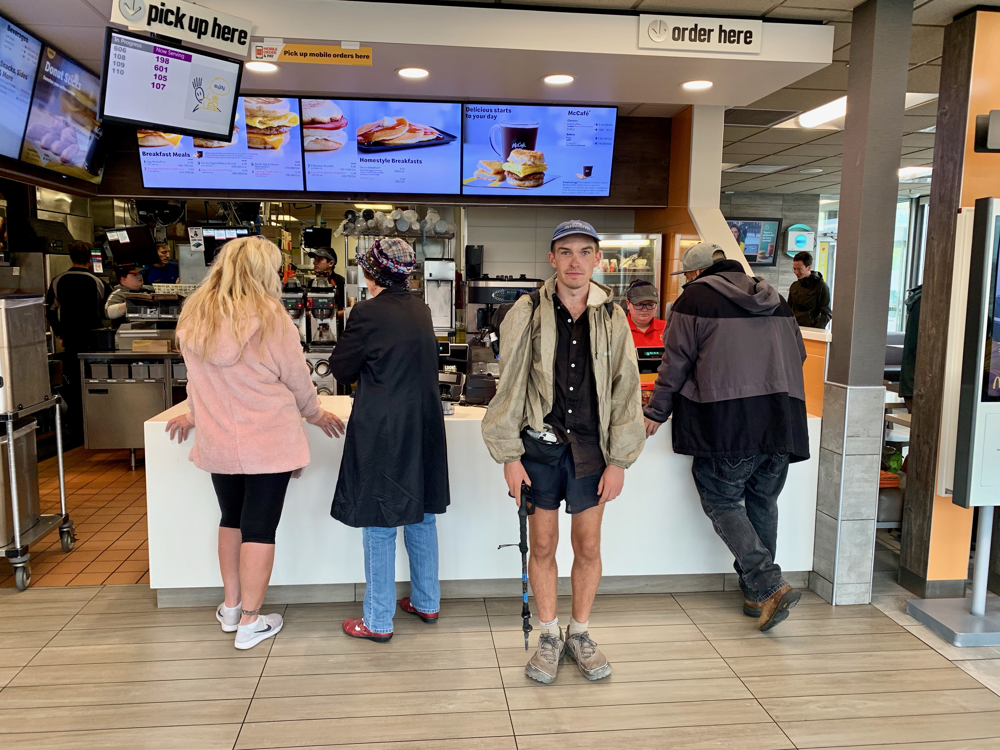
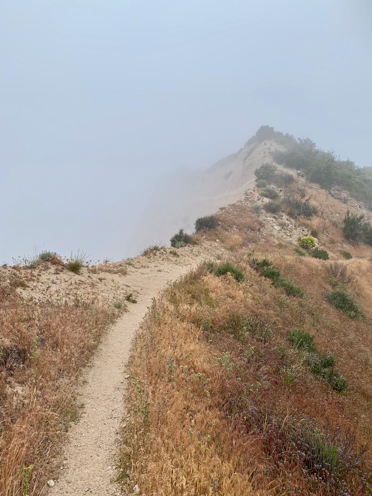
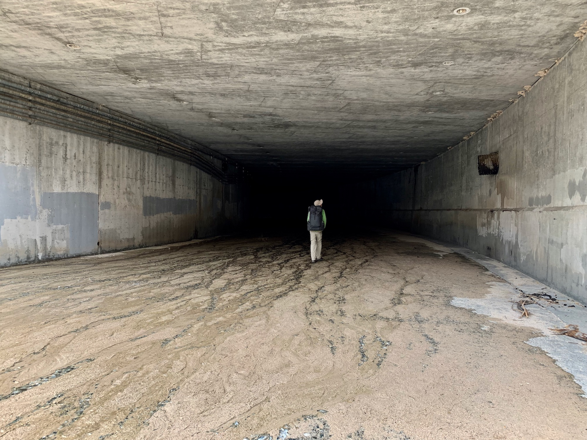
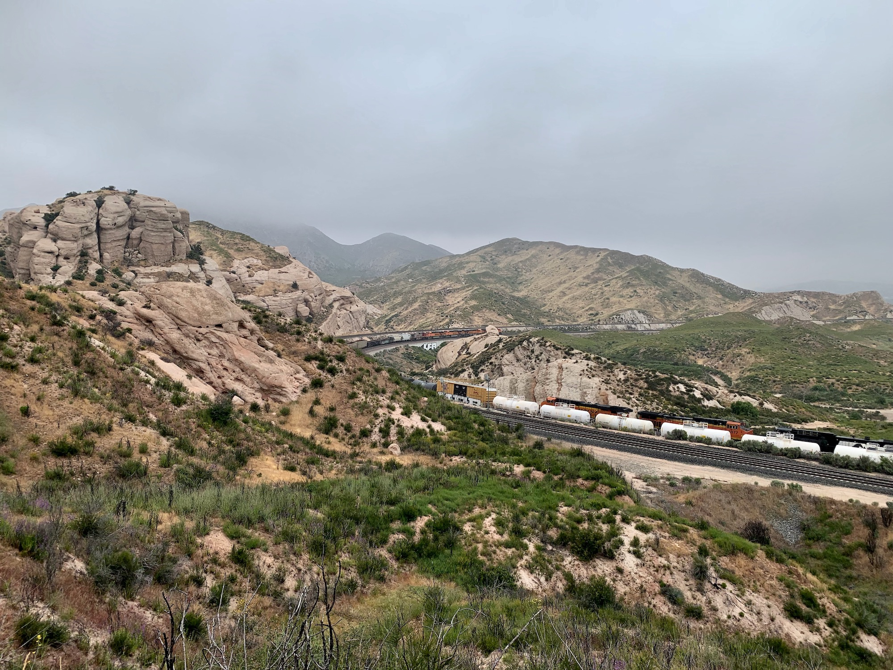
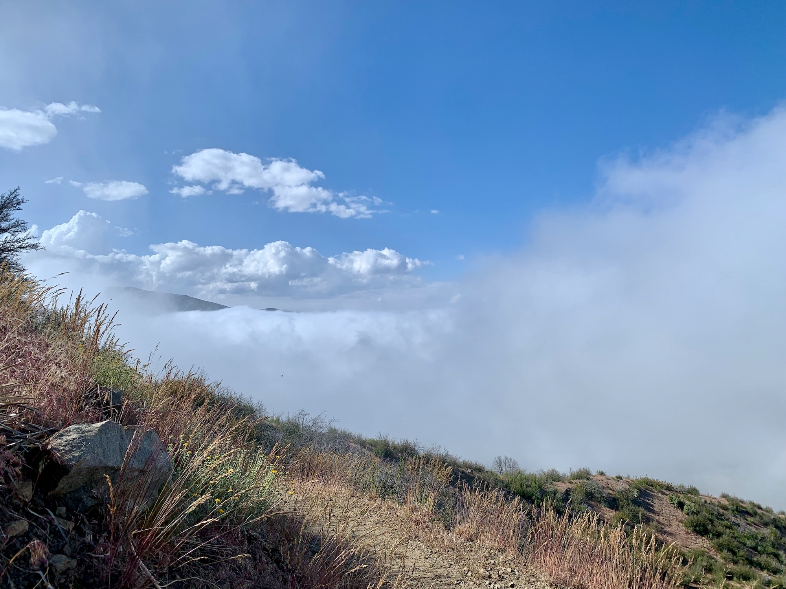

# Day Twenty

The past few days, when asking others about where they intend to camp, distance has been measured in a new unit of measurement: proximity to McDonalds.

Long distance walking paths have taken form as pilgrimage trails for as long as organized religion. It only makes perfect sense that within late capitalism in America we are motivated to walk hundreds of miles to devour calories scientifically refined and corporately branded. It is with this in mind that I placed my shelter in my pack and set out for the remaining 6 miles to the McDonalds in Cajon Pass.

<!-- more -->

The fog that had enveloped the valley I slept in became denser as I walked the switchbacks up a canyon wall, visibility reduced to no more than a few seconds in time. In the distance a train continuously sounded its horn as it carried containers from the port of Long Beach to midwest distribution centers. Overhead high-voltage transmission lines buzzed as the fog vaporized on contact while carrying electricity to the high desert. The trail guided me directly beneath the trestle structures, the lines barely visible through the haze.

Winds picked up as elevation was gained, the tall dry grass whipping around, a realtime visualization of the intensity and direction of the heavy gusts.

Suddenly I’m staring over the edge of a sandstone cliff, seemingly materializing out of nowhere, the bottom obscured in the mist. My limited line of sight almost suggests an infinite procedurally generated landscape taking form just beyond the fog, the landscape parametrically folding in on itself as I continue walking through it.

Many moments on trail feel cinematic, the sense increasing as I near the backlots and GPUs of Los Angeles. The landscape I inhabit at this moment most resembles the Zone of Tarkofsky’s seminal film [Stalkers](https://www.youtube.com/watch?v=xB7jVTut3-g), a film as much about obscured landscape as the characters within it. Both the film and I occupy post-industrial landscapes, the only inconsistency of note being the omission of a McDonalds in the Zone.

Cresting the ridge I can hear (but not see) Interstate 15 in the distance, semi-trucks and minivans cresting the saddle between the San Bernardino and the San Gabriel ranges, the sand and the suburbs.

The trail dove down several switchbacks off the ridge and into Crowder Canyon, paralleling a stream, as it often does. I noticed eroded asphalt beneath my shoes, the remnants of the [Old Spanish Trail](https://en.wikipedia.org/wiki/Old_Spanish_Trail_(trade_route)) paved into the [Sanford Cutoff](https://en.wikipedia.org/wiki/Mormon_Road) around 1915.

A sign appeared ahead indicating the fork in the trail and related milage.

> `→` McDonalds .4  
> `←` Guffy Campground 22.1

I arrived in time for breakfast and stayed late enough to have lunch, spending around $35 and eating about two days worth of calories. In the context of a thru-hike McDonalds is the apex of culinary evolution.

After a courtesy couple of minutes for my metabolism to make peace with the situation I walked back to the trail. A slog of a different type.

Crossing I-15 required walking a cavernous underpass with a ridiculous acoustic decay time. Trekking poles on concrete make great impulse generators, and for all I know the reverberations may still be ringing.

The underpass was both a spatial and temporal gateway, placing me directly inside the San Andreas Rift Zone, a cluster of massive hogback ridges breaking through the surrounding crust. 

After a brief descent into Lone Pine Canyon the trail ascended. Exactly where and for how long remained ambiguous due to the low hanging layer of stratus. One thing was sure; my legs were possessed by the ghost of Ronald[^1] as I was f-l-y-ing up that incline.

While continuing to gain elevation along Upper Lytle Creek Ridge I began noticing brief patches of blue sky above. Hoping to catch a glimpse of the surrounding peaks I was glad to round a corner and begin walking through a gradation in visibility.

Out across the high desert were a few thunderstorm cells in varying stages of development, some with long anvil tops. I paused for around fifteen minutes as the clouds hugging the ridge cycled between obscuring and revealing the view and snacked.

The trail continued its way along the ridge for a few miles and crossed a fire road. Mount Baldy came into view, its summit capped with An opening in a grassy level area with decent coverage stood out as a good place to make camp for the evening, so I did.

After a quick dinner of instant mash potatoes I turned in. My unimpeded view of the storms above the desert put on an impressive show of lightning as I dozed off. 

([Suggested soundtrack](https://www.youtube.com/watch?v=DOw62EREnCg) for the day)

[^1]: Is Ronald still around?