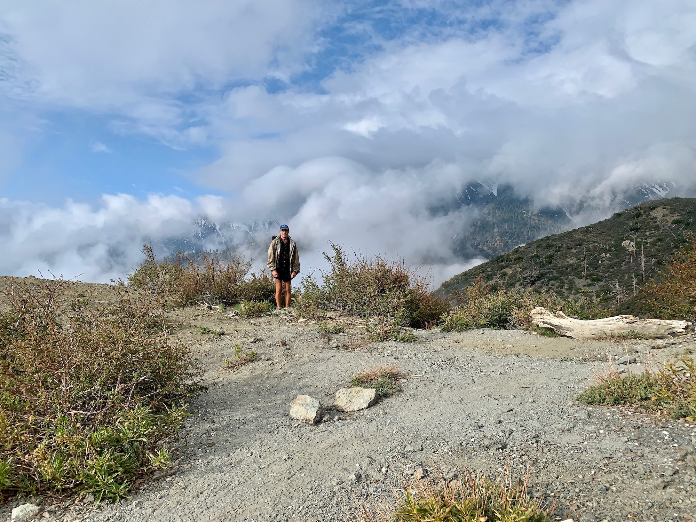
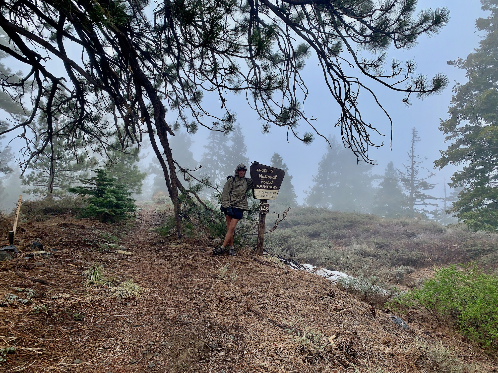

# Day Twenty-two

Whereas camp had been above the evening cloud layer I woke up to find myself back within it. These cold foggy mornings are enjoyable. Sort of like a cold shower once you get walking. Today would be easy enough, a stroll up some remaining elevation to rendezvous with Lily where the trail first intersects the Angeles Crest Highway.

Some snowy patches along the trail hinted at the unusually high accumulation of the past winter. After a few miles a brief window in the clouds appeared to reveal the slopes of Mount Baldy. It’s difficult to position yourself, even in familiar terrain, when you find yourself so socked in. A nice reprieve.

<!-- more -->

A few minutes later it was back into the clouds, returning with a cold light drizzle. The plan was to have lunch in Wrightwood, and perhaps locate accommodations for the evening, but all the cabins I had seen were uninspiring and expensive. It appeared people used them as storage for furniture they didn’t like enough for their primary residence.

The question of what to do became clearer as the rain turned into freezing sleet. A weather system was forecasted to move through over the next two days, and most I talked to planned to double zero and wait it out. The next day on trail would have me summiting the snowy Mount Baden-Powell. To do this in inclement conditions would be a drag; in lightning it would be dangerous.

I came across a spot at the junction of an offshoot trail down into Wrightwood which had some service and called Lily. “So… what if I came home for the weekend?” At this point the choice was obvious, the drive only being a little over an hour long.

Shortly after arranging plans I passed a sign at mile 364 indicating my arrival at the Angeles National Forest. It felt like being home already.

The freezing rain turned to snow, and during the descent down to Inspiration Point turned back to freezing rain again. The indecisiveness of the weather didn’t bother me now that I had made a decision on what to do next.

A few minutes after arriving at the agreed location Lily pulled up. A few other hikes hopped in and we made the five minute drive back to Wrightwood. Grizzly Cafe was offering free coffees, so we stopped in for a moment and saw some familiar faces.

The drive back to Los Angeles involved retracing my steps back to Cajon Pass and past McDonalds. What took two days to traverse now took minutes. Walking through my front door I was greeted by all the familiarities of home. The drive back had felt somewhat strange, but the feeling quickly faded.

The puritan in me had a moment of hesitation before making the decision to wait the storm out at home. Almost as though I were cheating, but logic quickly caught up and I dismissed the impulse. As someone I met on the trail said, “if you’re out here to have fun how can you cheat?”