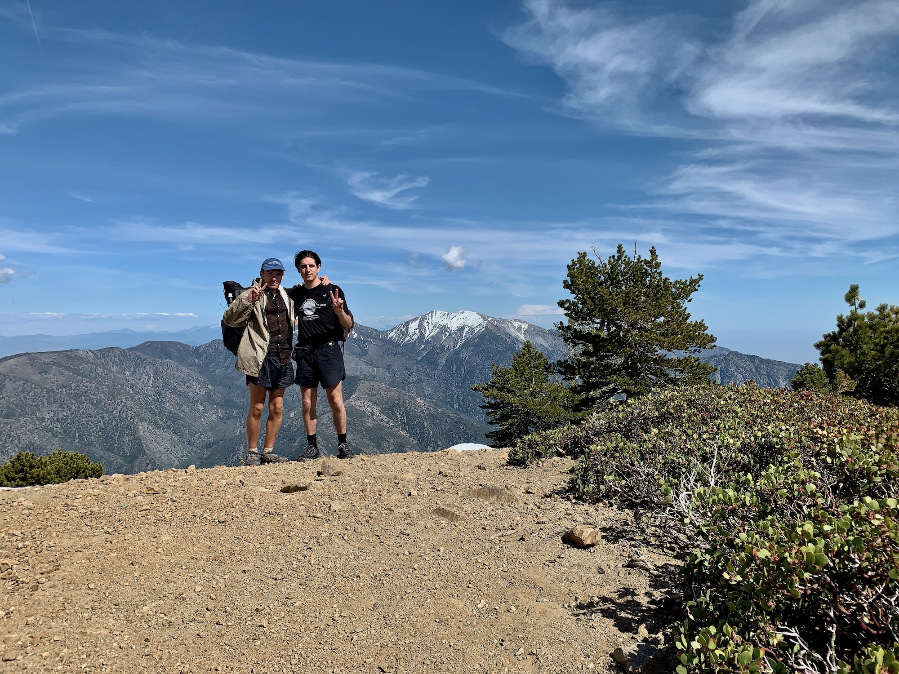
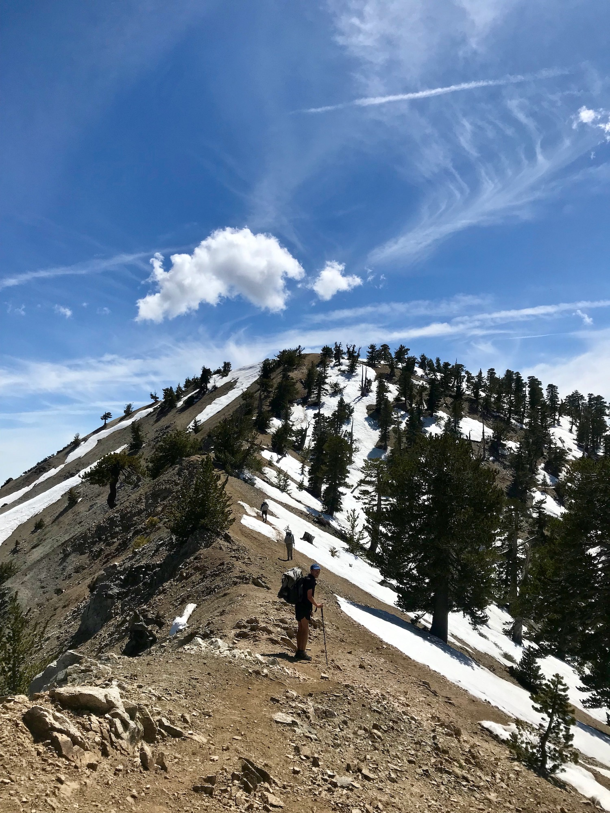

# Day Twenty-Two

A heavy layer of morning clouds blanketed Los Angeles as we drove towards Wrightwood. Not sunny skies, but an improvement on the weekend’s conditions.

Because of scheduling a decision had to be made about where to begin our walk. I had left at Inspiration Point, but starting there would add 8mi to Jon’s out-and-back which there wasn‘t time for. The choice to park at Vincent Gap, the trailhead for Baden-Powell, and simply hike those four miles after completing the PCT seemed obvious.

Does this make me a flip-flopper[^1] now?

<!-- more -->

We grabbed lunch at the Grizzly Cafe and stopped by the grocer so I could resupply. As we pulled into the lot at Vincent Gap a few familiar faces were there—looks like many others ended up pulling double zeros, too.

Starting up the switchbacks my mind knew this was a return to the Pacific Crest Trail, but it just felt like a day hike because of how frequently I find myself beginning this hike from the same parking lot.

After about a mile patches of snow began to form on trail. This continued for maybe another half mile before everything ahead of us became snow. The trail was entirely obscured, and the footprints went from following the switchbacks to a steep straight shot towards the summit.

Back in Idyllwild I had considered shipping my microspikes up north to save weight, but am glad I held on to them. Although possible without spikes, this was a serious slog. Without switchbacks we reached the junction to the summit before long and the snow on the north face largely had melted off.

We hung around the summit for a while. A lot of people were up here, likely result of many holding off to summit over the weekend for today’s improved weather. After around an hour we decided to continue on. For Jon this meant the steep snowy slog down to the parking lot.

I headed down a ridge which was mostly snow free, avoiding some of the remaining accumulation on the trail itself. Navigation was a little tricky, and there was quite a bit of elevation gain considering the overall trend of going downhill.

By around 6:00 I had reached Little Jimmy camp. Not many miles for the day, but considering I had started at around 1:30 and not wanting to overdo it with having summited and a full pack of food the ten miles were good enough. 

The camp was very full, and a group continued to eat and talk loudly until well past sunset. Somewhat annoying. Tomorrow I’d get an early start and work to get ahead of the bubble.

[^1]: Flip-flopping is one you jump from one section of a trail to another with the intent of walking the skipped miles at some later date. This is most often associated with skipping large sections of the Sierra due to heavy snow.

