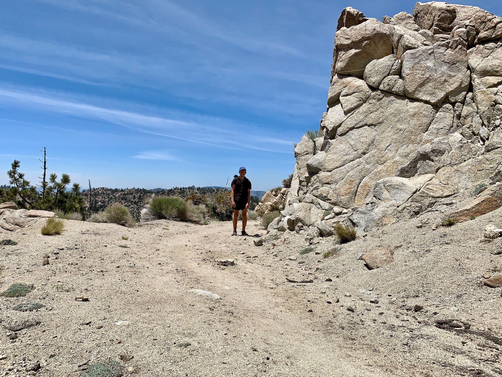
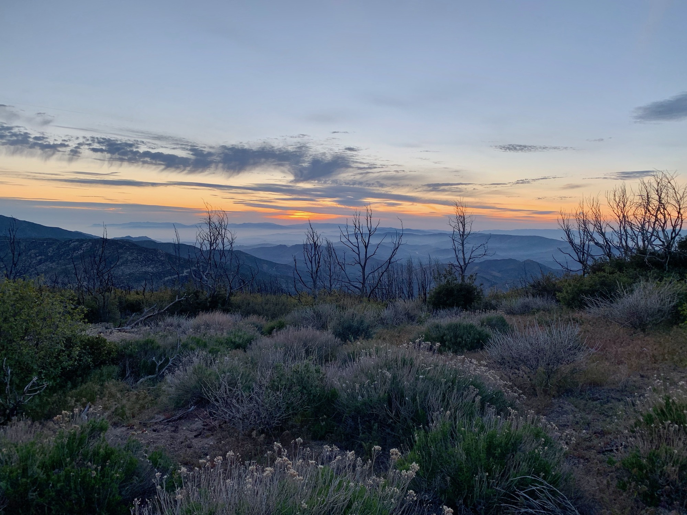

# Day Twenty-three

Morning came quickly and I packed things up to get ahead of the  large (loud) group I found myself camping beside. The next stretch included a decent water cary, so I first backtracked around a quarter of a mile to a stream and filled two liters.

After some snow patches during a decent towards SR-2 I began gaining elevation up Mount Williamson. No sooner had I gained the elevation over a couple miles did the trail lead me right back down to cross the 2 again. The PCT loves doing this; takes you up only to take you right back down. Fortunately the sun was out, somehow a rarity in the desert section now.

<!-- more -->

It felt great to be back on the trail and walking at a healthy pace, but I quickly approached a section of the trail closed for rehabilitation of the endangered mountain yellow-legged frog which has involved a [lengthy legal battle](https://www.outsideonline.com/2337561/williamson-rock-california-climbing-route-reopen). This requires walking along the Angeles Crest Highway for around four miles. Parts of the 2 have been closed throughout the winter and spring due to landslides, but this particular section is open until Vincent Gap. 

What could’ve been a drag was in fact enjoyable. I’m out here on the 2 frequently. Walking an area often seen at 55mph revealed a lot that goes overlooked. It was also sort of fun to know I was walking a portion of a continuous asphalt line ending near my front door. I live just over a mile from where the highway stretch of the 2 terminates at the border of Echo Park and Silver Lake.

Having a good time walking along, I didn’t notice I missed the turnoff connecting back to the trail through Buckhorn Camp. Continuing along the 2, I simply got back on trail at Cloudburst. To make up for the four previous miles and this little stretch I may simply do the Silver Moccasin trail when I return, which follows the PCT through the San Gabriels.

For lunch I stopped at Glenwood Camp, a small structure where there is a water spigot and some shade. This also marked mile 400! After around 45 minutes I set back out into the afternoon sun.

On the horizon I noticed smoke—enough to make me pause. Over the next few miles this would come in and out of view. Every now and then a helicopter would fly over, reassuring me this was a controlled burn. At times the smoke was thick enough to filter the light and cover the terrane in an orange glow. After all the wildfires of last year I’m hoping this will be one of the few times I’ll encounter smoke like this.

The trail began to ascend Bare Mountain. Just after this was a substantial water cary, so seeing a small group of familiar faces gathered around a stream I planned to stop by was nice. I didn’t stick around to hang, and continued with the intent of grabbing a good campsite with coverage. This ridge is known for being windy and exposed.

While shopping for sites I began talking to someone who I had caught up with. Turns out he is a computer science major who had just wrapped a project with Google. He worked in a lab on reinforcement learning with hundreds of robotic arms, and was headed to MIT’s Media Lab for a PhD after finishing the trail.

I mentioned how I’ve been coming to understand the evolution of my walk over the course of the trail. Small movements repeated hundreds of thousands of times over a condensed period accumulate into issues which cause me to make small adjustments—to where I place my foot, or how I rotate my hip for instance. It reminds me greatly of some [classic examples](https://www.youtube.com/watch?v=pgaEE27nsQw) in reinforcement learning as applied to simulated walking. Generation one immediately falls over, but by generation 1000 the model has evolved to optimize for the defined parameters.

We made it to an area with a bit of cover. I dropped my pack to suss out if there were any better sites. Someone was just down the ridge attempting to pitch their tent in the huge gusts of wind, the rain fly almost ripped out of their hands as we chatted. Back up to where I was before, I suppose.

I made camp as lenticulars gave form to the massive mountain waves making their way up the San Gabriels and across the high desert. The sun set, and I called it a night. This is when I crunch numbers for the day. By the map, I walked 31 miles today, but I highly doubt that considering the endangered frog bypass. Regardless, it was probably closer to 28.