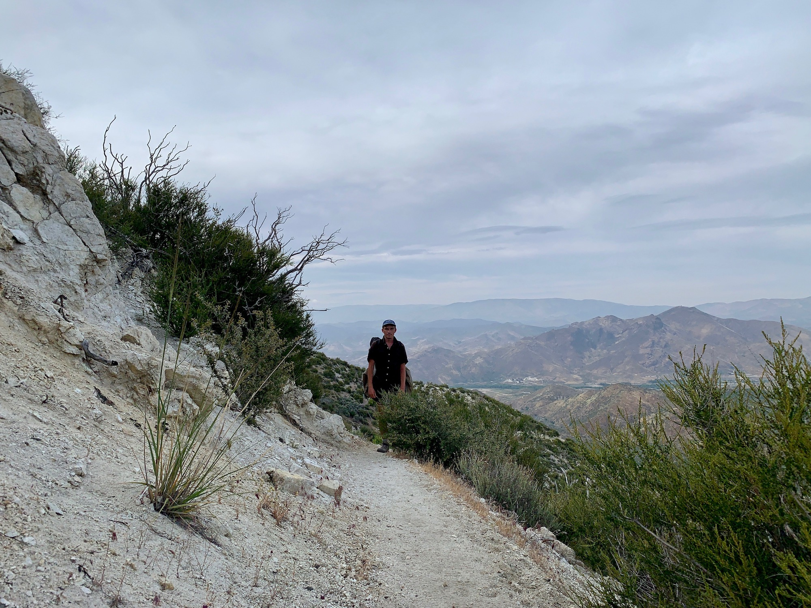
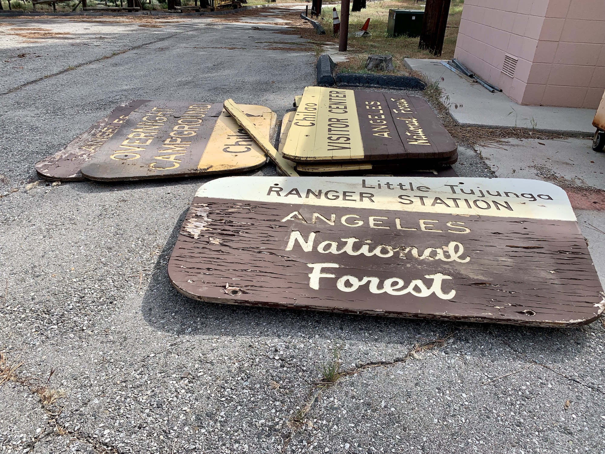

# Day Twenty-Four

As expected, last night was extremely windy. On nights like this sleep tends to be spotty. The sky was overcast, which I hoped would hold throughout the afternoon.

The first few miles involved the best kind of trail. A mild downhill grade hugging the side of a canyon with huge views. While crossing the 2 (again) next to a gate guarding a maintenance road a powerline worker rolled down the window of his truck and called out, “You hiking into there today? I saw a fucking HUGE mountain lion this morning.” I didn’t know what to say, there’s not much I can do with that information that I don’t already. “Oh, ok, thanks!”

<!-- more -->

The afternoon was pleasant and generally uneventful as I progressed down towards the Antelope Valley and out of the San Gabriels. An old forestry road provided a shady flat area for lunch and siesta.

Late in the afternoon I stopped by the North Fork Saddle Station, a decommissioned ranger station. Someone had driven up and was giving out free hotdogs if you spent $2 on a soda and bag of chips. Sounded like a good deal to me! He described a caretaker who has lived there for the past 30 years. The forest service commissions him to create all of the signage in the Angeles National Forest. Totally amazing.

I had been intending to camp at the Acton KOA, which would mean another long day of around 30 miles. Rumors of train tracks running adjacent the campsites promised another night of interrupted sleep, which didn’t sound too appealing. As I approached a water source some campsites along the stream were incredibly inviting. I decided instead to camp there in Mattox Canyon as opposed to pushing on towards KOA.