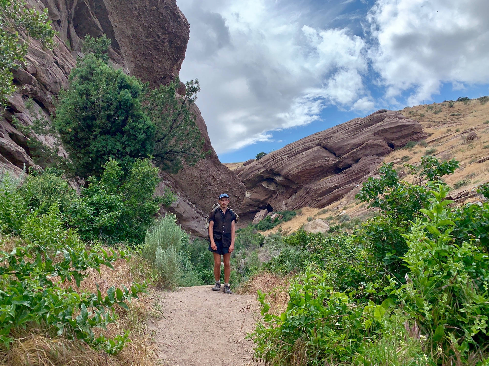
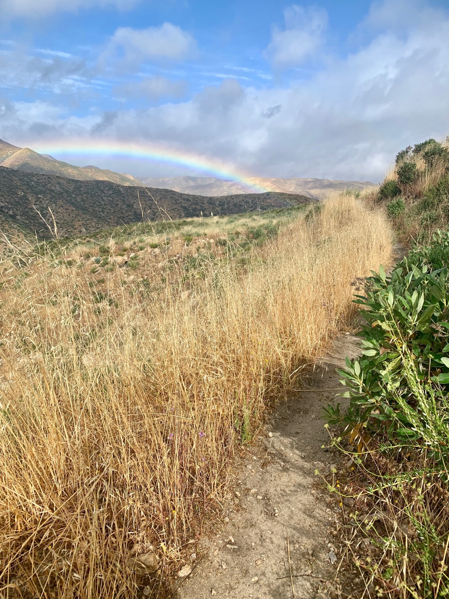
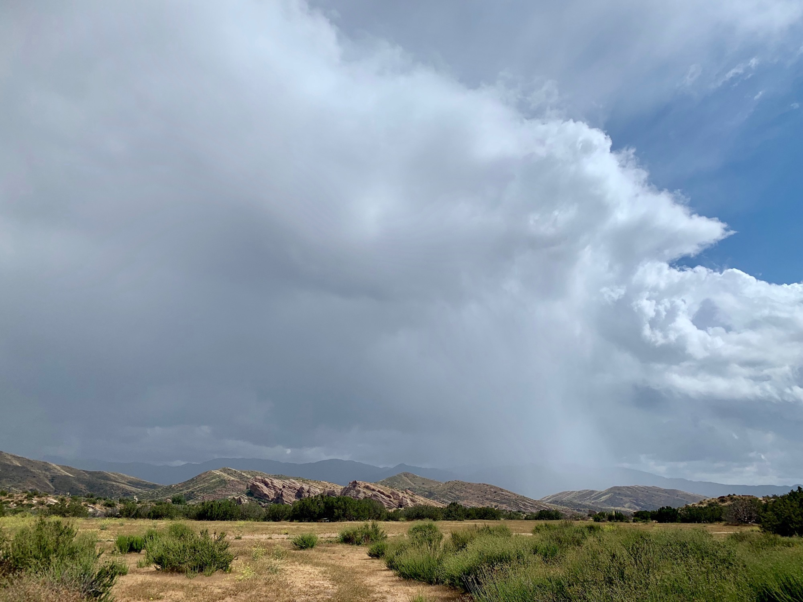

# Day Twenty-Five

I woke up to the sound of raindrops on sil-nylon. After a good nights sleep the decision to camp at Mattox Creek was one well made, and leaving my quilt was becoming a matter of will. Water was pooling in the corners of my tent. I’ve been using an old Sixmoon Lunar Solo purchased used for $100 on backpackerlight. The geometry is a bit off. A few days ago I ordered a ZPacks Duplex, and mornings like this make me anticipate it arriving even greater.

A break in the rain was a boost of motivation, and so the day began off into the mist. As I walked ridge lines down to the desert floor the rain would intermittently alternate between a drizzle and a dump, unlocking aromas in the California sage. After four miles the KOA I had considered as camp last night came into view. It’s always nice to be reassured a past decision was well made.

<!-- more -->

I stopped by the KOA general store and bought a pint of ice cream. A few familiar faces were in a common area, some looking over printouts of the latest Sierra snow reports. All of these weather systems moving through are dumping more fresh snow on an already unusually high snowpack. Already people are arriving in the Sierra and navigating decisions; to enter, to flip-flop, to wait it out, etc…

After downing the pint I was about to leave when suddenly the light drizzle turned to hail. Radar showed an isolated cell directly above me. Hmm… maybe another cup of coffee. This lasted only a few minutes, and I began the walk to Agua Dulce.

The trail meandered through tall dry grass as the cumulonimbus continued to pop off, columns of rain visible in every direction. Most of the afternoon I occupied a sort of dry bubble between cells, lending to frequent stops for observing the slow motion travel of shadows across the rolling hills.

The trail eventually led to a tunnel under highway 14. Backfill piled a good hundred feet rose above me as I walked in. Exiting on the other side I found myself standing directly within the San Andreas fault once more.

This area, Vasquez Rocks, is a window into geologic time. Suddenly you are walking through the late Oligocene, some 30 million years ago. The horizon tilts at 45 degrees as the conglomerate plunges into the Soledad basin. The whole thing is a little disorienting.

Ahead a man was aimlessly walking while staring at his phone. As I approached he shouted, “Hey! Do you recognize this rock?” I went over and he shows me a tightly cropped image of a rock with no defining characteristics. “Uh, I’m not sure. I’ve seen a lot of rocks today.” He presses play and a video begins. “I’m trying to locate this scene in Star Trek.” he explains. We look around, trying to place the action in a park of almost one thousand acres. I notice a dark band of clouds moving our way. “Looks like its going to rain soon, good luck!”

In anticipation of precipitation I duck under an outcrop and have a snack, but the rain never begins, skirting just to the south. I decide to begin walking towards town, only another two miles away. Of course a light rain now begins. I notice a small structure at the entrance of the park and sit beneath a corner where the roof cantilevers. “Vasquez Rocks Interpretive Center.” Radar says the cell should continue passing to the south, and I’d rather let this rain pass while eating a burrito at the Mexican restaurant, so I start walking again.

A few minutes later it begins to pour harder than it has at any other point on trail. There’s still another mile ahead of me. I make a split second decision to head back to the Interpretive Center and it’s modern steel cantilever cover. The rain increases in intensity as I begin to full on sprint back.

Just as I duck under the roof it begins to hail. “OMG IT HURTS” someone yells, and just then two figures come darting past me out of the park. One is carrying wardrobe and a camera, the other clearly a model caught mid-shoot. “OMG!” This is too good.

A few minutes pass and a family emerges from the rocks. The father sees me and comes over, drenched. “Are you doing that hike?!” His three kids stand around, soaked to the core and clearly not interested. “Isn’t that cool!” he exclaims as he continues his line of questioning. They leave, but only a minute passes before two of the kids walk back holding a vinyl poncho. “Our dad wants you to have this.” I was super appreciative, but explained I had everything I needed as the thing looked to weigh a couple pounds. “Seriously though, thanks!”

Before long the deluge was again a drizzle; onwards to the burrito. I arrived just as another group was hopping out of the bed of a pickup truck. They had arrived at “hiker heaven” earlier in the day, the backyard compound of a “trail angel” with all the amenities; showers, laundry, porta-potties…

Soaked, I made short order of that burrito and two margaritas — s/o Ryan for donating to the drink fund! Highly suggest Maria Bonita if you find yourself in Agua Dulce after a storm.

I hopped in the bed of another truck with around 10 other hikers and soon arrived at camp. Feeling tired, I pitched my tent and rested up a bit. The sun had already set and my shoes were still soaked, so I walked over to the fire and held them up. The sight of steaming pouring out of my trail runners was both amusing and disgusting. “bro u want a hit?”

I went to bed around 10 and looked forward to tomorrow when Lily would make the short drive to meet me for breakfast. This format of seeing her every four or five days is a nice luxury as the trail parallels Los Angeles.