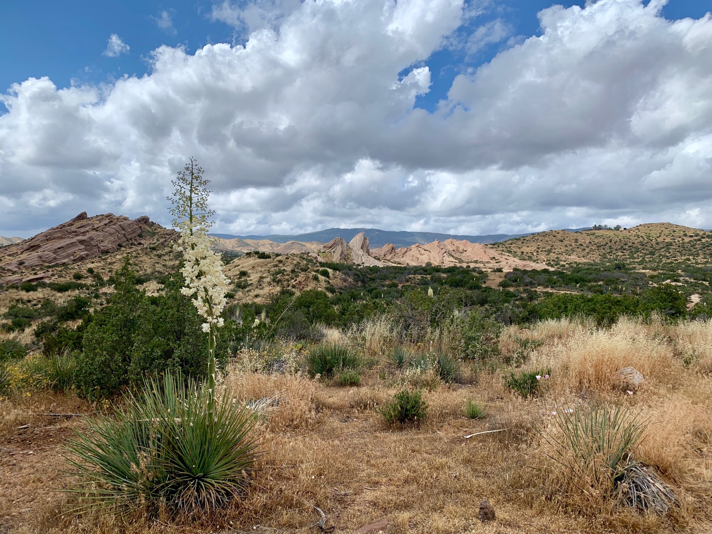

# Lazy Weekend

The night was uneventful. Luckily there was no rain. I had set up in an area where water clearly moved through, and had improvised a small canal to buy some time incase of precipitation.

Lily soon arrived, I packed up, and we headed off to breakfast at SweetWater Cafe. We then stopped by Vasquez Rocks to meander. Within a ten minute span we managed to see four snakes; three gophers, one red racer.

<!-- more --> 

The forecast was looking very poor for the next few days. Rainy and cold. Not necessarily a bad thing in the desert if you can avoid the real serious stuff and hail, but day after day of slow moving sounded questionable.

Since Lily was out here we figured why not find a place and stay an extra day to let some of this weather pass? Of course with it being the weekend rates were inflated, and nothing looked very appealing.

Additionally, people ahead of me had begun to hit Kennedy Meadows up in the Sierra. A quick glance at a snow map will show you just how much is on the ground—this year around 180% the annual average. More concerning was that all this rain moving through the desert over the next week would be dumping fresh snow up there.

Considering these variables, and that we were only forty minutes from home, we decided to (again) head back for the weekend. What a funny situation walking within close proximity to home has been!

After making the decision I suggested we stop by a vineyard. There had been several signs on the road walk into town. “Vineyard this way.” I knew it would be a wildcard, but it felt appropriate considering the impulsive direction the afternoon was taking.

We pulled up and it was definitely a wildcard, as anticipated, the entrance lined with phrases like “live, laugh, wine” or whatever, but we went ahead and ordered two (extended) tastings of their list. We got to talking with someone else doing a tasting, and of course the conversation drifted towards the Pacific Crest Trail.

Two hours later we were feeling quite good, and as we began leaving our new friend stopped us and covered our tab. Big thanks Karen!

We stopped by In-n-Out on the way back and barely hit any traffic—Los Angeles was truly welcoming me back again, and so soon. The plan is to head back out on Monday, but we’ll see.