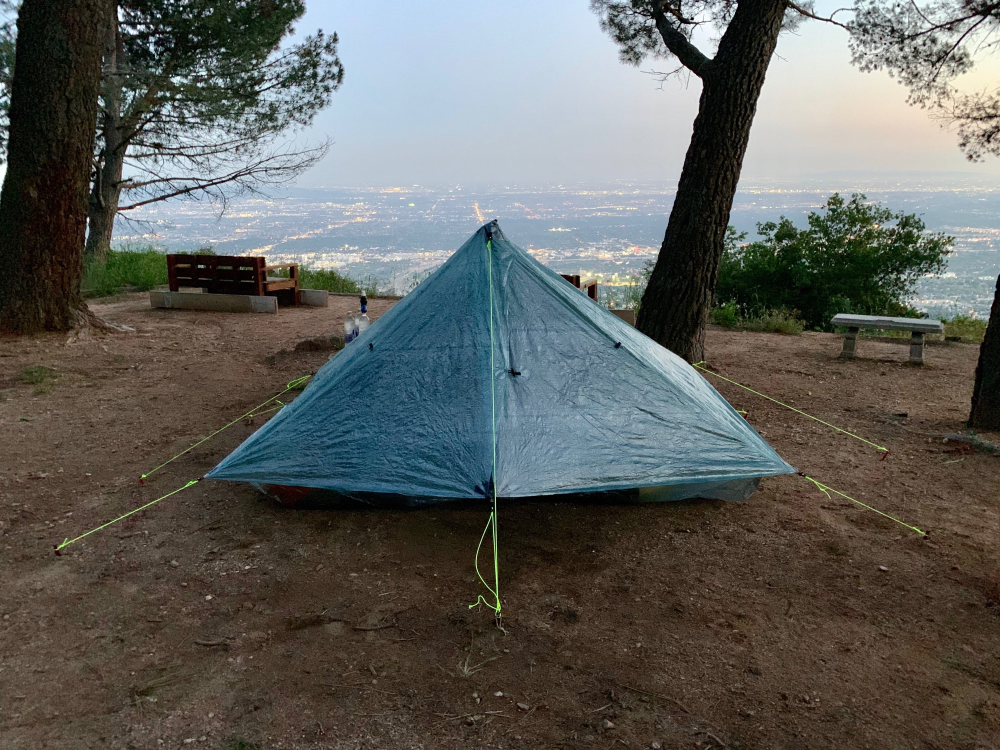

# Extended Break

My lazy weekend back home coincided with substantial weather in the section of trail I would have been found myself in. Although an affirmation in my decision to take a few days, the more impactful result was the amount of snow received in the Sierra. A few fresh feet of snow. Not a big deal in isolation, but this is already a big snow year, and the forecast called for more systems rolling through over the entire next week due to a low pressure system hanging off the coast and pushing a series of atmospheric rivers onshore.

I am also expecting two big deliveries; a new tent, and a new pack for the Sierra. Shipping this to me on trail was going to require some timing logistics, as you don’t want to be stuck waiting around in some town for a package to arrive.

<!-- more -->

Between the weather being so poor over the next week, and these two packages arriving, I decided to extend my stay and wait it out at home. Over the next few days I felt better about the decision as more people hit the Sierra and began “flipping” north, essentially skipping hundreds of miles of trail and hiking south, requiring them to again flip north to continue upon reaching their initial point of departure.

Of course, there is a lot of snow (at lower elevations) the further north you go, and many of those who flipped earlier in the week began to question the decision as they encountered just as poor conditions.

This lead to a pile up of people stuck at Kennedy Meadows (mile 700) waiting for the conditions to approve. Several groups decided to take side-trips to other national parks near by in an effort to pass time. Keeping track of all this from the comfort of home I felt rather vindicated.

My new tent arrived after a few days, a Zpacks Duplex in spruce green. Eager to try it before going on trail I did a quick overnighter at [Henniger Flats](https://en.m.wikipedia.org/wiki/Henninger_Flats) in the San Gabriels. The climb follows a fire road leading you to a dense flat pine forest in an otherwise steep and dry series of cliffs. In the late 1800s an experimental reforestation nursery was established which has now matured into this incredible isolated pocket of alpine foliage.

I set up camp right on the edge of the forest overlooking the megalopolis in the basin below, around eighteen-million people in my immediate field of view. Jon met me a bit later and brought Toki whisky to make highballs. What a move! (The duplex is also amazing.)

Later in the week Lily and I did another spontaneous overnighter at Millard Camp, which is super close to the Jet Propulsion Lab in Pasadena.

A week had passed and the sustained poor weather had moved on. The situation in the Sierra was not getting any better. June 1st set the record for most snow on the ground at that time of year thanks to the unprecedented series of late storms. Even more people began flipping around and taking side trips. Many of them began to simply take a few weeks off trail to give it time.

I began to get a bit impatient to get back on trail. This hadn’t been the plan. Now I was waiting on my new pack to arrive. The lead time when ordering months ago had been 10–12 weeks, and this was the end of the window. The waiting was made a bit easier knowing the situation up north needed time regardless.

My new pack was finally delivered on June 6th. It was definitely worth the wait. It’s a Superior Wilderness Designs 35L. Very proud to have done most of the desert with a pack I made myself, but this thing is certainly more comfortable.

With having taken delivery of my packages, and the temperature rising in the Sierra, I headed back on trail in Agua Dulce exactly three weeks to the day after having gotten off. The break was great, and the timing could not have been better. On the way out we made a quick stop by REI for a fresh pair of shoes.

Good to be back.

