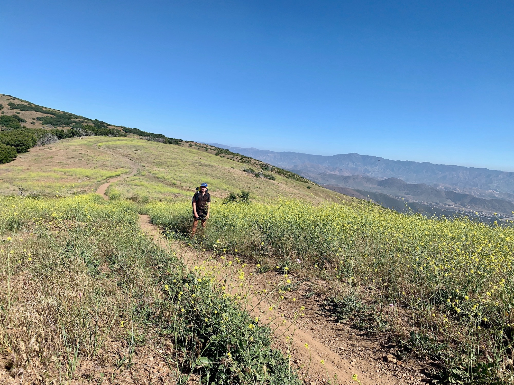

# Day Twenty-six

With having taken delivery of my packages, and the temperature rising in the Sierra, I headed back on trail in Agua Dulce exactly three weeks to the day after having gotten off. The break was great, and the timing could not have been better. On the way out we made a quick stop by REI for a fresh pair of shoes. I ended up picking up a stove. Cold soaking in the desert is fine, but it will be a nice motivator in the snowy Sierra.

<!-- more -->

We arrived where I had left off around 1pm.Goodbyes are still hard! The day began around 2pm to let some of the heat subside, and I began up a long road walk to a trail heading up along a canyon full of film trucks and a fake fuselage for a plane.

After crossing a ridge I headed down across a small road leading, you guessed it, back up a canyon. I located a nice secluded campsite and set up for the night. Probably best not to push it too hard too fast. Definitely feeling a little sore from the time off. Hope to be back to where I was in time for the long aqueduct walks in a few days.

