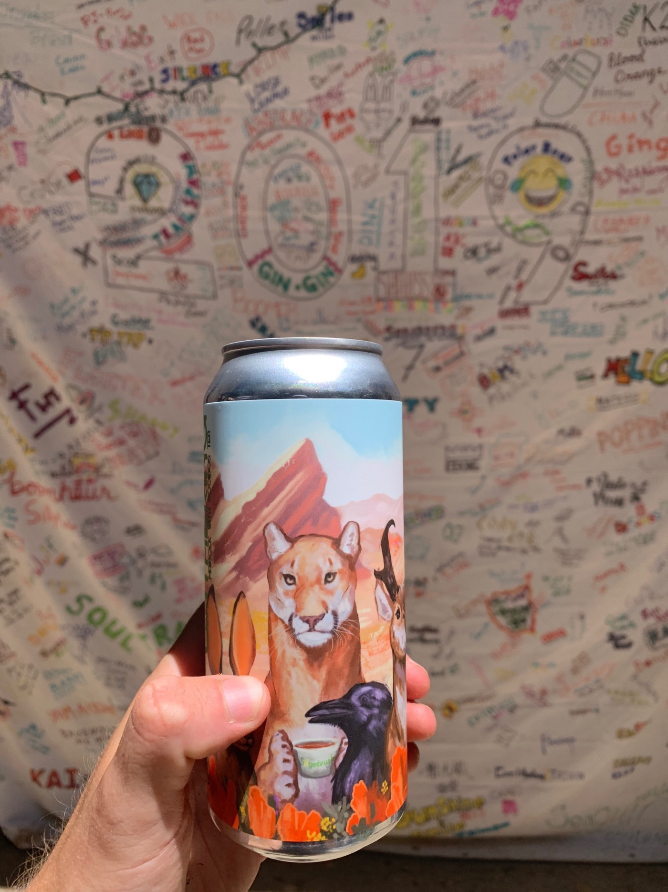

# Day Twenty-Seven

The day began at 5am with another climb. This area is still within the Angeles National Forest, where I do most of my hiking, but I’ve never spent time here with it being some distance away.

As the heat of the day begins to set in there is a memorial bench strategically positioned under a large Oak. I’m a bit of a bench connoisseur—this one checks all boxes. While lounging I come up with a plan for the day. Up ahead is Casa De Luna, a residence whose owners open it up for thru-hikers to eat a home cooked meal and relax. There are a few of these destinations over the next hundred miles, and I’m tempted to skip it as I’ve only recently gotten back on trail. Getting there requires hitching around three miles.

The plan is simple; take a break at the road around noon, and if anyone stops to give me a lift go check it out and get back on trail in the evening. If not, continue along.

<!-- more -->

Within perhaps five minutes a truck pulls over. “Hop in!”

I arrive and the scene is chaotic but welcoming. My reluctance to engage this part of “trail culture” is waning as I gain exposure to some of the goofy charm these sort of spots provide. I decide to stay the night and make camp far back in the manzanita forest on their property. The promise of bear limitless taco salad makes this an easy choice.

During a quick stop by the local grocer I pick up a rooibos infused IPA with a mountain lion and Vasquez Rocks on the can. It tasted as fresh as the packaging looked!

The evening is full of the sort of banter you’d expect. What are your plans for the Sierra, what are your tips for managing burn out on rough slogs, etc...

I turn in with the intention to wake up around 5am to road walk back to the trail to put some real miles in.
