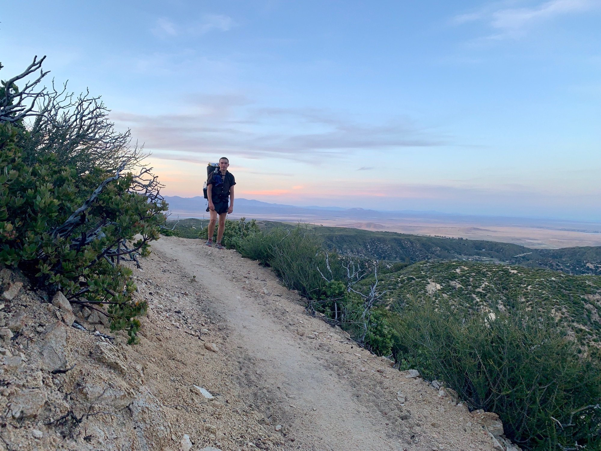

# Day Twenty-Eight

My alarm went off and I snoozed my plan to road walk to the trail in favor of pancakes. Hard decision. By the time people were heading back to the trail there would be only an hour or two of decent hiking before the heat set in, so I decided to hang and let that pass before going.

This ended up taking a little longer than initially intended, as the first ride out left at 5pm. Back on trail I began the climb out of the valley, and creating the ridge there was a great view of the expansive stretch of the Mojave ahead.

<!-- more -->

The evening led me past old gold mines and through soft rolling folds of sandstone. As the sun set I began looking for a spot to make camp, ultimately settling on a flat patch adjacent an elevated concrete platform with a great view of the synchronized blinking ref led lights atop hundreds of huge windmills.

I’m finding it’s good to keep plans flexible, and respond to how things present themself as the day progresses. This in mind, tomorrow will be enjoyable, as it will be the first truly full day since getting back on trail.