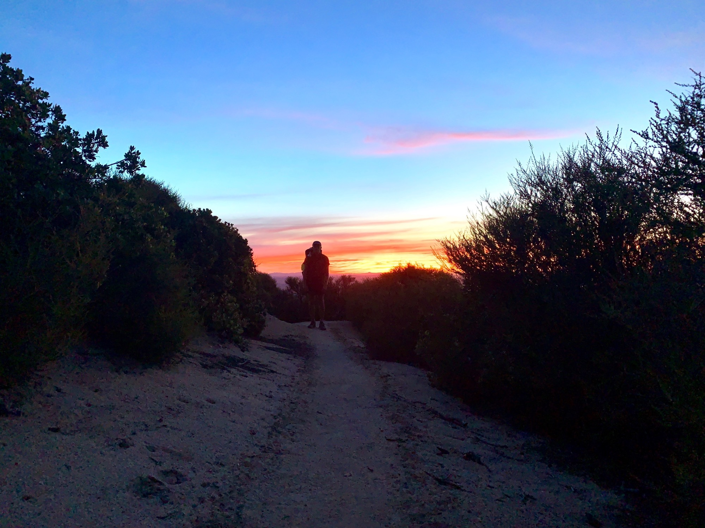

# Day Twenty-Nine

Sleep last night was not the best. My nose was giving me some difficulty, and I developed a cough as the night progressed. Nonetheless, I started the day at 4:30am, happy to finally have a full day ahead of me.

The sunrise was remarkable. Fields of solar panels reflected the early rays as the high cirrus glowed pink. The first several miles of trail ran along the north face of the mountain through dense foliage. 

<!-- more -->

With the rising sun came a rising temperature. The first water source of the day was a large covered cistern of collected rain water. It was a little difficult to scoop the water, requiring some MacGyver-ing by attaching a water bottle to a trekking pole with shock cord.

My lunch siesta took place beneath several large pines overlooking the desert vista. The bugs were bad enough to warrant quickly pitching the tent. Because of the heat I let around two hours pass before moving again, knowing that the next several miles moved to the more exposed southern face of the ridge.

Sure enough, the next few miles were a hot slog. Spirits were lifted when passing the 500 mile marker, though! Reaching these sorts of milestones mid-day are super useful!

I stopped by another water source, however a huge swarm of aggressive bees prevented me from filling up here. The next source had a decomposing bear which had fallen into it. Great!

Around 5pm I reached another source, a small stream, but it was 300 yards and around 500 feet off trail. My destination for the day was only another ten miles ahead, and had a dependable source of water. Impatience got the best of me and I pushed ahead with around 1.5L left on me.

The remaining miles were rather draining, having taken me through private land used as hunting grounds during the winter. The trail itself hugs the border of the property, and involved countless seemingly unnecessary switchbacks and redundant ascents and descents. It’s almost as though the property owners agreed to let the trail pass through it under the condition it be as frustrating as possible to prevent anyone but thru-hikers from doing it.

Finally I made it to camp, Hiker Town, a collection of western-themed sheds with beds in them. I opted to pitch my tent and sleep there instead.

It was late, and so I turned in. Tomorrow marks the start of the aqueduct, arguably the hottest and driest stretch of trail. The plan is to hang out most of the day and start as the sun sets, then hike several hours overnight.

I spill the food out of the pot on my stove and decide to call it. Goodnight!