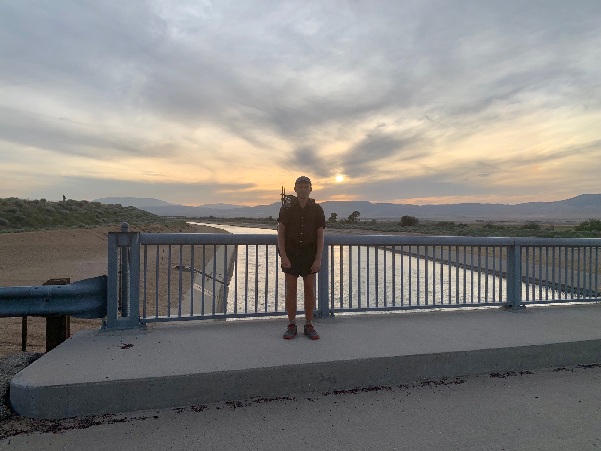
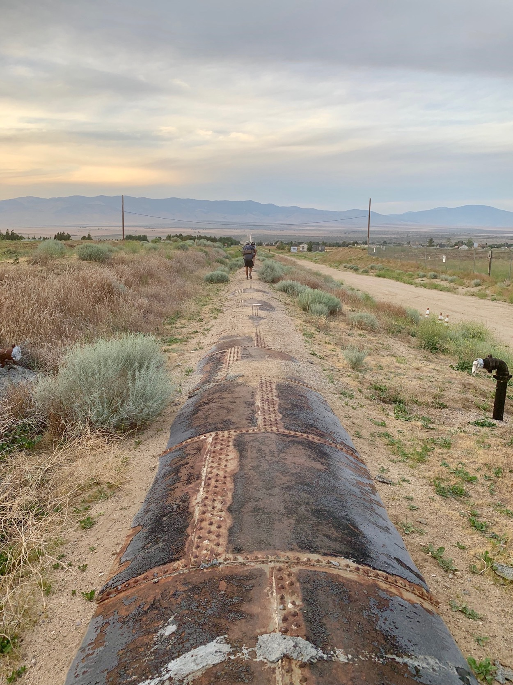
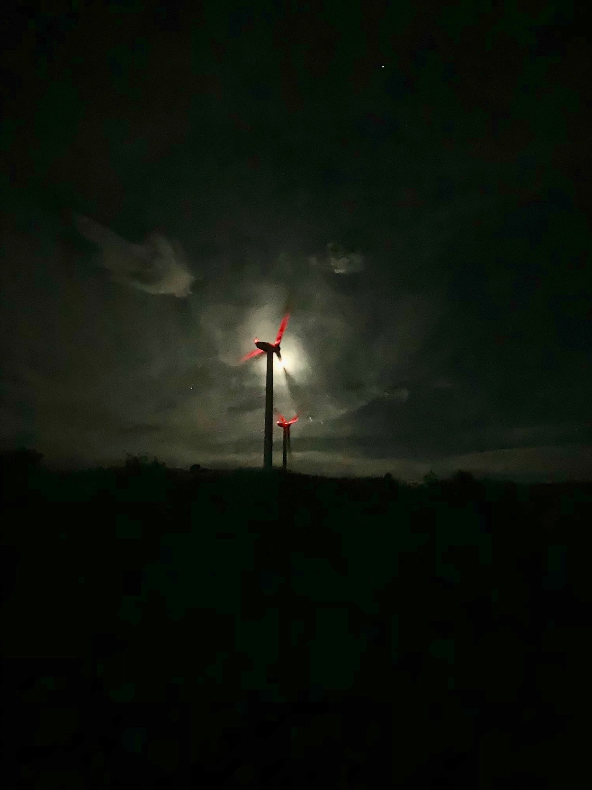

# Day Thirty

I awoke to the desert sun turning my tent into a solar oven. An outdoor shower (hose) was available for washing off my clothes and myself as much as possible. The wind blowing causes the dust to stick to anything wet, efforts were ultimately negligible.

Around two miles from Hikertown is the Neenatch Market. By 10am the temperature was crossing 100 degrees—most hikers opted to wait out the heat of the day eating ice cream in the air conditioning, myself happily included.

<!-- more -->

The plan was to nap hard during the afternoon with the intent of walking the long stretch of trail following the Los Angeles aqueduct and a large wind farm at night when temperatures are cooler to conserve water and avoid baking in the sun.

While dozing in and out of sleep in this bubble of cool air I think about Rem Koolhaus and his Junkspace essay which details the transformative power of air conditioning within architectural form.

As the sun begins to dip towards the ridge on the horizon a group forms and begins making our way to the start of a dirt road leading to the pipeline carrying water out of the mountains separating me from the next big town of Tehachapi.

The walk is totally flat, totally straight, and the sense of scale is immense. Staring down the line I’m walking I can see several others perhaps 5 miles in the distance walking the same line I’m now on.

The sun set, causing the entire landscape to glow red from the light reflecting off the clouds forming over the distant hills dotted with windmills. As the glow faded the nearly full moon illuminated our path. No need for headlamps our here.

The larger group has slimmed to three of us, and a head towards the blinking red lighted of the windmills. They’re massive, and it’s impossible to tell of the edge of the windmill farm is directly in front of us or 5 miles off.

We reach a bridge where the Los Angeles Department of Water and Power has a faucet connected directly to the aqueduct for filling up on water, a critical supply in this ultra barren stretch.

One of the other hikers, Daway and I, had been talking about perhaps pushing on through the night all the way to Tehachapi, a total of 42 miles. We’re feeling good between the full moon and mild temperature. Let’s do it.

We soon begin heading uphill, pushing as hard as we can. For the first time on trail I put my headphones in and play some music to get me in the zone. It’s not that I had been avoiding listening to anything, but that the soundscape of the trail has been so dense in sonic detail. There was so much to hear. 520 miles with only the sounds around me.

In a few years this section of the PCT will be re-routed north to avoid the scorching desert floor in an effort to maintain the spirit of the “crest” portion of the name. This is a little unfortunate, as I find the contrast extremely refreshing, and the time spent adjacent the infrastructure useful for better understanding how it all connects.

By 2am we were continuing to gain elevation and leaving the towering windmills behind and below us. There were two primary peaks ahead of us. It’s difficult to gauge distance at night, and the moon had set leaving us in pure darkness, leaving us climbing into the void. We stop thinking we must be close, but we are barely halfway to the first peak. Onwards!

Finally we cross the first peak and begin a rapid descent down to a seasonal stream. Daylight begins to break as reach the bottom, and we have some breakfast (poptarts) and coffee (cold) to keep us moving.

After the brief break we begin the second larger ascent. After the shot or caffeine my legs are moving rapidly, and I decide to pull away to take advantage of the energy burst.

Around 6am I hit the steepest section of trail on this push, a number of aggressively graded switchbacks stand like a wall in front of me. There’s nothing to do other than begin heading upwards. The sun rises above the neighboring ridge blasting the switchbacks in intense light. Initially a big motivator after walking all night, the sun and heat now becomes a little oppressive as tiredness really sets in.

Reaching the top of the switchbacks I pause for a break. Sure enough, Daway catches up after only 20 minutes having been only a mile behind. We catch up and psych ourselves up for the remaining 12 miles.

A few miles later we reach a fire road where someone had bothered to bring a few big red deck umbrellas, chairs, and a healthy cache of water. Amazing. We break for 15 and look out over the substantial distance of the Mojave we just covered. It’s all downhill from here into town.

The following 10 miles down to Tehachapi Willow Springs Road are very meandering with scarcely any shade. The windmills return, covering the ridges and extending far out towards the Mojave Air and Space Port. From the ridge I can see an airfield where decommissioned airliners are scrapped for parts; the airliner graveyard.

18 hours and 42 miles later my feet hit the road at 2:30pm. Daway arrives a few minutes later. We sit in the sun and attempt to hitch a ride into town. After several cars pass by, mostly maintenance vehicles for the windmills, a hiker emerges from the trail and a van pulls up. She gestures us over and offers us a ride into town! Perfect. We hop in and are offered a cold soda from a range of options. Amazing.

Daway and I grab a hotel room, drop our packs, and head to a pizza spot down the block. I order an extra large and an IPA (thanks to all who have donated to the beer fund!)

After cleaning up I pass out at 6:00pm. A day to remember.