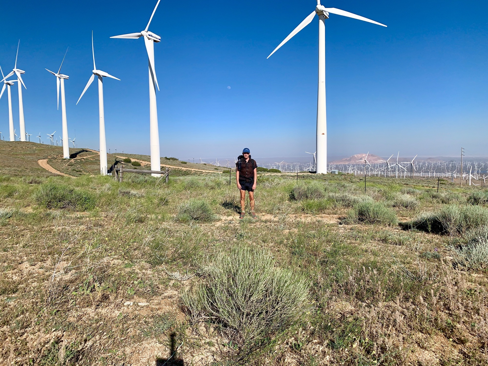

# Day Thirty-Two

With a sleepless night the day began at the first hint of sunlight at 4am. The uphill slog continued and the wind felt even more intense as the temperature rose. At certain points my footing became completely unglued from the trail. Regardless, I was feeling great. Incase it’s unclear, the walking is very enjoyable.

This stretch, and the ones immediately following it, require big water carries with sources being more scarce here at elevation than elsewhere in the desert.

<!-- more -->

By 10:45 I had done 14.5 miles. Quite the push. After a one hour lunch featuring leftover pizza from town, and a nearby nap, I was feeling refreshed and eager to continue with the day.

Another climb lead to a wide grassy valley. Really starting to get hints of the Sierra.

The map indicates a radio tower maybe a mile ahead. Assuming this indicates a good line of sight to the surrounding areas I pull out my phone and have reception. I catch up with Lily which is always a nice moment of the day when possible.

Pushing a few more miles I notice a saddle between two climbs densely packed with tall pines. There’s great wind coverage—you can really hear it whipping through the top branches. Looking forward to quality sleep I snack a bit then get to bed before sundown.