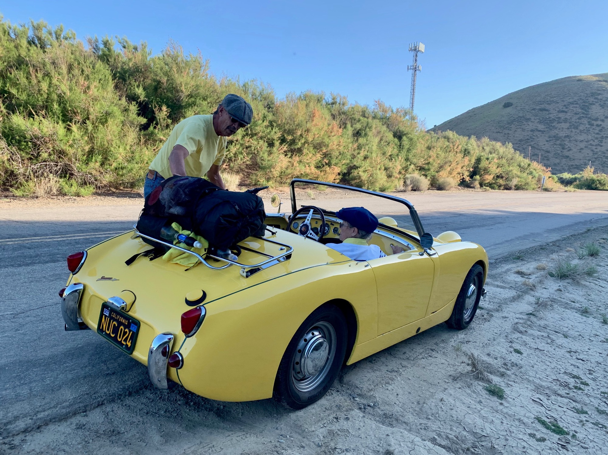

# Day Thirty-One

I wake up at around 9am, a solid 15 hours of sleep more or less! There are a few items needing to be picked up, which I do, then I stand on the edge of town with my thumb up and a smile to try hitching back to the trail. For some reason I never expect this to work, but so far it always has.

Charles pulls up and asks, “to the trail?” Yep! We get to talking. He was a mechanic in the Air Force. Deployed all over. Bought an RV and spent years driving around the country. Visited Tehachapi and parked for the past few years. Nicest guy.

<!-- more -->

I get to the trail and the turbines appear at max velocity in the howling wind. Tehachapi means whirlwind, and it’s proving true. The trail meanders for several miles until it hits I-58, and throughout the trek intermittent gusts literally knock me sideways off trail.

A brief 1.5 mile road walk across the interstate connects two trailheads. Just as I exit one do two restored vintage British cars come bombing down the canyon road. Nice. A few minutes later they come screaming back and screech to a halt in the middle of the road. “Want a lift?! It’s not far but hop in!” What!

There’s no trunk space in either car, just a luggage rack on the one. We take my pack and lay it on top. Suzy, two chihuahuas in one arm, throws her other arm over the back of the car and holds on to an arm strap. I hop in the other car and off we go.

We’re gunning it down the side road and I’m simultaneously loving it and nervous as hell that my pack will fall off the car ahead and spill all over the road. Whatever!

We reach the trailhead (quickly) and hop out. Insane. Two others hikers walk by and give me the side eye. We say our goodbyes and I almost forget my trekking poles.

The tail parallels the interstate for a while then darts to the left and up a ridge. This area is notoriously windy, so as soon as a campsite with good coverage presents itself I take it. This one happens to be amongst a group of Joshua trees.

No sooner did I make camp did the wind shift with the setting sun, my coverage now no good. My tent is shaking in the gusts and I’m concerned it may begin ripping at the seams. I decide to take down the tent and use it as a ground sheet to cowboy camp in the center of the Joshua trees.

Looking up and seeing the expansive desert sky of stars helped to ease the frustration of being unable to sleep. Relenting, this is no longer sleep and merely a relaxing break through the night.